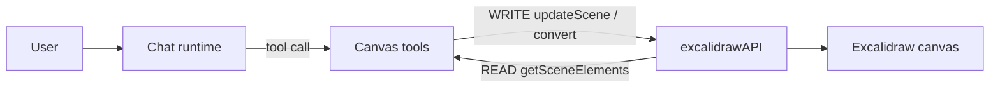

# excalidraw

<!-- BEGIN GENERATED: .agent/README.md — do not edit; run `pnpm sync:skill-readme`

# `.agent` — WAT skills (Workflow · Agent · Tools)

Skills the agent uses to work in this repo. Core idea: **offload deterministic steps to scripts so you stay focused on decisions.** Chained 90%-accurate manual steps decay fast (0.9^5 ≈ 59%) — scripts don't drift, and they save tokens.

## Skill layout

```
.agent/skills/<skill-name>/
  SKILL.md      # when to use, how, available tools, constraints, success criteria
  workflows/    # markdown SOPs (step-by-step procedures)
  tools/        # deterministic scripts the workflows call
```

## How you (the agent) work

1. Match the task to a skill, read its `SKILL.md`.
2. Scan workflow **filenames** for a relevant SOP — don't read every file.
3. Follow the SOP; run the tool scripts instead of doing the steps by hand.
4. **Self-evolve:** if you solved something repeatable the hard way, capture it as a new workflow SOP (+ tool). Future agents thank you.

END GENERATED: .agent/README.md -->

Work on the **`apps/canvas`** app — a full-window Excalidraw whiteboard with the chat assistant floating on top — and the **chat-assistant ⇄ Excalidraw bridge** that lets a user draw by prompting. Read `../../README.md` first for the WAT framework.

Excalidraw is a React whiteboard component (`@excalidraw/excalidraw`). It is **embedded and wired up** in `apps/canvas` (added in the canvas feature work); this skill maps the integration so the next agent can extend it. The authoritative prop/API contracts live in a **read-only reference clone**, not in this repo.

## When to use

- Extending or debugging `apps/canvas` (the whiteboard app + chat overlay).
- Adding/adjusting the assistant's canvas tools (`draw_on_canvas` / `read_canvas` / `clear_canvas`) or the canvas bridge.
- Embedding `<Excalidraw>` somewhere new (mount, CSS/assets, code-splitting) or touching the app-tools seam.
- Any question about Excalidraw props, the `excalidrawAPI` handle, or programmatic element creation — go to the reference, don't guess.

## How

1. `node .agent/skills/excalidraw/tools/excalidraw-ref.mjs` — prints the clone location, the pinned npm version, and the high-value doc paths. Pass a query to `git grep` the reference (e.g. `… updateScene`).
2. Read the relevant doc in the clone (paths below), then the matching integration file in `apps/canvas` (see "How it is wired" below).
3. To add a new API call end-to-end, follow `workflows/wire-excalidraw-api-call.md`.

## Reference clone (READ-ONLY)

- Location: **`~/excalidraw`** (outside this repo). Set up with `git clone https://github.com/excalidraw/excalidraw ~/excalidraw`.
- **Never modify it; never commit it into tinytinkerer.** It exists only to read source + `dev-docs/`.
- High-value docs (run the tool for the live ✓/✗ list):
  - `dev-docs/.../api/props/props.mdx` — every `<Excalidraw>` prop.
  - `dev-docs/.../api/props/excalidraw-api.mdx` — the `excalidrawAPI` handle (the bridge surface).
  - `dev-docs/.../api/props/initialdata.mdx` — initial scene/appState/files.
  - `dev-docs/.../api/utils/export.mdx` — `exportToSvg` / `exportToBlob` / `exportToCanvas`.
  - `dev-docs/.../api/excalidraw-element-skeleton.mdx` — `convertToExcalidrawElements`.
  - `dev-docs/.../installation.mdx` + `integration.mdx` — CSS, fonts/`EXCALIDRAW_ASSET_PATH`, SSR, bundler notes.

## npm package

- Package: **`@excalidraw/excalidraw`**, pinned at **`0.18.1`** in `apps/canvas/package.json` (published 2026-04-20, so it cleared the repo's 7-day `minimumReleaseAge` gate without an exclude).
- Peer deps: `react` + `react-dom`. The app is on **React 19**, which Excalidraw 0.18 supports (its transitive Radix deps warn about React 16–18 peers; harmless).
- Imports: `import { Excalidraw, convertToExcalidrawElements, CaptureUpdateAction } from '@excalidraw/excalidraw'` **and** `import '@excalidraw/excalidraw/index.css'`. `ExcalidrawImperativeAPI` is a type at the `@excalidraw/excalidraw/types` subpath.
- Self-hosting fonts: copy `dist/prod/fonts` into a served path and set `window.EXCALIDRAW_ASSET_PATH`; otherwise fonts come from a CDN (the current MVP uses the CDN default).

## API map — tagged for the bridge

The `excalidrawAPI` handle (captured via the `excalidrawAPI={(api) => …}` prop — `ref` was removed in v0.17) is the whole bridge surface. **READ** = assistant inspects the canvas; **WRITE** = assistant changes it.

| Direction | Call                                                                  | Use                                                                                     |
| --------- | --------------------------------------------------------------------- | --------------------------------------------------------------------------------------- |
| READ      | `getSceneElements()`                                                  | non-deleted elements (the scene as data)                                                |
| READ      | `getSceneElementsIncludingDeleted()`                                  | include tombstones                                                                      |
| READ      | `getAppState()`                                                       | viewport, theme, selection, colors                                                      |
| READ      | `getFiles()`                                                          | embedded image/binary files                                                             |
| READ      | `exportToSvg` / `exportToBlob` / `exportToCanvas` (from package root) | render scene → SVG/PNG/canvas to show the assistant the drawing                         |
| WRITE     | `updateScene({ elements, appState, captureUpdate })`                  | the core draw/replace call                                                              |
| WRITE     | `convertToExcalidrawElements(skeleton)` (from package root)           | build elements from a simplified skeleton — **call before** `updateScene`/`initialData` |
| WRITE     | `scrollToContent(target?, { fitToContent })`                          | frame what was just drawn                                                               |
| WRITE     | `resetScene()`                                                        | clear the canvas                                                                        |
| WRITE     | `addFiles(files)`                                                     | attach images referenced by elements                                                    |
| EVENT     | `onChange(els, appState, files)` prop / `api.onChange(cb)`            | observe edits → feed the assistant                                                      |

`captureUpdate` (`CaptureUpdateAction.IMMEDIATELY` / `EVENTUALLY` / `NEVER`) controls undo/redo — use `NEVER` for assistant-driven writes you don't want on the user's undo stack. Element/appState/skeleton type shapes: read the doc, don't invent fields.

## How it is wired in `apps/canvas`

`apps/canvas` is its own browser shell (mirrors `apps/widget`). Excalidraw is the full-window base; the chat floats on top, sharing one React tree.

- `apps/canvas/src/features/canvas/canvas-page.tsx` — composes `<ExcalidrawCanvas>` (base) + the shared `<FloatingWidgetChat>` (overlay). The overlay is click-through (`.canvas-chat-overlay` is `pointer-events: none`; only `.widget-floating-shell` re-enables it) so the whiteboard stays usable.
- `apps/canvas/src/features/canvas/excalidraw-canvas.tsx` — the **only** static importer of `@excalidraw/excalidraw` + its CSS; loaded via `React.lazy` from the page so it code-splits into `excalidraw-vendor`. On mount it registers the API via `setCanvasApi`.
- `apps/canvas/src/canvas-bridge.ts` — module singleton holding the live `ExcalidrawImperativeAPI` (`setCanvasApi`/`getCanvasApi`), modeled on app-browser's `human-prompt-bridge.ts`.
- `apps/canvas/src/canvas-tools.ts` — `createCanvasTools()` builds the `draw_on_canvas` / `read_canvas` / `clear_canvas` tools, closing over `getCanvasApi()`. **Excalidraw is dynamic-`import()`ed inside `execute`** so it never enters the entry chunk; tools degrade gracefully when the API is null.
- `apps/canvas/src/main.tsx` — `createBrowserShellRoot({ router, BootScreen, appTools: createCanvasTools() })`.

**The app-tools seam** (NOT a plugin): `appTools` threads `createBrowserShellRoot → createBrowserApp → createChatStore → createBrowserRuntimeFactory → createRuntime` (`packages/app/app-browser/src/...`), where each tool registers with a planner descriptor derived from its Zod `schema`. App tools are always-on and only present in the app that passes them — web/widget/mobile are unaffected.

**The floating chat chrome is shared**: `FloatingWidgetChat` + `WidgetChatSurface` live in `packages/app/app-browser/src/widget-chat/` (extracted from the widget). `apps/widget`'s `WidgetPage` and `apps/canvas` both consume it. app-browser must not depend on `@tinytinkerer/ui`, so the surface uses `react-icons/fa6` + a local button (the turn-chrome precedent).

- **Bundle budget is the hard constraint.** `apps/canvas/src/bundle-size.test.ts`: entry < 65 kB, lazy `canvas-page` route < 40 kB, first-party chunks < 120 kB, Excalidraw isolated in a lazy `excalidraw-vendor` chunk. `apps/canvas/vite.config.ts` `manualChunks` routes `node_modules/@excalidraw/` (+ roughjs/points-on-\* render deps) into `excalidraw-vendor`. Excalidraw also lazily pulls a bundled Mermaid (large third-party lazy chunks) — exempt from the first-party budget by the `moduleIds` check.
- Client-only (no SSR) via `createBrowserShellRoot`; keep Excalidraw behind the lazy boundary.



To add a new canvas capability, follow `workflows/wire-excalidraw-api-call.md`.

## Available tools

- `tools/excalidraw-ref.mjs [query]` — prints the `~/excalidraw` clone location + recorded npm version + key doc paths; with a query, `git grep`s the read-only reference.

## Constraints

- Never modify or commit `~/excalidraw` (read-only reference clone, outside this repo).
- Keep all Excalidraw code behind the lazy boundary (its own `excalidraw-vendor` chunk) so `apps/canvas/src/bundle-size.test.ts` stays green — never statically import `@excalidraw/excalidraw` from `main.tsx`, the router, or `canvas-tools.ts` (use dynamic `import()` there).
- app-browser must not depend on `@tinytinkerer/ui` (boundary check) — the shared chat surface uses `react-icons` + local primitives.

## Success criteria

A future agent can, from this skill alone: find the read-only reference, know which API call reads vs writes the canvas, locate every integration file in `apps/canvas` + the app-tools seam in app-browser, and extend the canvas tools — without re-deriving any of it.
