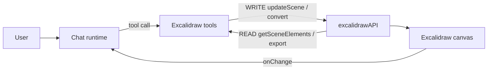

# excalidraw

<!-- BEGIN GENERATED: .agent/README.md — do not edit; run `pnpm sync:skill-readme`

# `.agent` — WAT skills (Workflow · Agent · Tools)

Skills the agent uses to work in this repo. Core idea: **offload deterministic steps to scripts so you stay focused on decisions.** Chained 90%-accurate manual steps decay fast (0.9^5 ≈ 59%) — scripts don't drift, and they save tokens.

## Skill layout

```
.agent/skills/<skill-name>/
  SKILL.md      # when to use, how, available tools, constraints, success criteria
  workflows/    # markdown SOPs (step-by-step procedures)
  tools/        # deterministic scripts the workflows call
```

## How you (the agent) work

1. Match the task to a skill, read its `SKILL.md`.
2. Scan workflow **filenames** for a relevant SOP — don't read every file.
3. Follow the SOP; run the tool scripts instead of doing the steps by hand.
4. **Self-evolve:** if you solved something repeatable the hard way, capture it as a new workflow SOP (+ tool). Future agents thank you.

END GENERATED: .agent/README.md -->

Work on the widget's Excalidraw integration and the planned **chat-assistant ⇄ Excalidraw bridge**. Read `../../README.md` first for the WAT framework.

Excalidraw is a React whiteboard component (`@excalidraw/excalidraw`). The widget does **not** embed it yet — this skill is the map for the agent who wires it in, and for the one who then lets the chat assistant read and draw on the canvas. The authoritative prop/API contracts live in a **read-only reference clone**, not in this repo.

## When to use

- Embedding `<Excalidraw>` into `apps/widget` (mount, CSS/assets, code-splitting).
- Building the chat ⇄ canvas bridge: letting the assistant **read** the scene (export/inspect) or **write/draw** on it via tools.
- Any question about Excalidraw props, the `excalidrawAPI` handle, or programmatic element creation — go to the reference, don't guess.

## How

1. `node .agent/skills/excalidraw/tools/excalidraw-ref.mjs` — prints the clone location, the recorded npm version, and the high-value doc paths. Pass a query to `git grep` the reference (e.g. `… updateScene`).
2. Read the relevant doc in the clone (paths below), then the matching widget file in `apps/widget`.
3. To add a new API call end-to-end, follow `workflows/wire-excalidraw-api-call.md`.

## Reference clone (READ-ONLY)

- Location: **`~/excalidraw`** (outside this repo). Set up with `git clone https://github.com/excalidraw/excalidraw ~/excalidraw`.
- **Never modify it; never commit it into tinytinkerer.** It exists only to read source + `dev-docs/`.
- High-value docs (run the tool for the live ✓/✗ list):
  - `dev-docs/.../api/props/props.mdx` — every `<Excalidraw>` prop.
  - `dev-docs/.../api/props/excalidraw-api.mdx` — the `excalidrawAPI` handle (the bridge surface).
  - `dev-docs/.../api/props/initialdata.mdx` — initial scene/appState/files.
  - `dev-docs/.../api/utils/export.mdx` — `exportToSvg` / `exportToBlob` / `exportToCanvas`.
  - `dev-docs/.../api/excalidraw-element-skeleton.mdx` — `convertToExcalidrawElements`.
  - `dev-docs/.../installation.mdx` + `integration.mdx` — CSS, fonts/`EXCALIDRAW_ASSET_PATH`, SSR, bundler notes.

## npm package (do NOT add the dep here)

- Package: **`@excalidraw/excalidraw`**, recorded version **`0.18.1`** (latest at authoring; verify with `npm view @excalidraw/excalidraw version`).
- Adding the dep is **future, human-approved work** — the repo enforces a 7-day dependency age gate. This skill is knowledge only.
- Peer deps: `react` + `react-dom`. The widget is on **React 19** (`apps/widget/package.json`), which Excalidraw 0.18 supports.
- Required imports once added: `import { Excalidraw } from '@excalidraw/excalidraw'` **and** `import '@excalidraw/excalidraw/index.css'`.
- Self-hosting fonts: copy `dist/prod/fonts` into a served path and set `window.EXCALIDRAW_ASSET_PATH`; otherwise fonts come from a CDN.

## API map — tagged for the bridge

The `excalidrawAPI` handle (captured via the `excalidrawAPI={(api) => …}` prop — `ref` was removed in v0.17) is the whole bridge surface. **READ** = assistant inspects the canvas; **WRITE** = assistant changes it.

| Direction | Call                                                                  | Use                                                                                     |
| --------- | --------------------------------------------------------------------- | --------------------------------------------------------------------------------------- |
| READ      | `getSceneElements()`                                                  | non-deleted elements (the scene as data)                                                |
| READ      | `getSceneElementsIncludingDeleted()`                                  | include tombstones                                                                      |
| READ      | `getAppState()`                                                       | viewport, theme, selection, colors                                                      |
| READ      | `getFiles()`                                                          | embedded image/binary files                                                             |
| READ      | `exportToSvg` / `exportToBlob` / `exportToCanvas` (from package root) | render scene → SVG/PNG/canvas to show the assistant the drawing                         |
| WRITE     | `updateScene({ elements, appState, captureUpdate })`                  | the core draw/replace call                                                              |
| WRITE     | `convertToExcalidrawElements(skeleton)` (from package root)           | build elements from a simplified skeleton — **call before** `updateScene`/`initialData` |
| WRITE     | `scrollToContent(target?, { fitToContent })`                          | frame what was just drawn                                                               |
| WRITE     | `resetScene()`                                                        | clear the canvas                                                                        |
| WRITE     | `addFiles(files)`                                                     | attach images referenced by elements                                                    |
| EVENT     | `onChange(els, appState, files)` prop / `api.onChange(cb)`            | observe edits → feed the assistant                                                      |

`captureUpdate` (`CaptureUpdateAction.IMMEDIATELY` / `EVENTUALLY` / `NEVER`) controls undo/redo — use `NEVER` for assistant-driven writes you don't want on the user's undo stack. Element/appState/skeleton type shapes: read the doc, don't invent fields.

## This repo today (grounding)

- The widget is a small **floating chat window**, not a canvas app: `apps/widget/src/features/chat/widget-page.tsx`. Default 400×680, min 320×420 (`WIDGET_DEFAULT_*` / `WIDGET_MIN_*`); it also renders embedded-in-host and minimized modes.
- Mount today is `WidgetSurface` (the chat column) inside `WidgetWindow`. **No Excalidraw is present.** A canvas does not fit the chat column — it needs a dedicated surface (a tab/route or a separate larger pane), decided with the maintainer.
- Routing: `apps/widget/src/app/router.tsx` (hash router; `WidgetPage` is already `lazy`-loaded).
- **Bundle budget is the hard constraint.** `apps/widget/src/bundle-size.test.ts` caps the lazy widget-route chunk at **40 kB** and every non-vendor chunk at **120 kB**. Excalidraw is hundreds of kB, so it **must** be its own lazy chunk (`React.lazy` / dynamic `import()`), never bundled into `widget-page`. Expect to add a vendor-chunk carve-out, mirroring the existing `react-vendor` / `codemirror-vendor` split.
- No SSR concern here (the widget is a client SPA via `createBrowserShellRoot` in `apps/widget/src/main.tsx`), but the component is still client-only — keep it behind the lazy boundary.

## Path toward the chat ⇄ Excalidraw bridge

The assistant already calls **tools** through the chat runtime — see `packages/app/app-browser/src/runtime/tool-calling.ts` and `mcp-tool.ts` (each tool is a `Tool<Input, Output>` from `@tinytinkerer/app-core`; MCP tools use the id pattern `mcp:<server>:<tool>`). The bridge is: register **local tools that close over the live `excalidrawAPI`** and map onto the table above.



Sequence to build it: (1) embed `<Excalidraw>` behind a lazy boundary and lift the `excalidrawAPI` handle into a store; (2) expose READ tools (inspect/export) first — lower risk; (3) add WRITE tools (`convertToExcalidrawElements` → `updateScene`) with `captureUpdate: NEVER`; (4) wire `onChange` so edits flow back to the assistant. `workflows/wire-excalidraw-api-call.md` is the per-call SOP.

## Available tools

- `tools/excalidraw-ref.mjs [query]` — prints the `~/excalidraw` clone location + recorded npm version + key doc paths; with a query, `git grep`s the read-only reference.

## Constraints

- **Knowledge only here.** Do NOT add the npm dependency, do NOT embed Excalidraw, do NOT implement the bridge — that is future, human-approved work (7-day dep age gate applies).
- Never modify or commit `~/excalidraw`.
- When the integration is built, the new Excalidraw code must stay in its own lazy chunk to keep `bundle-size.test.ts` green.

## Success criteria

A future agent can, from this skill alone: find the read-only reference, know the package + version to request, know which API call reads vs writes the canvas, know where Excalidraw would mount in `apps/widget` and the bundle constraint, and know which runtime files host the chat ⇄ canvas bridge — without re-deriving any of it.
