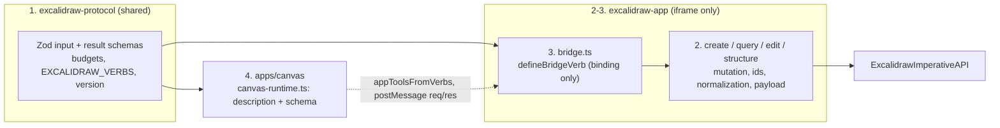

# excalidraw

<!-- BEGIN GENERATED: .agent/README.md — do not edit; run `pnpm sync:skill-readme`

# `.agent` — WAT skills (Workflow · Agent · Tools)

Skills the agent uses to work in this repo. Core idea: **offload deterministic steps to scripts so you stay focused on decisions.** Chained 90%-accurate manual steps decay fast (0.9^5 ≈ 59%) — scripts don't drift, and they save tokens.

## Skill layout

```
.agent/skills/<skill-name>/
  SKILL.md      # when to use, how, available tools, constraints, success criteria
  workflows/    # OPTIONAL: markdown SOPs (some skills are just SKILL.md + tools/)
  tools/        # deterministic scripts SKILL.md / the workflows call
```

## How you (the agent) work

1. Match the task to a skill, read its `SKILL.md`.
2. If it has `workflows/`, scan their **filenames** for a relevant SOP — don't read every file.
3. Follow `SKILL.md` (and the SOP, if any); run the tool scripts instead of doing the steps by hand.
4. **Self-evolve:** if you solved something repeatable the hard way, capture it as a new workflow SOP (+ tool). Future agents thank you.

END GENERATED: .agent/README.md -->

This skill is for implementation agents **changing TinyTinkerer's Excalidraw integration**, which is now
shipped and live. It is **not** a chat-assistant prompt or a usage guide for drawing on the canvas. Use it
to extend the verb ladder, change contracts/handlers/tool wiring, touch the iframe lifecycle, or fix
rendering bugs — without breaking package ownership or bundle isolation.

The integration exists today: a sandboxed Excalidraw iframe talks to the chat shell over a generic,
versioned `postMessage` bridge, and the assistant drives it through **20 verbs**. Everything below describes
the real, implemented system — not a plan.

## When to use

- Changing `packages/shared/excalidraw-protocol`, `packages/app/excalidraw-app`, or `apps/canvas`.
- Adding, removing, or changing Excalidraw verbs or their model-facing descriptions.
- Touching Excalidraw imperative API calls, element normalization, edit/structure safety, connector layout,
  budgets, pagination, versioning, or the isolated iframe build.
- Investigating rendering bugs caused by generated elements or connector coordinates.

## Required references

- `docs/app-harness.md` — **source of truth** for package relationships, generic-bridge vs app-contract
  versions, verbs, detail levels, pagination, payload budgets, connector policy, iframe lifecycle, and the
  `excalidraw-app` module split. The diagrams in this skill are distilled from it; keep them in step.
- `docs/ARCHITECTURE.md` — dependency rules and the monorepo package map; package `tinytinkerer`
  architecture roles (`app-protocol`, `iframe-app`, `harness-shell`) that `check:boundaries` enforces.
- `workflows/wire-excalidraw-api-call.md` — the SOP for wiring a new/changed verb end to end.

## End-to-end data flow

A verb is four coordinated pieces in a fixed dependency order (the numbers are the order to touch files —
see the SOP). `bridge.ts` only binds; all behavior is in the adjacent modules; the parent shell never
imports `@excalidraw/excalidraw`.



Wire path at call time: model tool (validated by protocol input schema in canvas) → `AppBridgeHandle` →
app-bridge client → `postMessage` → server (re-validates input) → `defineBridgeVerb` handler → `execute*`
behavior → `ExcalidrawImperativeAPI` → result (validated against protocol result schema) back across.

## Ownership map

- `packages/shared/excalidraw-protocol` (role `app-protocol`) owns `EXCALIDRAW_APP_ID`,
  `EXCALIDRAW_PROTOCOL_VERSION`, `EXCALIDRAW_VERBS`, Zod input/result contracts (`inputs.ts` / `contracts.ts`,
  re-exported from `index.ts`), payload budgets, detail levels, pagination fields, truncation metadata,
  normalized result variants, and edit-capability vocabulary. Stays small, serializable, side-effect-free
  (`sideEffects: false`), and **must not import** `@tinytinkerer/app-bridge` or `@excalidraw/excalidraw`.
- `packages/app/excalidraw-app` (role `iframe-app`) owns **every** import from `@excalidraw/excalidraw`, all
  interaction with `ExcalidrawImperativeAPI`, and app-domain behavior, split into focused modules:
  - `create.ts` — `draw`/`clear`, stable ids, post-layout connector endpoints.
  - `query.ts` — `search`/`inspect`/`read`, scene snapshots, pagination, result budgets.
  - `normalization.ts` — normalized element records, bounds, labels, relationships, capabilities.
  - `edit.ts` — atomic, version-checked, invariant-safe field patches with receipts.
  - `structure.ts` — the 8 structural verbs (`group`, `duplicate`, `delete`, `align`, `distribute`,
    `stack`, `order`, `transform`).
  - `binding.ts` — the connector binding verbs (`bind`, `audit`) and the shared edge-anchor reflow geometry
    reused by `transform`'s `reflowConnectors`.
  - `mutation.ts` — shared receipt + budget-bounded record helper used by `edit` **and** `structure`.
  - `ids.ts` — collision-free id minting used by `create` **and** `structure`.
  - `payload.ts` — exact UTF-8 measurement/truncation.
  - `bridge.ts` — **binding only**: `defineBridgeVerb(...)` + `createBridgeServer`. No behavior.
- `apps/canvas` (role `harness-shell`) owns the deployable shell, iframe URL, app id/version wiring, and the
  model-facing verb descriptions in `src/canvas-runtime.ts`. It imports Excalidraw **contracts** but **never**
  `@excalidraw/excalidraw` and never reimplements behavior.
- `packages/shared/app-bridge` and `packages/app/app-harness` are generic. They must not know Excalidraw verb
  names, schemas, element kinds, or behavior.
- `apps/widget` is a chat-only sibling: no Excalidraw protocol/bridge/harness dependency.

## Rules every new (or changed) verb MUST follow

These are enforced — break one and `pnpm check:boundaries`, the canvas bundle test, lint, or the contract
tests fail.

1. **Boundaries.** Behavior in `excalidraw-app`; schemas in `excalidraw-protocol`; `bridge.ts` is binding
   only; canvas consumes the shared input schema and stays free of `@excalidraw/excalidraw`. No
   workspace-subpath imports, no app-to-app imports; the iframe package is imported only by its declaring
   harness shell's iframe entry (`check:boundaries`).
2. **One verb = touch all five seams.** Add an entry to `excalidrawVerbInputSchemas` (`inputs.ts`) and
   `excalidrawVerbContracts` (`contracts.ts`); an `execute*` in the owning `excalidraw-app` module; a
   `defineBridgeVerb` line in `bridge.ts`; a description in `canvas-runtime.ts`; and update the canvas bundle
   test's tool-count guard (currently "twenty-tool startup entry" + size budget in
   `apps/canvas/src/bundle-size.test.ts`).
3. **Mutations are atomic, undoable, version-checked.** validate → preflight versions + relationship safety
   → exactly **one** `api.updateScene({ ..., captureUpdate: CaptureUpdateAction.IMMEDIATELY })`. Reject
   stale/locked/missing/relationship-unsafe batches **before** any partial write. Versioned by default:
   explicit operands are `{ id, expectedVersion }` refs **and** require `expectedSceneVersion`. The only
   un-versioned path is the live-selection fallback (omit `elements`); `duplicate`/`delete` are always
   explicit.
4. **Reads are bounded.** Budgeted (exact UTF-8 bytes), paginated (`offset`/`limit`/`expectedSceneVersion`),
   and detail-level-aware (`summary`/`standard`/`full`). Always return `sceneVersion`, `page`, and
   `truncation`. Requests over budget fail before behavior runs; results drop trailing records and report
   omissions. `read`'s discriminated union and per-element `capabilities` must match what `edit` enforces —
   any advertised `editableField` must be honored by `edit`, computed from the same capability logic.
5. **Versioning.** Bump `EXCALIDRAW_PROTOCOL_VERSION` (currently **6**) for any incompatible app-contract
   change (verb names, required inputs, result shapes, normalized variants, budgets, semantics). Do **not**
   bump `APP_BRIDGE_PROTOCOL_VERSION` unless the generic envelope changes.
6. **Serializable & model-friendly.** Zod schemas are the wire source of truth. Never expose raw Excalidraw
   seeds, nonces, React state, functions, DOM objects, or module instances.

## Current verbs (20)

| Verb         | Dir.  | Module         | Focus                                                                                |
| ------------ | ----- | -------------- | ------------------------------------------------------------------------------------ |
| `draw`       | WRITE | `create.ts`    | Element skeletons, stable ids, post-layout connectors, one undoable update           |
| `clear`      | WRITE | `create.ts`    | Undoable `updateScene({ elements: [] })`                                             |
| `search`     | READ  | `query.ts`     | Capped candidates by query, type, selection, or viewport                             |
| `inspect`    | READ  | `query.ts`     | Compact scene/viewport/selection/grouping/z-order/locking/relationships              |
| `read`       | READ  | `query.ts`     | Budgeted normalized discriminated records, capabilities, versions, pagination        |
| `edit`       | WRITE | `edit.ts`      | Atomic, version-checked, invariant-safe field patches with receipts                  |
| `group`      | WRITE | `structure.ts` | Group/ungroup by id or selection, carrying bound labels; contiguous z-order          |
| `duplicate`  | WRITE | `structure.ts` | Copy by id with offset, fresh ids, remapped groups/labels/intra-set bindings         |
| `delete`     | WRITE | `structure.ts` | Delete by id; rejects relationship crossings unless `includeRelated`                 |
| `align`      | WRITE | `structure.ts` | Align ≥2 elements to a shared edge/center on x or y                                  |
| `distribute` | WRITE | `structure.ts` | Equalize gaps between ≥3 elements along an axis, ends fixed                          |
| `stack`      | WRITE | `structure.ts` | Lay out in order with a configurable gap and cross-axis alignment                    |
| `order`      | WRITE | `structure.ts` | Reorder z-layers: front/back, forward/backward (array reorder → fractional resync)   |
| `transform`  | WRITE | `structure.ts` | Relationship-aware move/resize by id + expected version; opt-in `reflowConnectors`   |
| `bind`       | WRITE | `binding.ts`   | (Re)bind/detach a connector endpoint to a target + anchor; re-anchors, syncs bounds  |
| `audit`      | READ  | `binding.ts`   | Connector binding health: unbound/ok/stale/detached/ambiguous + safe repair hints    |
| `snap`       | WRITE | `layout.ts`    | Snap top-left (and optionally size) to the grid; carries relationships, reflows      |
| `place`      | WRITE | `layout.ts`    | Position a cluster relative to an anchor element/group (below/above/left/right/over) |
| `arrange`    | WRITE | `layout.ts`    | Auto-layout into a row-major grid or an evenly spaced circle                         |
| `survey`     | READ  | `layout.ts`    | Layout health: element overlaps, label overflow, unreadable connectors + fixes       |

The 8 structural verbs share `mutation.ts` (receipts + budget trimming, also used by `edit`) and `ids.ts`
(also used by `create`). Each commits exactly one atomic, undoable `updateScene`. `delete` additionally
rejects relationship crossings (cascading a bound label/frame child, detaching a connector) unless
`includeRelated: true`.

The connector binding verbs `bind` and `audit` live in `binding.ts`, which also owns the deterministic
edge-anchor geometry that `transform`'s opt-in `reflowConnectors` reuses to keep bindings consistent on
move/resize. `bind` is versioned by default (connector ref + attach target refs + `expectedSceneVersion`)
and commits one atomic, undoable `updateScene`; `audit` is a budgeted, paginated, detail-aware read.

The layout helpers `snap`/`place`/`arrange`/`survey` live in `layout.ts`. The three writes reuse
`structure.ts`'s `applyDeltas`/`boxOf` and `binding.ts`'s `reflowBoundConnectors` so repositioning carries
labels/frame children and re-anchors bound connectors; `survey` reuses `binding.ts`'s
`connectorEndpoints`/`distanceToBox` plus the `query.ts` paging/budget helpers as a bounded read. They are
versioned by default like the other structural verbs (`snap` also offers the selection fallback).

## Upstream `@excalidraw/excalidraw` API map

Pinned at `0.18.1`. Only `excalidraw-app` may call these. **Authoritative source for exact signatures =
the installed pinned type declarations**, not the clone (see "Verifying upstream APIs" below). Don't guess.

| Symbol                                         | R/W         | Used in                               | Purpose                                 |
| ---------------------------------------------- | ----------- | ------------------------------------- | --------------------------------------- |
| `Excalidraw`, `ExcalidrawImperativeAPI`        | —           | `index.tsx`, all                      | Mount component; imperative handle      |
| `api.getSceneElements()`                       | READ        | `query`, `edit`, `structure`          | Current ordered, non-deleted elements   |
| `api.getAppState()`                            | READ        | `query`                               | Viewport, selection, theme, grid        |
| `getVisibleSceneBounds(appState)`              | READ        | `query`                               | Viewport bounds                         |
| `getCommonBounds(elements)`                    | READ        | `query`, `normalization`, `structure` | Bounding box for layout/align/normalize |
| `hashElementsVersion(elements)`                | READ        | `normalization`                       | Scene version hash                      |
| `convertToExcalidrawElements(skeletons)`       | write-prep  | `create`                              | Skeletons → full elements               |
| `newElementWith(element, patch)`               | write-prep  | `structure`                           | Immutable element clone with updates    |
| `api.updateScene({ elements, captureUpdate })` | WRITE       | `create`, `edit`, `structure`         | **The one atomic commit** per verb      |
| `CaptureUpdateAction.IMMEDIATELY`              | WRITE       | `create`, `edit`, `structure`         | Marks the update as one undo checkpoint |
| `api.scrollToContent()`                        | WRITE(view) | `create`                              | Reveal newly drawn content              |

Every write funnels through exactly one `api.updateScene(..., { captureUpdate: CaptureUpdateAction.IMMEDIATELY })`,
so a successful batch is one user-visible undo step and a failed batch changes nothing.

## Editing ladder & connector policy

- Safe co-editing ladder for existing drawings: `search` → `inspect` → `read` → `edit`/structure. `edit` and
  explicit structural operands require the current element version from `read`; retry stale edits only after
  reading again.
- For generated diagrams, prefer declarative `draw.connectors` over hand-built arrow coordinates. Endpoints
  are computed **after** node conversion from final bounds. Horizontal row links use a shared `rowY`
  (`startY === endY`); vertical trunks use a shared `trunkX` (`startX === endX`); `routing: "auto"` picks by
  endpoint geometry. Receipts expose the computed start/end + `horizontal`/`vertical` invariants.

## Verifying upstream APIs (read the source, in this order)

Never rely on memory for Excalidraw signatures. Two sources, two purposes — know which is authoritative:

1. **Exact signatures / types → the installed pinned `0.18.1` declarations.** This is what our code actually
   type-checks against, so it is the source of truth. Grep/Read them directly:

   ```bash
   # resolve the pinned type dir (pnpm hoists under a hashed dir)
   T=$(dirname "$(find node_modules/.pnpm -path '*@excalidraw/excalidraw/dist/types/excalidraw/types.d.ts' | head -1)")
   grep -n "captureUpdate" "$T/types.d.ts"            # e.g. updateScene's options
   grep -n "convertToExcalidrawElements" "$T/data/transform.d.ts"
   ```

   Prefer the native Grep/Read tools over `git grep` here — line-numbered, navigable, lets you follow types.

2. **Concepts / examples / prose → the `~/excalidraw` clone, via the ref helper.** Use it to find _where_
   something lives and _how_ it's meant to be used, then confirm the signature against source #1.

   ```bash
   node .agent/skills/excalidraw/tools/excalidraw-ref.mjs                       # list key docs
   node .agent/skills/excalidraw/tools/excalidraw-ref.mjs CaptureUpdateAction   # git grep over the clone
   ```

   **Caveats:** the helper is a thin `git grep` wrapper, so common terms return noisy, repo-wide hits; and
   the clone tracks upstream **`master`** (its doc links point at `blob/master/…`), which can drift from the
   pinned `0.18.1` API. Treat clone findings as a lead to verify against the installed types, not as final.
   If `~/excalidraw` is absent the helper prints the `git clone …` command to recreate it.

## Validation checks

Focused validation for the touched packages:

```bash
pnpm --filter @tinytinkerer/excalidraw-protocol test   # + typecheck, lint
pnpm --filter @tinytinkerer/excalidraw-app test        # + typecheck, lint
pnpm --filter @tinytinkerer/canvas test                # + typecheck
```

Repository-level checks before pushing (husky pre-commit runs these — never `--no-verify`):

````bash
pnpm typecheck
pnpm lint                # also runs check:boundaries
pnpm test
pnpm format:check
pnpm check:boundaries    # package roles + import boundaries (call out explicitly)
pnpm check:mermaid       # every ```mermaid block must render
pnpm check:skill-readme  # SKILL.md index block in sync (run `pnpm sync:skill-readme` to fix)
````

## Success criteria

- Contracts, handlers, model-facing descriptions, docs, and tests move together.
- Excalidraw runtime code stays isolated to `excalidraw-app` and its iframe build; generic bridge/harness
  packages stay app-agnostic; the parent shell never imports `@excalidraw/excalidraw`.
- Reads are validated, paginated, compact, budgeted, serializable. Writes are atomic, undoable,
  version-aware, and never corrupt relationship-sensitive elements.
- Generated connectors use one post-layout anchoring policy per route and expose verifiable receipts.
- `check:boundaries`, canvas bundle isolation, `check:skill-readme`, `check:mermaid`, lint, typecheck, and
  tests all pass for the touched scope.
