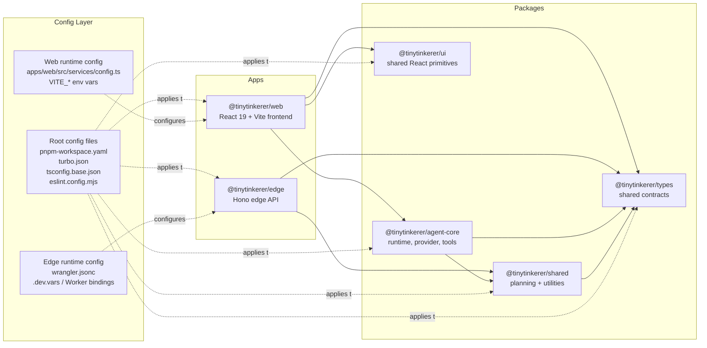
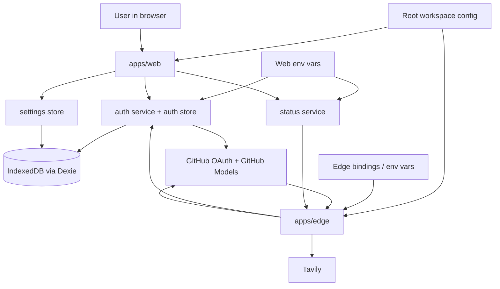

<!--
This architecture document reflects the current implementation. This markdown file will reflect desired future architecture.
If changes affecting the architecture are made docs/ARCHITECTURE.md should be updated.
Do NOT delete above lines.
-->

# Architecture

TinyTinkerer is a pnpm/turbo monorepo with two runnable apps and four shared packages. The browser app owns the user experience and most of the orchestration. The edge app is a thin, stateless proxy for OAuth, web search, health checks, and GitHub Models access.

## Monorepo Map

## Big Picture

- `apps/web` is the primary application. It renders the chat UI, stores settings and history in IndexedDB, manages OAuth state, and runs the agent runtime in the browser.
- `apps/edge` is a stateless backend. It exposes `/health`, `/auth/github/exchange`, `/api/search`, and `/api/models/chat`.
- `packages/agent-core` contains the agent loop: plan, optional tool execution, synthesis, event streaming, and rate-limit handling.
- `packages/shared` contains pure utilities used across runtime boundaries, including local plan inference, timeout helpers, and retry-after parsing.
- `packages/types` defines the contracts both apps use, especially chat events, execution plans, service status, and search results.
- `packages/ui` provides reusable React UI primitives. Today it is consumed by `apps/web`.

### What each layer contributes

- The web app builds conversation history from prior persisted events and passes that history into `AgentRuntime`.
- `AgentRuntime` emits typed `ChatEvent` objects for planning, execution, tool usage, errors, rate limits, and final assistant output.
- `GitHubModelsProvider.plan()` is local and deterministic. It uses `inferPlan()` from `@tinytinkerer/shared` instead of calling a remote planner.
- Tool execution is opt-in. The web app enables the `web-search` tool based on user settings, then `ToolRegistry` routes the call.
- The edge app normalizes third-party responses so the browser only deals with the repo's own contracts.

## Responsibilities By Component

| Component | Primary responsibility | Depends on | Key outputs |
| --- | --- | --- | --- |
| `apps/web` | User interface, local state, persistence, runtime orchestration | `agent-core`, `types`, `ui` | Rendered chat, persisted events/preferences, OAuth token usage |
| `apps/edge` | External service boundary and API normalization | `shared`, `types` | Health status, OAuth token exchange, search results, model proxy responses |
| `packages/agent-core` | Agent loop and provider/tool abstractions | `shared`, `types` | `ChatEvent` stream |
| `packages/shared` | Pure shared logic and helpers | `types` | Plans, timeout behavior, retry-after parsing |
| `packages/types` | Shared contracts | none | Stable cross-app TypeScript types |
| `packages/ui` | Shared UI primitives | React peer dependency | Reusable components such as `Button` |
| Config layer | Build, lint, typecheck, env wiring | root files + app-local config | Consistent workspace behavior and runtime endpoints |

## Browser-Side State And Persistence

- `apps/web` uses Zustand stores for chat state, auth state, and settings state.
- Dexie-backed IndexedDB stores:
  - conversations
  - persisted chat events
  - preferences such as GitHub token, selected model, search toggle, and rate-limit cooldown
- Streaming `assistant.chunk` events are intentionally not persisted. The store accumulates them in memory and only persists the terminal events such as `assistant.done`.
- This design keeps the edge backend stateless while still preserving conversation history locally.

## Auth, Config, And Status

### Config boundaries

- Root config is shared through `pnpm-workspace.yaml`, `turbo.json`, `tsconfig.base.json`, and `eslint.config.mjs`.
- Web runtime config is local to `apps/web`, mainly `VITE_EDGE_URL`, `VITE_GITHUB_CLIENT_ID`, and `VITE_GITHUB_REDIRECT_URI`.
- Edge runtime config is local to `apps/edge`, mainly `GITHUB_CLIENT_ID`, `GITHUB_CLIENT_SECRET`, `TAVILY_API_KEY`, `ALLOWED_ORIGIN`, and `GITHUB_MODELS_URL`.

### Auth and health behavior

- GitHub sign-in starts in the browser, but code exchange happens through the edge endpoint so the client secret never lives in the web app.
- The GitHub access token is stored in browser preferences and attached by `GitHubModelsProvider` when calling `/api/models/chat`.
- `/health` reports whether OAuth and search are configured, which lets the web UI show degraded vs ready states without guessing.
- If search is not configured, edge returns a mock fallback result. If a GitHub token is missing, the runtime falls back to local mock synthesis.

## Shared Contracts

`@tinytinkerer/types` is the spine that keeps `web`, `edge`, and `agent-core` aligned.

- `ChatEvent` defines the event protocol used by the runtime and rendered by the UI.
- `ExecutionPlan` and `PlanStep` define how local planning feeds execution.
- `SystemStatus` defines the health payload returned by edge and consumed by the web app.
- `SearchResult` defines the normalized search shape returned from edge and tool execution.

Without this package, the web app, edge app, and agent runtime would each need their own copies of the same payload definitions.
