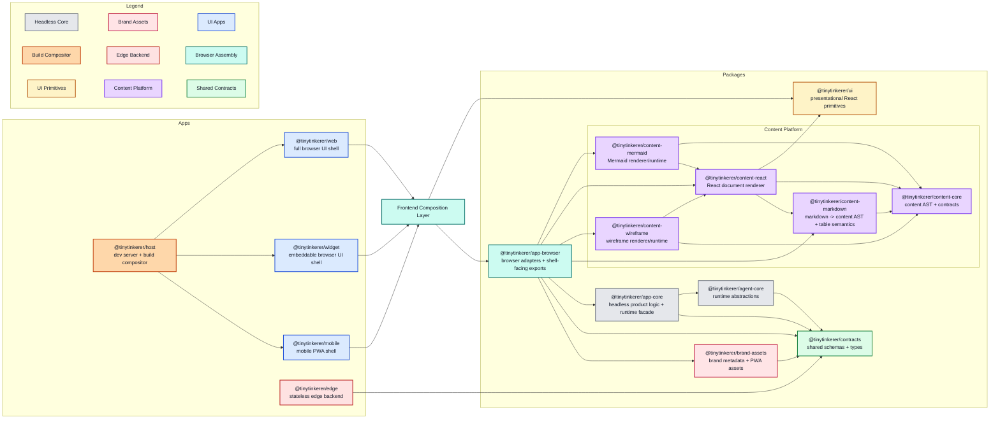

<!--
This architecture document reflects the current implementation. This markdown file will reflect desired future architecture.
If changes affecting the architecture are made docs/ARCHITECTURE.md should be updated.
Do NOT delete above lines.
-->

# Architecture

This document describes the current TinyTinkerer architecture as it exists in the repo today. The frontend is split into three thin shells, a host-owned compositor, a shared browser composition package, and a dedicated assistant-content platform.

See also:
- [content-platform.md](./content-platform.md)
- [packages-concept.md](./packages-concept.md)
- [ui-ux-concept.md](./ui-ux-concept.md)

## Route Model

The deployed and local host serves four frontend entrypoints:

- `/` renders the host-owned composite workspace.
- `/web/` renders the full web shell.
- `/mobile/` renders the mobile shell.
- `/widget/` renders the standalone widget shell.

The root compositor is not a fourth app. It is a thin host page that embeds the real shells:

- web on the left
- mobile on the right in a device-style frame
- widget as a floating movable window

`/health`, `/api/*`, and `/auth/github/exchange` are still shared edge-facing routes and are proxied through the host in dev.

## Monorepo Map

## Design Principles

- Apps stay thin. `web`, `mobile`, and `widget` own routes, page composition, shell layout, and shell-specific UX, but not shared product behavior.
- Shared product behavior stays headless where possible. Core orchestration, projections, and runtime policies live in packages that do not depend on React or browser APIs.
- Shared browser-shell behavior has a single boundary. Browser-specific adapters, shell-facing React hooks and components, OAuth helpers, and shared browser styles live in `@tinytinkerer/app-browser`.
- Contracts are the wire source of truth. Shared request, response, event, and payload schemas live in `@tinytinkerer/contracts`.
- Rich assistant content is a dedicated subsystem. Markdown parsing, AST handling, and specialized renderers live in the content platform, not in apps and not in `ui`.

## Layers

| Layer | Purpose | Owns | Must not own |
| --- | --- | --- | --- |
| `apps/host` | frontend composition infrastructure | dev routing, build composition, root compositor page | shared runtime logic, app feature code |
| `apps/web` | full browser shell | routes, page composition, shell-local layout | copied shared runtime logic, direct lower-layer imports |
| `apps/widget` | embeddable browser shell | host integration, compact layout, widget window UX | copied shared runtime logic, direct lower-layer imports |
| `apps/mobile` | mobile browser shell | PWA shell, install affordances, narrow-screen layout | copied shared runtime logic, direct lower-layer imports |
| `apps/edge` | stateless backend boundary | HTTP endpoints, upstream normalization, transport concerns | browser APIs, UI logic |
| `packages/contracts` | shared wire contracts | schemas and DTOs | runtime orchestration, UI code |
| `packages/agent-core` | product-agnostic runtime abstractions | provider/tool abstractions, runtime mechanics | browser code, app-specific behavior |
| `packages/app-core` | headless product behavior | chat/auth/settings orchestration, projections, ports | React, browser APIs, fetch, storage adapters |
| `packages/app-browser` | shared browser composition boundary | browser adapters, shell bootstrap config, OAuth helpers, shell-facing hooks and components, shared browser styles | app-specific layout, app-owned screens |
| `packages/brand-assets` | shared brand metadata | favicon, icon, manifest, and theme definitions | DOM mutation, app bootstrapping |
| `packages/ui` | presentational primitives | buttons, icons, tiny visual atoms, styling helpers | feature runtimes, orchestration |
| `packages/content-*` | shared content platform | content AST, markdown parsing, default renderers, specialized content runtimes | app shells, transport contracts |

## Dependency Rules

- Browser apps (`web`, `widget`, `mobile`) may depend only on `@tinytinkerer/app-browser`, `@tinytinkerer/ui`, and their own local modules.
- Browser apps must not import `contracts`, `app-core`, `agent-core`, or any `content-*` package directly.
- `app-browser` may depend on `app-core`, `content-*`, `brand-assets`, and `contracts`. It is the browser-facing composition boundary for shared frontend behavior.
- `brand-assets` may depend on `contracts` and nothing else.
- `content-core` must not depend on other workspace packages.
- `content-markdown` may depend only on `content-core`.
- `content-react` may depend only on `content-core`, `content-markdown`, and `ui`.
- `content-mermaid` and `content-wireframe` may depend only on `content-core` and `content-react`.
- `ui` must stay primitive-only.
- `app-core` may depend only on `agent-core`, `contracts`, and app-core-local modules.
- `agent-core` may depend only on `contracts` and agent-core-local modules.
- `edge` may depend only on `contracts` and edge-local modules.
- `host` must not declare workspace dependencies on other apps. It composes the built or dev-served apps by path, not by module import.

## Contracts And Data Flow

`@tinytinkerer/contracts` is the shared source of truth for:

- agent event schemas and types such as `ChatEvent`
- planning schemas such as `ExecutionPlan` and `PlanStep`
- edge DTOs such as `/health`, `/auth/github/exchange`, `/api/search`, and `/api/models/chat`
- rate-limit payloads shared between backend and browser layers

The current flow is:

1. A browser shell renders app-local layout and routes.
2. The shell consumes shared browser behavior from `@tinytinkerer/app-browser`.
3. `@tinytinkerer/app-browser` composes browser-backed implementations on top of `@tinytinkerer/app-core`.
4. `@tinytinkerer/app-core` orchestrates product behavior through ports and runtime abstractions.
5. `@tinytinkerer/agent-core` executes the agent runtime using product-agnostic abstractions.
6. Assistant markdown is parsed and rendered inside the `app-browser` boundary through `content-markdown`, `content-react`, `content-mermaid`, and `content-wireframe`.
7. `@tinytinkerer/edge` exposes stateless endpoints and returns payloads that conform to `contracts`.

## Browser App Model

All three browser shells consume the same browser-facing shared layer.

`@tinytinkerer/app-browser` currently owns:

- browser app creation and provider wiring
- shell bootstrap config resolution
- OAuth start and callback helpers
- shell-facing chat and settings controllers
- shared browser settings modal
- shared browser stylesheet
- `AssistantContent`

The apps still own:

- routes
- page structure
- shell layout
- app-local copy
- shell-specific affordances such as install UX, widget window controls, and root-page embedding

This means TinyTinkerer has two different kinds of sharing:

- `app-core` stays headless
- `app-browser` is allowed to expose React hooks and components when that is the correct browser-shell reuse boundary

## Host Model

`apps/host` is both the local dev environment and the composed deployment surface for the frontends.

It is allowed to own:

- the root `/` compositor page
- iframe composition of the three real shells
- dev proxying and static asset composition
- host-local widget layout persistence for the composite workspace

It must not own:

- chat, auth, settings, or content feature logic
- app-to-app shared runtime code
- a second implementation of the browser shell

## Content Platform

- `content-markdown` parses markdown into an internal `ContentDocument` and owns table markup plus table-to-markdown serialization.
- `content-react` renders general nodes such as markdown, code blocks, and images, and owns shared content chrome such as copy and preview/code controls.
- `content-mermaid` and `content-wireframe` isolate specialized rendering behavior and fallback policy.
- Heavy specialized runtimes stay lazy so they do not bloat eager browser entry bundles.
- The content AST stays internal to the content platform in this phase; `contracts` still expose assistant output as strings.
