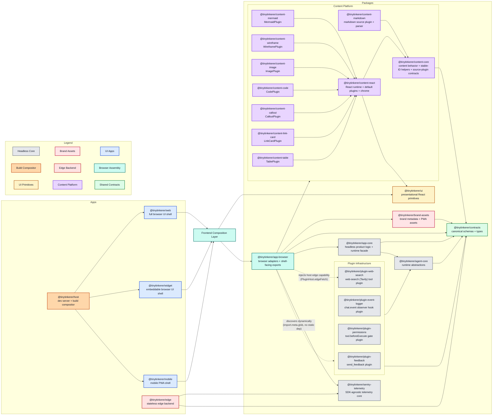

<!--
This architecture document reflects the current implementation. This markdown file will reflect desired future architecture.
If changes affecting the architecture are made docs/ARCHITECTURE.md should be updated.
Do NOT delete above lines.
-->

# Architecture

This document describes the current TinyTinkerer architecture as it exists in the repo today. The frontend is split into three thin shells, a host-owned compositor, a shared browser composition package, and a dedicated assistant-content platform.

See also:
- [content-platform.md](./content-platform.md)
- [packages-concept.md](./packages-concept.md)
- [ui-ux-concept.md](./ui-ux-concept.md)
- [mcp-integration.md](./mcp-integration.md)
- [sentry-telemetry.md](./sentry-telemetry.md)
- [plugin-infrastructure.md](./plugin-infrastructure.md)

## Route Model

The deployed and local host serves four frontend entrypoints:

- `/` renders the host-owned composite workspace.
- `/web/` renders the full web shell.
- `/mobile/` renders the mobile shell.
- `/widget/` renders the standalone widget shell.

The root compositor is not a fourth app. It is a thin host page that embeds the real shells:

- web on the left
- mobile on the right in a device-style frame
- widget as a floating movable window

`/health`, `/api/*`, and `/auth/github/exchange` are still shared edge-facing routes and are proxied through the host in dev.

## Monorepo Map



Diagram convention: when a package consumes the content platform through its public subsystem boundary, point it at the `ContentPlatform` subgraph rather than drawing separate edges to each internal content package. Internal edges inside the subgraph still describe package-to-package relationships within that subsystem.

## Design Principles

- Apps stay thin. `web`, `mobile`, and `widget` own routes, page composition, shell layout, and shell-specific UX, but not shared product behavior.
- Shared product behavior stays headless where possible. Core orchestration, projections, and runtime policies live in packages that do not depend on React or browser APIs.
- Shared browser-shell behavior has a single boundary. Browser-specific adapters, shell-facing React hooks and components, OAuth helpers, and shared browser styles live in `@tinytinkerer/app-browser`.
- Error telemetry has an SDK-agnostic core. Fetch wrappers (`fetchWithTelemetry`), request
  sanitization, the PII scrubbers, and the capture-sink indirection live in
  `@tinytinkerer/sentry-telemetry`, shared by both the browser shells and the edge backend
  (which use different Sentry SDKs). The package carries no Sentry SDK runtime dependency; each
  runtime keeps its own `Sentry.init`/`withSentry` and registers a capture sink.
  `@tinytinkerer/app-browser` remains the browser-facing facade and re-exports the request
  telemetry surface, so the thin app shells never touch telemetry directly. See
  [sentry-telemetry.md](./sentry-telemetry.md).
- Contracts are the foundational shared schema and type source of truth. Shared request, response, event, payload, and canonical content-model schemas live in `@tinytinkerer/contracts`.
- Rich assistant content is a dedicated subsystem. Markdown parsing, AST handling, and specialized renderers live in the content platform, not in apps and not in `ui`.

## Coding Conventions

These conventions are load-bearing. Several of them are enforced by `pnpm -r lint` and `pnpm -r typecheck` in CI — see the **Enforcement** subsection.

### TypeScript strictness

`config/tsconfig.base.json` enables `strict`, `exactOptionalPropertyTypes`, and `noUncheckedIndexedAccess` for every package. **Never weaken these.** They catch real bugs and shape the type contracts below.

### Optional properties

Write `id?: NodeId`, not `id?: NodeId | undefined`. Under `exactOptionalPropertyTypes` these mean different things:

- `id?: NodeId` — the property is either missing or holds a `NodeId`. An explicit `{ id: undefined }` is rejected.
- `id?: NodeId | undefined` — the property may also be present with an explicit `undefined`. This is wider and is almost always wrong as a contract.

### Zod schemas are the source of truth — with one carve-out

For non-recursive schemas, infer types with `z.infer<typeof xSchema>`. Do not declare a parallel type by hand.

```ts
export const planStepSchema = z.object({ id: z.string(), summary: z.string() })
export type PlanStep = z.infer<typeof planStepSchema>
```

For **recursive discriminated unions** (AST nodes in `packages/contracts/src/content.ts`), TypeScript cannot infer the union type when one variant references the union itself — `z.infer` produces `circularly references itself in mapped type` errors even with the official Zod 4 getter pattern. The convention there is:

1. Declare the node shape as an `interface NodeBase { … }` plus a strict `interface XNode extends NodeBase { … }` per variant. Optional properties use `?: T`, structural array fields use `readonly T[]`.
2. Build the schema with `z.lazy(() => …)` for the recursive references and `z.discriminatedUnion('type', […])` for the union.
3. Bridge schema → interface with `as unknown as z.ZodType<XNode>` on the recursive schema. Runtime parsing is unchanged; the cast just converts Zod's `T | undefined`-flavored output of `.optional()` into the strict `?: T` shape under `exactOptionalPropertyTypes`.

This carve-out applies **only** to recursive discriminated unions. Plain objects, atomic schemas (`NodeId`, `TableAlignment`), and the top-level `ContentDocument` all use `z.infer` directly.

### Reusable bases over duplication

If multiple schemas share a common shape, factor it out:

- `nodeBaseShape` (and the corresponding `NodeBase` interface) in `content.ts` carries the shared `id?: NodeId` field that every AST node spreads in.
- `rateLimitDetailFields` in `contracts/src/index.ts` carries the shared `retryAfterMs` + `retryAt` fields spread into every rate-limit schema.
- `eventBaseSchema(type, payload)` in `contracts/src/index.ts` is the factory for every `ChatEvent` variant.

Prefer extending or spreading a shared base over copy-pasting a field block in each schema.

### Readonly-friendly node types

Structural array fields on AST node types are `readonly`:

- `ContentDocument.nodes`, `*.children`, `TableNode.align / header / rows`, `ChoicePromptNode.choices`, `TableCell`.

Consumers may still build fresh `T[]` arrays via `.map()` / `.flatMap()` and assign them to readonly fields — TS allows the narrowing direction. Object fields themselves stay mutable so parsers can do `item.checked = …` style post-init assignment. Helpers that walk these arrays must accept `readonly T[]` in their parameter types (`serializeInlineNodes`, `normalizeInlineNodes`, `renderInline`, `inlineNodesToText`).

## Layers

| Layer | Purpose | Owns | Must not own |
| --- | --- | --- | --- |
| `apps/host` | frontend composition infrastructure | dev routing, build composition, root compositor page | shared runtime logic, app feature code |
| `apps/web` | full browser shell | routes, page composition, shell-local layout | copied shared runtime logic, direct lower-layer imports |
| `apps/widget` | embeddable browser shell | host integration, compact layout, widget window UX | copied shared runtime logic, direct lower-layer imports |
| `apps/mobile` | mobile browser shell | PWA shell, install affordances, narrow-screen layout | copied shared runtime logic, direct lower-layer imports |
| `apps/edge` | stateless backend boundary | HTTP endpoints, upstream normalization, transport concerns | browser APIs, UI logic |
| `packages/contracts` | foundational shared schemas and types | Zod schemas, inferred types, canonical content model, DTOs | runtime orchestration, UI code |
| `packages/agent-core` | product-agnostic runtime abstractions | provider/tool abstractions, runtime mechanics, the plugin contract + registry | browser code, app-specific behavior |
| `packages/plugins/*` | optional plugin packages | one plugin's tools and/or hooks + UI manifest over the agent-core plugin contract (e.g. `plugin-feedback`, `plugin-event-logger`, `plugin-permissions`, `plugin-web-search`) | browser APIs, telemetry SDKs, app-specific UI |
| `packages/app-core` | headless product behavior | chat/auth/settings orchestration, projections, ports | React, browser APIs, fetch, storage adapters |
| `packages/app-browser` | shared browser composition boundary | browser adapters, shell bootstrap config, OAuth helpers, shell-facing hooks and components, shared browser styles | app-specific layout, app-owned screens |
| `packages/brand-assets` | shared brand metadata | favicon, icon, manifest, and theme definitions | DOM mutation, app bootstrapping |
| `packages/sentry-telemetry` | SDK-agnostic error-telemetry core | PII scrubbers, `fetchWithTelemetry` + request-failure capture, the `accept` mechanism, the capture-sink indirection | a Sentry SDK runtime dependency, consent UI, runtime `Sentry.init`/`withSentry` |
| `packages/ui` | presentational primitives | buttons, icons, tiny visual atoms, styling helpers | feature runtimes, orchestration |
| `packages/content-*` | shared content platform | content behavior over the canonical content model, stable IDs, source-plugin contracts, React runtime + chrome, markdown parsing, specialized content plugins | app shells, transport orchestration |

## Dependency Rules

- Browser apps (`web`, `widget`, `mobile`) may depend only on `@tinytinkerer/app-browser`, `@tinytinkerer/ui`, and their own local modules.
- Browser apps must not import `contracts`, `app-core`, `agent-core`, or any `content-*` package directly.
- `app-browser` may depend on `app-core`, `brand-assets`, `contracts`, `sentry-telemetry`, `content-react`, and the outward-facing content packages (`content-markdown`, `content-mermaid`, `content-wireframe`, `content-image`, `content-code`, `content-callout`, `content-link-card`, `content-table`). It must **not** statically depend on any concrete plugin package — plugins are discovered dynamically via `import.meta.glob` over `packages/plugins/*` (see [plugin-infrastructure.md](./plugin-infrastructure.md)).
- `brand-assets` may depend on `contracts` and nothing else.
- `sentry-telemetry` is a leaf: it may depend only on `@sentry/core` (external, types only) and its own local modules.
- `content-core` may depend only on `contracts` and local modules.
- `content-react` may depend only on `content-core`, `ui`, and local modules. It owns the React runtime and re-exports the content-core symbols downstream content packages need.
- `content-markdown` may depend only on `content-core` and local modules. It is a source-plugin package, not a rendering facade.
- `content-mermaid`, `content-wireframe`, `content-image`, `content-code`, `content-callout`, `content-link-card`, and `content-table` may depend only on `content-react` and local modules.
- `contracts` may depend only on local modules.
- `ui` must stay primitive-only.
- `app-core` may depend only on `agent-core`, `contracts`, and app-core-local modules.
- `agent-core` may depend only on `contracts` and agent-core-local modules.
- `packages/plugins/*` packages (`plugin-feedback`, `plugin-event-logger`, `plugin-permissions`, `plugin-web-search`, and future ones) may depend only on `agent-core`, `contracts`, and plugin-local modules, and must stay product-agnostic (no browser APIs, React, or telemetry imports). Each exports the `PluginModule` contract (`manifest` + `createPlugin`) so the host can discover it dynamically. A plugin that needs a host-only capability (telemetry capture, a human-in-the-loop permission prompt, or an edge request) receives it as an injected function on `PluginHost` rather than importing it — see [plugin-infrastructure.md](./plugin-infrastructure.md).
- `app-browser` discovers plugins dynamically (no static plugin dependency), wiring the `PluginHost` capabilities (the capture sink to telemetry, the permission prompt to the confirmation modal, and the edge capability to its `edgeFetch`) and surfacing their activation toggles from the discovered manifests. Every plugin — including `plugin-web-search` — is activated uniformly through the generic plugin-activation list; a plugin whose manifest sets `defaultEnabled: true` (web search) ships on out-of-the-box, and an explicit user toggle always wins.
- `edge` may depend only on `contracts`, `sentry-telemetry`, and edge-local modules.
- `host` must not declare workspace dependencies on other apps. It composes the built or dev-served apps by path, not by module import.

## Contracts And Data Flow

`@tinytinkerer/contracts` is the shared source of truth for:

- agent event schemas and types such as `ChatEvent`
- planning schemas such as `ExecutionPlan` and `PlanStep`
- edge DTOs such as `/health`, `/auth/github/exchange`, `/api/search`, and `/api/models/chat`
- rate-limit payloads shared between backend and browser layers
- the canonical content document schemas and node types shared with the content platform

The current flow is:

1. A browser shell renders app-local layout and routes.
2. The shell consumes shared browser behavior from `@tinytinkerer/app-browser`.
3. `@tinytinkerer/app-browser` composes browser-backed implementations on top of `@tinytinkerer/app-core`.
4. `@tinytinkerer/app-core` orchestrates product behavior through ports and runtime abstractions.
5. `@tinytinkerer/agent-core` executes the agent runtime using product-agnostic abstractions.
6. Assistant synthesis still arrives from the model provider as markdown text, but `app-browser` now creates a markdown content session through `content-markdown` and emits structured assistant events with `{ source, content }`, where `content` is the shared semantic `ContentDocument` shape from `contracts`.
7. `AssistantContent` in `app-browser` passes that document directly to `content-react`, applies the specialized Mermaid and wireframe plugins, and renders through the content platform.
8. `@tinytinkerer/edge` exposes stateless endpoints and returns payloads that conform to `contracts`.

## Browser App Model

All three browser shells consume the same browser-facing shared layer.

`@tinytinkerer/app-browser` currently owns:

- browser app creation and provider wiring
- shell bootstrap config resolution
- OAuth start and callback helpers
- shell-facing chat and settings controllers
- shared browser settings modal
- shared browser stylesheet
- `AssistantContent` for structured assistant content DTOs

The apps still own:

- routes
- page structure
- shell layout
- app-local copy
- shell-specific affordances such as install UX, widget window controls, and root-page embedding

This means TinyTinkerer has two different kinds of sharing:

- `app-core` stays headless
- `app-browser` is allowed to expose React hooks and components when that is the correct browser-shell reuse boundary

## Host Model

`apps/host` is both the local dev environment and the composed deployment surface for the frontends.

It is allowed to own:

- the root `/` compositor page
- iframe composition of the three real shells
- dev proxying and static asset composition
- host-local widget layout persistence for the composite workspace

It must not own:

- chat, auth, settings, or content feature logic
- app-to-app shared runtime code
- a second implementation of the browser shell

## Content Platform

- `content-core` owns content behavior over the canonical shared content model: stable identity helpers (`computeNodeId`, `assignNodeIds`), serialization used for normalization, and source-plugin contracts. The block + inline node types now come from `contracts`.
- `content-markdown` parses markdown into the semantic `ContentDocument`, emits Mermaid and wireframe fences as `codeBlock` nodes with specialized `language` values, and provides `markdownSourcePlugin` plus `createMarkdownContentSession()` for parser-side streaming snapshots.
- `content-react` provides the React `ContentRuntime<TResult>` implementation and the `NodeRendererPlugin` contract, the default React plugins (paragraph, heading, list, blockquote, thematicBreak, codeBlock — image and table are no longer defaults; they live in `content-image` / `content-table`), the inline renderer (exported as `renderInline`), and the shared chrome (`PreviewCodeFrame`, `CodeBlockFallback`, `useCopyButtonState`, `tableToMarkdown`). `ContentDocumentContent` normalizes hand-built documents through `assignNodeIds()`, accepts an optional `renderOptions: ContentRenderOptions` ({ codeBlockPersistenceScopeId?, showCodeBlockFullscreenButton? }) surfaced to plugins via `useContentRenderOptions()`, and threads `isStreaming` through `RenderContext` so plugins can adapt their behavior during streaming turns. `ContentDocumentRenderer` renders canonical documents with Suspense plus a render error boundary around runtime-managed node preparation.
- `content-mermaid` and `content-wireframe` export singleton convenience plugins plus `createMermaidPlugin()` / `createWireframePlugin()` factory helpers for runtime-scoped plugin instances. Mermaid still ships its heavy runtime as a separately code-split chunk loaded on first use.
- `content-image`, `content-code`, `content-callout`, `content-link-card`, and `content-table` follow the same renderer-plugin shape and each export a `create*Plugin()` factory plus a singleton plugin. `content-image` and `content-table` replace the previous `core:image` / `core:table` defaults in `content-react`; `content-callout` and `content-link-card` are gated by `matches(node)` predicates (blockquote `[!NOTE]`-style markers and single-link paragraphs respectively); `content-code` is the canonical editable renderer for every non-specialized `codeBlock` (including unlanguaged fences) — it builds on CodeMirror 6 (`basicSetup` + per-language extensions, with `@codemirror/legacy-modes` for shell/bash, HTTP, and diff), exposes Copy + optional Fullscreen buttons, and persists user edits per `(turnId, node.id)` in `localStorage` once the turn is no longer streaming. The CodeMirror runtime is split into a `codemirror-vendor` chunk in each app's vite build.
- `contracts` own the canonical content document schemas and types directly. The schema is recursive (block ↔ list-item via `z.lazy`), uses a discriminated union on `type`, and bridges schema → interface with a single `as z.ZodType<…>` cast per recursive schema (see the [Coding Conventions](#coding-conventions) section for why).
