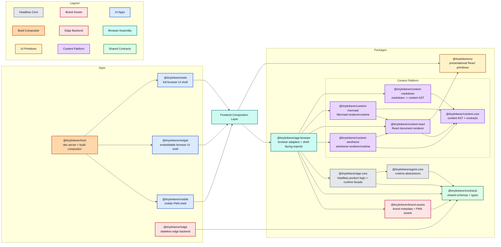

<!--
This architecture document reflects the current implementation. This markdown file will reflect desired future architecture.
If changes affecting the architecture are made docs/ARCHITECTURE.md should be updated.
Do NOT delete above lines.
-->

# Architecture

This document describes the current target architecture for TinyTinkerer. UI apps stay thin, shared product behavior stays headless, browser-specific concerns live behind `@tinytinkerer/app-browser`, and rich assistant content is handled by a dedicated content platform.

See also:
- [content-platform.md](./content-platform.md)
- [packages-concept.md](./packages-concept.md)
- [ui-ux-concept.md](./ui-ux-concept.md)

## Monorepo Map

## Design Principles

- Apps stay thin. `web`, `widget`, and `mobile` own routes, screens, layout, install or embedding concerns, and final UI composition, but not shared product behavior or shared assistant-content runtime wiring.
- Shared product behavior is headless. Reusable orchestration, projections, and use-case logic live in packages that do not depend on React or browser APIs.
- Browser-specific code is isolated. Fetch clients, OAuth browser flows, IndexedDB, session storage, and similar concerns live behind `@tinytinkerer/app-browser`.
- Contracts are the wire source of truth. Shared request, response, event, and payload schemas live in `@tinytinkerer/contracts` and are reused by clients, the edge app, and runtime layers.
- Shared content behavior is extracted early. If assistant-content parsing or rendering is non-trivial and reused across shells, it belongs in the content platform instead of being reimplemented in apps or pushed into `ui`.

## Target Layers

| Layer | Purpose | Owns | Must not own |
| --- | --- | --- | --- |
| `apps/web` | Full browser shell | routes, page composition, shell-local layout | shared runtime logic, direct lower-layer imports |
| `apps/widget` | Embeddable browser shell | host integration, compact layout, widget UX | copied feature runtimes, direct lower-layer imports |
| `apps/mobile` | Mobile browser shell | PWA shell, install affordances, mobile layout | copied feature runtimes, direct lower-layer imports |
| `apps/edge` | Stateless backend boundary | HTTP endpoints, upstream normalization, transport concerns | browser APIs, UI logic |
| `packages/contracts` | Shared wire contracts | schemas and DTOs | runtime orchestration, UI code |
| `packages/agent-core` | Product-agnostic runtime abstractions | provider/tool abstractions, runtime mechanics | browser code, app-specific behavior |
| `packages/app-core` | Headless product behavior | chat/auth/settings orchestration, projections, ports | React, browser APIs, fetch, storage adapters |
| `packages/app-browser` | Shared browser composition boundary | OAuth/browser storage adapters, runtime assembly, shell-facing exports including assistant content | app-specific layout, page composition |
| `packages/brand-assets` | Shared brand metadata | favicon/manifest/theme definitions | DOM mutation, app bootstrapping |
| `packages/ui` | Presentational primitives | buttons and simple reusable visual building blocks | feature runtimes, orchestration |
| `packages/content-*` | Shared content platform | content AST, markdown parsing, default renderers, specialized content runtimes | app shells, transport contracts |

## Dependency Rules

- Browser apps (`web`, `widget`, `mobile`) may depend only on `@tinytinkerer/app-browser`, `@tinytinkerer/ui`, and their own local modules.
- Browser apps must not import `contracts`, `app-core`, `agent-core`, or any `content-*` package directly.
- `app-browser` may depend on `app-core`, `content-*` packages, `brand-assets`, and `contracts`. It is the only browser-facing composition boundary for shared runtime and shared assistant-content rendering.
- `brand-assets` may depend on `contracts` and nothing else.
- `content-core` must not depend on other workspace packages.
- `content-markdown` may depend only on `content-core`.
- `content-react` may depend only on `content-core` and `ui`.
- `content-mermaid` and `content-wireframe` may depend only on `content-core` and `content-react`.
- `ui` must stay primitive-only.
- `app-core` may depend only on `agent-core`, `contracts`, and app-core-local modules.
- `agent-core` may depend only on `contracts` and agent-core-local modules.
- `edge` may depend only on `contracts` and edge-local modules.
- `host` must not declare workspace dependencies on other apps. Path resolution for build composition uses relative filesystem paths, not module imports.

## Contracts and Data Flow

`@tinytinkerer/contracts` is the shared source of truth for:

- agent event schemas and types such as `ChatEvent`
- planning schemas such as `ExecutionPlan` and `PlanStep`
- edge DTOs such as `/health`, `/auth/github/exchange`, `/api/search`, and `/api/models/chat`
- rate-limit payloads shared between backend and browser layers

The current intended flow is:

1. A browser app renders the shell and binds user interaction through the frontend composition layer.
2. `@tinytinkerer/app-browser` supplies browser-backed implementations, shell-facing exports, and shared browser/runtime composition.
3. `@tinytinkerer/app-core` orchestrates product behavior through ports and runtime abstractions behind `app-browser`.
4. `@tinytinkerer/agent-core` executes the agent runtime using product-agnostic abstractions.
5. `@tinytinkerer/content-markdown` and `@tinytinkerer/content-react` transform assistant markdown into rendered content inside the `app-browser` composition boundary, with specialized rendering delegated to `content-mermaid` and `content-wireframe`.
6. `@tinytinkerer/edge` exposes stateless endpoints and returns payloads that conform to `contracts`.

## Browser App Model

- `web`, `widget`, and `mobile` all consume shared runtime state and browser integrations through `@tinytinkerer/app-browser`.
- Assistant output remains a raw markdown string at the transport boundary in this phase.
- `app-browser` parses and renders assistant output through the content platform and exposes a narrow shell-facing `AssistantContent` component.
- Apps still decide where assistant content appears, how it is spaced, and what shell-local affordances surround it.
- `apps/host` remains composition infrastructure, not a browser shell.

## Content Platform

- `content-markdown` parses markdown into an internal `ContentDocument`.
- `content-react` renders general nodes such as markdown, code blocks, tables, and images.
- `content-mermaid` and `content-wireframe` isolate specialized rendering behavior and fallback policy.
- Heavy specialized runtimes stay lazy so they do not bloat eager browser entry bundles.
- The content AST stays internal to the content platform in this phase; `contracts` still expose assistant output as strings.
