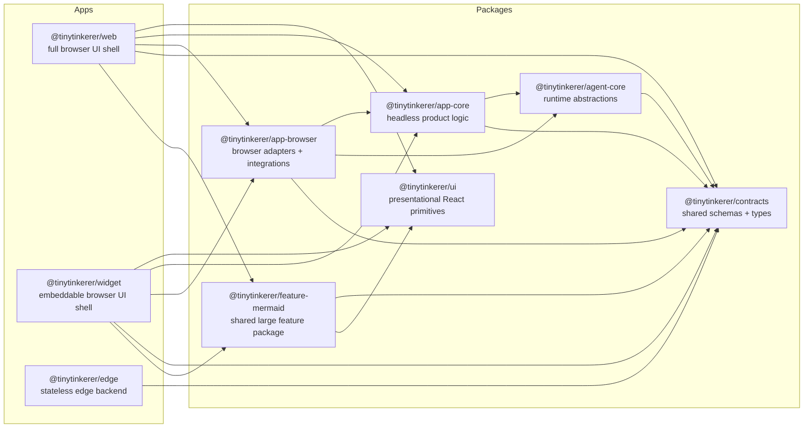

<!--
This architecture document reflects the current implementation. This markdown file will reflect desired future architecture.
If changes affecting the architecture are made docs/ARCHITECTURE.md should be updated.
Do NOT delete above lines.
-->

# Architecture

This document describes the desired future architecture for TinyTinkerer. The goal is a monorepo where UI apps are thin shells, shared behavior is headless and reusable, browser-specific concerns live behind adapters, and large shared features are extracted before they are duplicated.

See also:
- [packages-concept.md](./packages-concept.md) for detailed package boundaries
- [PLAN.md](./PLAN.md) for the migration roadmap

## Monorepo Map

## Design Principles

- Apps stay thin. `apps/web` and `apps/widget` own routes, screens, layout, embedding concerns, and final UI composition, but not shared product behavior.
- Shared product behavior is headless. Reusable orchestration, projections, and use-case logic live in packages that do not depend on React or browser APIs.
- Browser-specific code is isolated. Fetch clients, OAuth browser flows, IndexedDB, session storage, and similar concerns live in browser adapter packages.
- Contracts are the wire source of truth. Shared request, response, event, and payload schemas live in a single contracts package and are reused by clients, the edge app, and runtime layers.
- Large shared features are extracted early. If a feature is non-trivial and reused across apps, it becomes a dedicated package instead of being implemented twice.

## Target Layers

| Layer | Purpose | Owns | Must not own |
| --- | --- | --- | --- |
| `apps/web` | Full browser application shell | routes, screens, layout, app-local composition, final presentation | shared business logic, provider wiring, storage implementation details |
| `apps/widget` | Embeddable browser application shell | host integration, compact layout, widget-specific composition | copied web behavior, duplicated feature runtimes |
| `apps/edge` | Stateless backend boundary | HTTP endpoints, upstream normalization, transport concerns | browser APIs, UI logic, app-local state |
| `packages/contracts` | Shared schemas and types | agent event contracts, planning contracts, edge DTOs, rate-limit payloads | fetch logic, runtime orchestration, UI components |
| `packages/agent-core` | Product-agnostic runtime abstractions | `AgentRuntime`, tool registry, provider interfaces, rate-limit runtime behavior | GitHub-specific providers, app-specific tools, browser code |
| `packages/app-core` | Headless product behavior | chat/auth/settings orchestration, projections, feature policies, ports | React, Zustand, Dexie, fetch, `window`, `sessionStorage` |
| `packages/app-browser` | Shared browser adapters | IndexedDB repositories, OAuth state handling, edge clients, provider/tool wiring, shell config | app-specific layout and page composition |
| `packages/ui` | Presentational React primitives | buttons, simple shared visual building blocks, styling helpers | feature runtimes, orchestration, app-owned flows |
| `packages/feature-*` | Large shared features | reusable non-trivial feature logic shared by apps or layers | app shells, unrelated primitives |

## Dependency Rules

- Apps may depend on `contracts`, `agent-core`, `app-core`, `app-browser`, `ui`, and feature packages. Apps must never import from other apps.
- `packages/ui` must not import from `app-core`, `app-browser`, `agent-core`, or `apps/*`.
- `packages/app-core` may depend on `contracts` and `agent-core`, but must never use browser APIs, fetch, Dexie, session storage, React, or app-local UI code.
- `packages/app-browser` may depend on `contracts`, `agent-core`, and `app-core`, and owns browser-only adapters.
- `packages/agent-core` must stay product-agnostic. Concrete GitHub Models integrations, web-search implementations, and product planning heuristics do not belong there.
- `apps/edge` may depend on `contracts` and its own internal modules only. It must not depend on browser packages or UI packages.
- Feature packages should depend only on the layers required for the feature. They must not become a second `app-core` or a second `ui`.

## Browser App Model

The future browser architecture is built around one shared headless core and one shared browser adapter layer.

- `apps/web` and `apps/widget` both consume `packages/app-core` for shared product behavior.
- Both apps consume `packages/app-browser` for browser-specific integrations such as persistence, OAuth browser flows, fetch-based edge clients, and runtime composition.
- Both apps may consume `packages/ui` for presentational primitives, but each app remains responsible for its own shell, layout, and feature presentation.
- `packages/app-browser` is configured per shell. Different apps can vary by `edgeBaseUrl`, storage namespace, auth mode, host embedding behavior, and other shell-specific configuration without changing shared logic.
- The widget is treated as the stricter client. Shared code must assume embedding constraints, thin host-controlled surfaces, and the possibility of host-provided credentials.

## Shared Feature Extraction

When a large feature is introduced, shared behavior must be extracted before it is duplicated across UI apps.

- Feature extraction is required when a capability is non-trivial, has its own rendering or behavior pipeline, or is expected to be shared by `web` and `widget`.
- `packages/ui` is not the place for feature runtimes. It stays focused on primitives and presentational building blocks.
- Large shared features should use dedicated feature packages such as `packages/feature-mermaid`.

### Mermaid example

If both `apps/web` and `apps/widget` support Mermaid rendering:

- the shared parser/render pipeline belongs in `@tinytinkerer/feature-mermaid`
- markdown integration hooks belong in `@tinytinkerer/feature-mermaid`
- shared sanitization, lazy-loading, and rendering policy belong in `@tinytinkerer/feature-mermaid`
- app-local code only decides where Mermaid content appears and how it fits that shell's UX

This same rule applies to any large shared feature, not only Mermaid.

## Contracts and Data Flow

`packages/contracts` is the shared source of truth for:

- agent event schemas and types such as `ChatEvent`
- planning schemas such as `ExecutionPlan` and `PlanStep`
- edge DTOs such as `/health`, `/auth/github/exchange`, `/api/search`, and `/api/models/chat`
- rate-limit payloads shared between backend and browser layers

The desired flow is:

1. A UI app renders the shell and binds user interaction to `app-core`.
2. `app-core` orchestrates product behavior through ports and runtime abstractions.
3. `app-browser` supplies browser-backed implementations for persistence, auth state, edge clients, and runtime/provider wiring.
4. `agent-core` executes the agent runtime using product-agnostic abstractions.
5. `apps/edge` exposes stateless endpoints and returns payloads that conform to `contracts`.

## Current Gaps Motivating This Target

The current repository shape motivates this target architecture:

- `apps/web` currently owns too much orchestration and browser behavior.
- `packages/agent-core` currently contains product-specific integrations that should move outward.
- `packages/shared` mixes helpers with product planning concerns and should not remain a mixed-ownership bucket.
- shared contracts are not yet the runtime schema source of truth across all layers.
- there is no explicit package strategy yet for large shared features or for enforcing dependency boundaries.
