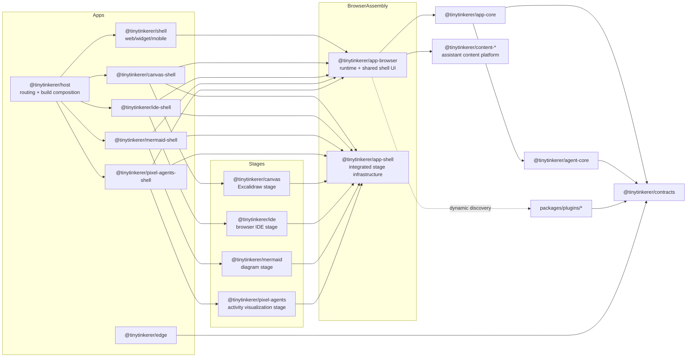

<!--
This architecture document reflects the current implementation. This markdown file will reflect desired future architecture.
If changes affecting the architecture are made docs/ARCHITECTURE.md should be updated.
Do NOT delete above lines.
-->

# Architecture

This document describes the current TinyTinkerer architecture. Browser presentations and
application workspaces share one host origin and one browser assembly layer. IDE, Mermaid, Canvas,
and Pixel Agents are integrated stages: their shell UI and assistant render in the same React
document.

See also:

- [app-shell.md](./app-shell.md)
- [content-platform.md](./content-platform.md)
- [packages-concept.md](./packages-concept.md)
- [ui-ux-concept.md](./ui-ux-concept.md)
- [mcp-integration.md](./mcp-integration.md)
- [sentry-telemetry.md](./sentry-telemetry.md)
- [plugin-infrastructure.md](./plugin-infrastructure.md)

## Route Model

The host composes production builds under one origin:

- `/` renders the single-document root app over one shared `BrowserApp`.
- `/web/`, `/widget/`, and `/mobile/` serve the one `apps/shell` build. URL-selected
  presentation descriptors choose the docked, floating, or mobile layout.
- `/canvas/` renders Excalidraw and the assistant as two dockable, in-process panels.
- `/ide/` renders the browser IDE and assistant through the same dock workspace contract.
- `/mermaid/` renders editor, sanitized preview, and assistant as three dockable panels.
- `/pixel-agents/` renders a pinned Pixel Agents office visualization and the assistant as two
  dockable panels.

Only mobile registers the `/mobile/`-scoped PWA service worker. Same-origin chat presentations
share authentication and conversation IndexedDB data. Application stages use app-owned workspace
namespaces (`tinytinkerer-canvas`, `tinytinkerer-ide`, `tinytinkerer-mermaid`, and
`tinytinkerer-pixel-agents`).

`/health`, `/api/*`, and `/auth/github/exchange` are shared edge-facing routes and are proxied by
the development host.

### Integrated application shells

Each integrated application has three deliberately small layers:

1. `apps/<app>` owns routing, app-specific loading copy, and top-level composition.
2. `packages/app/<app>` owns the trusted stage, its domain integration, and persistence.
3. `@tinytinkerer/app-shell` supplies generic controller indirection, schema-to-tool adaptation,
   IndexedDB workspace storage, assistant actions, and two/three-panel docking.

Tool-enabled stages call a stable in-process controller handle. Input and result Zod schemas remain enforced at
the controller boundary, but there is no serialized transport, secondary document, or duplicated
runtime. Passive stages may instead observe shared chat events without contributing tools. Heavy
stage code remains behind package-local lazy imports so the chat/bootstrap graph stays small.
Pixel Agents deliberately embeds its separately built third-party browser distribution in a
sandboxed (`allow-scripts`) iframe and adapts its WebSocket protocol to a `postMessage` bridge; it
does not create a second chat runtime or backend. The sandbox gives the distribution an opaque
origin, an explicit isolation boundary consistent with the rule that third-party executable content
owns one — the bridge authenticates messages by window identity, not by origin, since an opaque
origin can't be named or compared as a string. Other third-party executable content that is not
trusted still owns an explicit isolation boundary (for example Sandpack execution and the
code-execution sandbox); trusted first-party UI does not gain an iframe merely for package
separation.

See [app-shell.md](./app-shell.md) for the application-stage contract.

## Monorepo Map


```mermaid
flowchart LR
  subgraph Apps
    host["@tinytinkerer/host<br/>routing + build composition"]
    shell["@tinytinkerer/shell<br/>web/widget/mobile"]
    canvasShell["@tinytinkerer/canvas-shell"]
    ideShell["@tinytinkerer/ide-shell"]
    mermaidShell["@tinytinkerer/mermaid-shell"]
    pixelAgentsShell["@tinytinkerer/pixel-agents-shell"]
    edge["@tinytinkerer/edge"]
  end

  subgraph BrowserAssembly
    appbrowser["@tinytinkerer/app-browser<br/>runtime + shared shell UI"]
    appshell["@tinytinkerer/app-shell<br/>integrated stage infrastructure"]
  end

  subgraph Stages
    canvas["@tinytinkerer/canvas<br/>Excalidraw stage"]
    ide["@tinytinkerer/ide<br/>browser IDE stage"]
    mermaid["@tinytinkerer/mermaid<br/>diagram stage"]
    pixelAgents["@tinytinkerer/pixel-agents<br/>activity visualization stage"]
  end

  contracts["@tinytinkerer/contracts"]
  appcore["@tinytinkerer/app-core"]
  agent["@tinytinkerer/agent-core"]
  content["@tinytinkerer/content-*<br/>assistant content platform"]
  plugins["packages/plugins/*"]

  host --> shell
  host --> canvasShell
  host --> ideShell
  host --> mermaidShell
  host --> pixelAgentsShell
  shell --> appbrowser
  canvasShell --> appbrowser
  canvasShell --> appshell
  canvasShell --> canvas
  ideShell --> appbrowser
  ideShell --> appshell
  ideShell --> ide
  mermaidShell --> appbrowser
  mermaidShell --> appshell
  mermaidShell --> mermaid
  pixelAgentsShell --> appbrowser
  pixelAgentsShell --> appshell
  pixelAgentsShell --> pixelAgents
  canvas --> appshell
  ide --> appshell
  mermaid --> appshell
  pixelAgents --> appshell
  appbrowser --> appcore
  appbrowser --> content
  appbrowser -. "dynamic discovery" .-> plugins
  appcore --> agent
  appcore --> contracts
  agent --> contracts
  plugins --> contracts
  edge --> contracts
```

## Design Principles

- Apps stay thin. The single browser shell (`apps/shell`) owns routes, runtime per-presentation selection, shell layout, and presentation-specific UX (widget window mode, the mobile install banner + PWA, the context-inspector slot), but not shared product behavior. The three former per-shell apps collapsed into one because they were only different prop bundles over the same `ChatApp`.
- Shared product behavior stays headless where possible. Core orchestration, projections, and runtime policies live in packages that do not depend on React or browser APIs.
- Shared browser-shell behavior has a single boundary. Browser-specific adapters, shell-facing React hooks and components, OAuth helpers, and shared browser styles live in `@tinytinkerer/app-browser`.
- Error telemetry has an SDK-agnostic core. Fetch wrappers (`fetchWithTelemetry`), request
  sanitization, the PII scrubbers, and the capture-sink indirection live in
  `@tinytinkerer/sentry-telemetry`, shared by both the browser shells and the edge backend
  (which use different Sentry SDKs). The package carries no Sentry SDK runtime dependency; each
  runtime keeps its own `Sentry.init`/`withSentry` and registers a capture sink.
  `@tinytinkerer/app-browser` remains the browser-facing facade and re-exports the request
  telemetry surface, so the thin app shells never touch telemetry directly. See
  [sentry-telemetry.md](./sentry-telemetry.md).
- Contracts are the foundational shared schema and type source of truth. Shared request, response, event, payload, and canonical content-model schemas live in `@tinytinkerer/contracts`.
- Rich assistant content is a dedicated subsystem. Markdown parsing, AST handling, and specialized renderers live in the content platform, not in apps and not in `ui`.

## Coding Conventions

These conventions are load-bearing. Several of them are enforced by `pnpm -r lint`, `pnpm -r typecheck`, and `pnpm format:check` in CI — see the **Enforcement** subsection.

### TypeScript strictness

`config/tsconfig.base.json` enables `strict`, `exactOptionalPropertyTypes`, and `noUncheckedIndexedAccess` for every package. **Never weaken these.** They catch real bugs and shape the type contracts below.

### Optional properties

Write `id?: NodeId`, not `id?: NodeId | undefined`. Under `exactOptionalPropertyTypes` these mean different things:

- `id?: NodeId` — the property is either missing or holds a `NodeId`. An explicit `{ id: undefined }` is rejected.
- `id?: NodeId | undefined` — the property may also be present with an explicit `undefined`. This is wider and is almost always wrong as a contract.

### Zod schemas are the source of truth — with one carve-out

For non-recursive schemas, infer types with `z.infer<typeof xSchema>`. Do not declare a parallel type by hand.

```ts
export const planStepSchema = z.object({ id: z.string(), summary: z.string() })
export type PlanStep = z.infer<typeof planStepSchema>
```

For **recursive discriminated unions** (AST nodes in `packages/contracts/src/content.ts`), TypeScript cannot infer the union type when one variant references the union itself — `z.infer` produces `circularly references itself in mapped type` errors even with the official Zod 4 getter pattern. The convention there is:

1. Declare the node shape as an `interface NodeBase { … }` plus a strict `interface XNode extends NodeBase { … }` per variant. Optional properties use `?: T`, structural array fields use `readonly T[]`.
2. Build the schema with `z.lazy(() => …)` for the recursive references and `z.discriminatedUnion('type', […])` for the union.
3. Bridge schema → interface with `as unknown as z.ZodType<XNode>` on the recursive schema. Runtime parsing is unchanged; the cast just converts Zod's `T | undefined`-flavored output of `.optional()` into the strict `?: T` shape under `exactOptionalPropertyTypes`.

This carve-out applies **only** to recursive discriminated unions. Plain objects, atomic schemas (`NodeId`, `TableAlignment`), and the top-level `ContentDocument` all use `z.infer` directly.

### Reusable bases over duplication

If multiple schemas share a common shape, factor it out:

- `nodeBaseShape` (and the corresponding `NodeBase` interface) in `content.ts` carries the shared `id?: NodeId` field that every AST node spreads in.
- `rateLimitDetailFields` in `contracts/src/index.ts` carries the shared `retryAfterMs` + `retryAt` fields spread into every rate-limit schema.
- `eventBaseSchema(type, payload)` in `contracts/src/index.ts` is the factory for every `ChatEvent` variant.

Prefer extending or spreading a shared base over copy-pasting a field block in each schema.

### Readonly-friendly node types

Structural array fields on AST node types are `readonly`:

- `ContentDocument.nodes`, `*.children`, `TableNode.align / header / rows`, `ChoicePromptNode.choices`, `TableCell`.

Consumers may still build fresh `T[]` arrays via `.map()` / `.flatMap()` and assign them to readonly fields — TS allows the narrowing direction. Object fields themselves stay mutable so parsers can do `item.checked = …` style post-init assignment. Helpers that walk these arrays must accept `readonly T[]` in their parameter types (`serializeInlineNodes`, `normalizeInlineNodes`, `renderInline`, `inlineNodesToText`).

### Enforcement

These conventions are gated in CI, not left to reviewers:

- **Type contracts** (TypeScript strictness, optional properties, the `| undefined` and recursive-schema rules) are enforced by `pnpm -r typecheck` and by ESLint rules in `eslint.config.mjs` (run via `pnpm -r lint`). ESLint owns **code-quality** rules only — the `no-restricted-*` rules, `no-floating-promises`, the `exactOptionalPropertyTypes` syntax checks, etc.
- **Formatting** is owned entirely by **Prettier**, not ESLint. The single root config is `prettier.config.mjs` (`singleQuote`, no semicolons, `trailingComma: 'none'`, `printWidth: 100` — chosen to reproduce the existing hand-written style with minimal churn). `.prettierignore` keeps Prettier off generated/vendored files (lockfile, build outputs, `**/*.generated.ts`, the generated OpenAPI document, compliance artifacts).
- The two never fight: `eslint-config-prettier` is the **last** entry in `eslint.config.mjs`, disabling every ESLint rule that would conflict with Prettier. Add formatting opinions to `prettier.config.mjs`; add correctness/quality rules to `eslint.config.mjs`.
- CI runs `pnpm format:check` (`prettier --check .`) in the **Code Quality** workflow alongside `pnpm -r lint` and `pnpm -r typecheck`; an unformatted file fails the build. Run `pnpm format` locally to fix.

## Layers

| Layer                                                          | Purpose                           | Owns                                                                                                  | Must not own                                           |
| -------------------------------------------------------------- | --------------------------------- | ----------------------------------------------------------------------------------------------------- | ------------------------------------------------------ |
| `apps/host`                                                    | frontend composition              | development routing, production bundle composition, root app                                          | feature runtimes                                       |
| `apps/shell`                                                   | web/widget/mobile browser shell   | route-selected presentation and shell-only UX                                                         | shared product behavior                                |
| `apps/canvas`, `apps/ide`, `apps/mermaid`, `apps/pixel-agents` | integrated shell assemblies       | routes, loading copy, stage + assistant composition                                                   | stage domain logic, duplicate runtime wiring           |
| `apps/edge`                                                    | stateless backend boundary        | HTTP routes and upstream transport                                                                    | browser state or UI                                    |
| `packages/app-browser`                                         | shared browser assembly           | browser runtime, chat surfaces, auth, settings, shared routing/loading helpers                        | app-owned domain behavior                              |
| `packages/app-shell`                                           | integrated-stage infrastructure   | stable controller handles, tool adaptation, workspace store, assistant actions, 2/3-panel dock layout | concrete stage logic or third-party stage dependencies |
| `packages/app/canvas`                                          | Canvas stage                      | Excalidraw UI/API, schemas, controllers/tools, library relay, `tinytinkerer-canvas` persistence       | shell routing or chat runtime                          |
| `packages/app/ide`, `packages/app/mermaid`                     | trusted application stages        | stage UI, schemas/controllers/tools, app-owned IndexedDB data                                         | deploy routing or duplicated assistant runtime         |
| `packages/app/pixel-agents`                                    | agent activity visualization      | pinned iframe bridge, event projection, office/agent IndexedDB data                                   | chat execution or backend services                     |
| `packages/app-core`                                            | headless product logic            | state, orchestration, projections, ports                                                              | React or browser APIs                                  |
| `packages/agent-core`                                          | runtime abstractions              | agent runtime, tool registry, plugin hooks                                                            | product-specific UI                                    |
| `packages/contracts`                                           | foundational contracts            | canonical shared schemas and inferred types                                                           | browser implementation                                 |
| `packages/content-*`                                           | assistant content platform        | parsing, content AST behavior, React rendering plugins                                                | app composition                                        |
| `packages/plugins/*`                                           | dynamically discovered extensions | plugin manifests and product-agnostic capabilities                                                    | browser/runtime imports                                |
| `packages/brand-assets`                                        | shared brand metadata             | icons, manifest and theme definitions                                                                 | DOM mutation                                           |
| `packages/sentry-telemetry`                                    | SDK-agnostic telemetry            | scrubbers, fetch capture, sink indirection                                                            | runtime SDK initialization                             |
| `packages/ui`                                                  | presentation primitives           | small visual atoms                                                                                    | orchestration or persistence                           |

## Dependency Rules

- Browser apps declare an architecture role. `integrated-shell` apps must declare exactly one
  workspace `stagePackage`; boundary checks allow only `app-browser`, `app-shell`, `ui`, that
  stage package, and app-local modules.
- The generic browser shell depends only on `app-browser`, `ui`, and local modules. The host
  composes apps by build path rather than app-to-app imports.
- `app-shell` may depend only on `app-browser` and app-shell-local modules. Concrete stage
  packages depend on it, never the reverse.
- Application stage packages own their third-party libraries and app schemas. Calls across the
  tool/controller seam remain schema-validated in process.
- `app-browser` may depend on `app-core`, brand/contracts/telemetry, and outward-facing content
  packages. It discovers plugin packages dynamically rather than importing them statically.
- `app-core` depends only on `agent-core`, `contracts`, and local modules. `agent-core` depends
  only on `contracts` and local modules.
- Plugin packages depend only on `contracts` and local modules. Host-only capabilities are
  injected through `PluginHost`.
- Content packages follow the layering in [content-platform.md](./content-platform.md).
- `brand-assets`, `sentry-telemetry`, and `contracts` remain leaf-oriented packages as enforced
  by `scripts/check-boundaries.mjs`.
- Untrusted executable content uses a purpose-built sandbox. Package boundaries and lazy chunks
  are used for code ownership/performance, not simulated with cross-document messaging.

## Contracts And Data Flow

`@tinytinkerer/contracts` is the shared source of truth for:

- agent event schemas and types such as `ChatEvent`
- planning schemas such as `ExecutionPlan` and `PlanStep`
- edge DTOs such as `/health`, `/auth/github/exchange`, `/api/search`, and `/api/models/chat`
- rate-limit payloads shared between backend and browser layers
- the canonical content document schemas and node types shared with the content platform

The current flow is:

1. A browser shell renders app-local layout and routes.
2. The shell consumes shared browser behavior from `@tinytinkerer/app-browser`.
3. `@tinytinkerer/app-browser` composes browser-backed implementations on top of `@tinytinkerer/app-core`.
4. `@tinytinkerer/app-core` orchestrates product behavior through ports and runtime abstractions.
5. `@tinytinkerer/agent-core` executes the agent runtime using product-agnostic abstractions.
6. Assistant synthesis still arrives from the model provider as markdown text, but `app-browser` now creates a markdown content session through `content-markdown` and emits structured assistant events with `{ source, content }`, where `content` is the shared semantic `ContentDocument` shape from `contracts`.
7. `AssistantContent` in `app-browser` passes that document directly to `content-react`, applies the specialized Mermaid and wireframe plugins, and renders through the content platform.
8. `@tinytinkerer/edge` exposes stateless endpoints and returns payloads that conform to `contracts`.

## Browser App Model

The browser shell and integrated application shells consume the same browser-facing layer; integrated apps additionally compose `app-shell` and their declared stage package.

Browser-shell Vite configurations compose `scripts/browser-shell-vite.mjs`, which owns deployment bases, build identity, Sentry/source-map policy, and vendor chunking. The shell overrides the base to `'./'` (one build serves `/web/`, `/widget/`, `/mobile/`) and owns its PWA plugin, dev proxy, and brand `publicDir`.

`@tinytinkerer/app-browser` currently owns:

- the shared shell entrypoint `createBrowserShellRoot({ router, BootScreen, appTools?, registerServiceWorker? })` — config resolution, the provider/Suspense/gate tree, the bootstrap hook, the (optional, opt-out) PWA registration, and `createRoot().render()`
- browser app creation and provider wiring
- shell bootstrap config resolution
- OAuth start and callback helpers
- shell-facing chat and settings controllers
- shared browser settings modal
- shared browser stylesheet
- `AssistantContent` for structured assistant content DTOs

The shell's `main.tsx` resolves the presentation from the URL path, then passes that
presentation's `router` (content), `BootScreen` (visual), and `registerServiceWorker`
flag to `createBrowserShellRoot`. There are still no per-shell branches in the
bootstrap — no shell id, no `configSource` flag, no `onInit`/`beforeRender` hook; the
only per-presentation input is the descriptor. The shell ships one service worker (the
mobile PWA config), but `createBrowserShellRoot` registers it only for the mobile
presentation (`registerServiceWorker`), so the SW's `/mobile/` scope never leaks onto
the same-origin `/web` and `/widget`. The integrated applications ship no service worker.

The apps still own:

- routes
- page structure
- shell layout
- app-local copy
- shell-specific affordances such as install UX and widget window controls

### Shell embedding contract

The shared bootstrap resolves config uniformly for every shell from one
shell-agnostic window key layered over env and defaults:

```ts
const injected = window.__TINYTINKERER_SHELL_CONFIG__ ?? {}
```

The key is empty for web and mobile and populated by external widget embedding
pages. It supersedes the former widget-only
`window.__TINYTINKERER_WIDGET_CONFIG__` global — embedders must set
`window.__TINYTINKERER_SHELL_CONFIG__` before the shell entry script runs. (The
root `/` app is first-party and configures its panes directly, not through this
window key.)

The injected config carries an optional `theme?: ShellThemeTokens`
(`background`/`panel`/`text`/`border`/`accent`). An embedding page may pass it so
the embedded shell maps host colors onto its design tokens
(`shellThemeToCssVars`) and visually blends into its host. This is
host-adaptation, not a full dark mode; see
[ux-modernization-migration.md](./ux-modernization-migration.md).

This means TinyTinkerer has two different kinds of sharing:

- `app-core` stays headless
- `app-browser` is allowed to expose React hooks and components when that is the correct browser-shell reuse boundary

## Host Model

`apps/host` is the local dev environment, the composed deployment surface for the frontends, and the root `/` React app itself.

Its host-owned app inventory in `apps/host/src/app-definitions.mjs` is shared by dev serving, redirects, production composition, and host tests. Each `HOSTED_APP_SPECS` entry carries a `source` (the `apps/<source>` build that provides it): `web`, `widget`, and `mobile` all source the single `apps/shell` build; `canvas`, `ide`, `mermaid`, and `pixel-agents` use their own builds; and a `{ slug: 'host', mountPath: '/', source: 'host' }` entry sorted **last** (its `/` matches every path, so the `/<slug>/` mounts are matched first). In dev each mount runs its own Vite server rooted at its `source` with `base` pinned to the mount path (so the shell's relative-base build resolves under `/web/`, `/widget/`, `/mobile/`). `build-pages.mjs` seeds `apps/host/dist` from the root app's `dist-root` build, then copies each mount's `source` `dist` into `dist/<slug>/` — the one `apps/shell/dist` lands at `dist/web`, `dist/widget`, and `dist/mobile`. Turbo's static build edges remain explicit (`@tinytinkerer/host#build` also depends on `pixel-agents-shell`).

It is allowed to own:

- the root `/` single-document React app (`index.html` + `src/main.tsx` + `src/root-composition.tsx`, built to `dist-root`)
- in-process composition of the three shells' chat surfaces via `ChatApp` panes over one shared `BrowserApp` (no iframes)
- dev proxying and the root Vite app mount (the dev host-server no longer serves static assets)
- each root pane's own layout state (a distinct `storageKey` per pane)

It must not own:

- chat, auth, settings, or content feature logic
- app-to-app shared runtime code
- a second implementation of the browser shell

## Content Platform

- `content-core` owns content behavior over the canonical shared content model: stable identity helpers (`computeNodeId`, `assignNodeIds`), serialization used for normalization, and source-plugin contracts. The block + inline node types now come from `contracts`.
- `content-markdown` parses markdown into the semantic `ContentDocument`, emits Mermaid and wireframe fences as `codeBlock` nodes with specialized `language` values, and provides `markdownSourcePlugin` plus `createMarkdownContentSession()` for parser-side streaming snapshots.
- `content-react` provides the React `ContentRuntime<TResult>` implementation and the `NodeRendererPlugin` contract, the default React plugins (paragraph, heading, list, blockquote, thematicBreak, codeBlock — image and table are no longer defaults; they live in `content-image` / `content-table`), the inline renderer (exported as `renderInline`), and the shared chrome (`PreviewCodeFrame`, `CodeBlockFallback`, `useCopyButtonState`, `tableToMarkdown`). `ContentDocumentContent` requires an already-normalized document — normalization is producer-owned, so hand-built documents call `assignNodeIds()` at the build site (parser output is always normalized already) — accepts an optional `renderOptions: ContentRenderOptions` (`{ codeBlockPersistenceScopeId?, showCodeBlockFullscreenButton? }`) surfaced to plugins via `useContentRenderOptions()`, and threads `isStreaming` through `RenderContext` so plugins can adapt their behavior during streaming turns. `ContentDocumentRenderer` renders canonical documents with Suspense plus a render error boundary around runtime-managed node preparation.
- `content-mermaid` and `content-wireframe` export singleton convenience plugins plus `createMermaidPlugin()` / `createWireframePlugin()` factory helpers for runtime-scoped plugin instances. Mermaid still ships its heavy runtime as a separately code-split chunk loaded on first use.
- `content-image`, `content-code`, `content-callout`, `content-link-card`, and `content-table` follow the same renderer-plugin shape and each export a `create*Plugin()` factory plus a singleton plugin. `content-image` and `content-table` replace the previous `core:image` / `core:table` defaults in `content-react`; `content-callout` and `content-link-card` are gated by `matches(node)` predicates (blockquote `[!NOTE]`-style markers and single-link paragraphs respectively); `content-code` is the canonical editable renderer for every non-specialized `codeBlock` (including unlanguaged fences) — it builds on CodeMirror 6 (`basicSetup` + per-language extensions, with `@codemirror/legacy-modes` for shell/bash, HTTP, and diff), exposes Copy + optional Fullscreen buttons, and persists user edits per `(turnId, node.id)` in `localStorage` once the turn is no longer streaming. The CodeMirror runtime is split into a `codemirror-vendor` chunk in each app's vite build.
- `contracts` own the canonical content document schemas and types directly. The schema is recursive (block ↔ list-item via `z.lazy`), uses a discriminated union on `type`, and bridges schema → interface with a single `as z.ZodType<…>` cast per recursive schema (see the [Coding Conventions](#coding-conventions) section for why).
