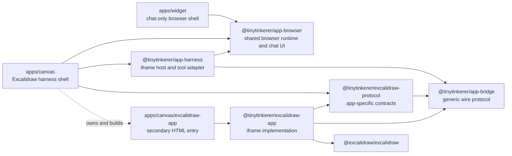
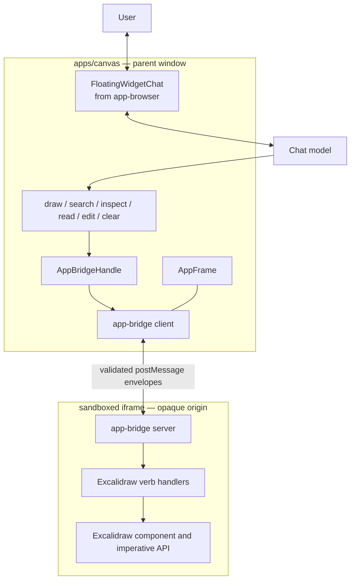
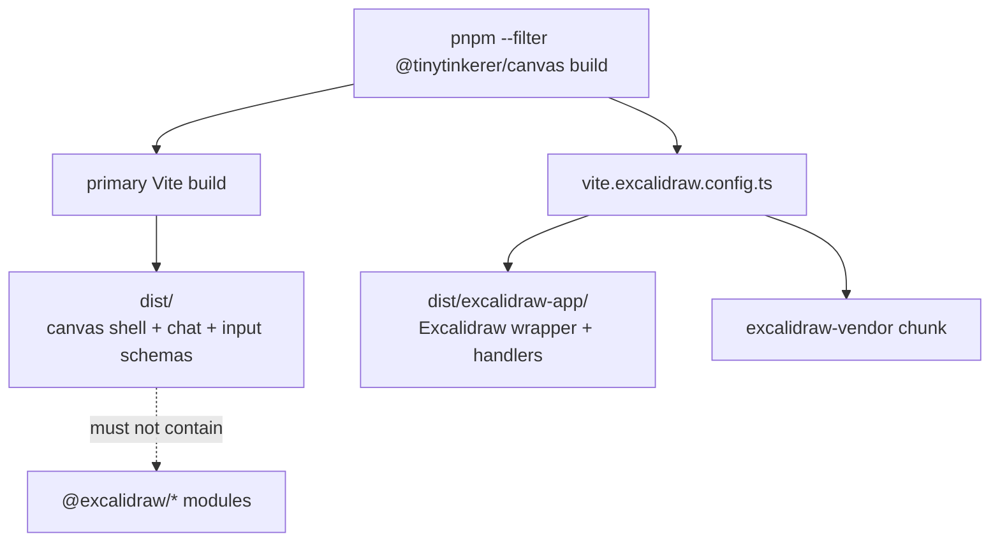
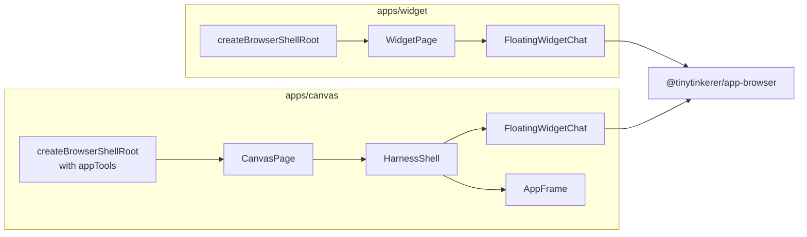
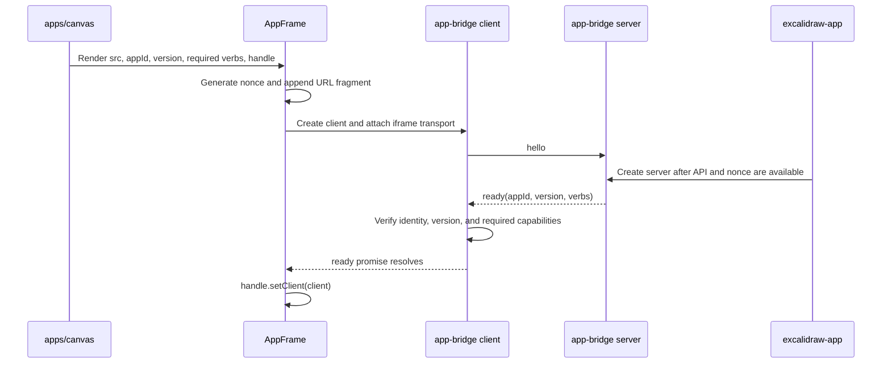
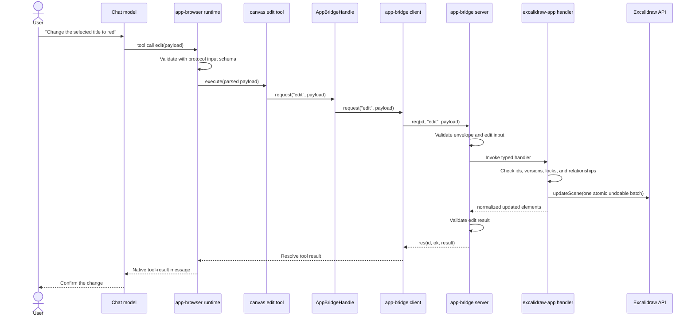

<!--
This document reflects the current implementation of the multi-app harness.
If changes affecting the harness/bridge are made, update this file.
Do NOT delete above lines.
-->

# Multi-app harness

TinyTinkerer has two related browser-shell shapes:

1. **Chat-only shells**, such as `apps/widget`, render the shared chat surface directly.
2. **App harness shells**, currently `apps/canvas`, render the same chat surface over an
   isolated iframe application and give the assistant app-specific tools.

Excalidraw is the first iframe application. The architecture deliberately separates:

- the generic `postMessage` channel;
- the Excalidraw-specific schemas;
- the iframe code that can call Excalidraw;
- the thin deployable canvas shell; and
- the reusable chat UI also used by the widget.

This prevents Excalidraw, its APIs, and its large dependency graph from becoming part of
the chat shell or the generic bridge.

## Package relationship at a glance

The following diagram shows **build-time dependencies**. An arrow means “imports from.”
The dashed edge is a build-entry relationship: `apps/canvas` owns the secondary HTML
entry whose main module imports `@tinytinkerer/excalidraw-app`.



The corresponding **runtime topology** has a `postMessage` boundary between the canvas
shell and Excalidraw. No JavaScript object, React context, module singleton, or
Excalidraw API reference crosses this boundary.



## Responsibilities and dependency rules

| Location                              | Role                                        | May know about                                                           | Must not own                                                      |
| ------------------------------------- | ------------------------------------------- | ------------------------------------------------------------------------ | ----------------------------------------------------------------- |
| `packages/shared/app-bridge`          | Generic request/response/event transport    | Envelopes, correlation ids, versions, nonces, transports, timeouts       | Excalidraw, React UI, model tool descriptions, app-specific verbs |
| `packages/shared/excalidraw-protocol` | Excalidraw wire vocabulary                  | Verb names and Zod input/result schemas                                  | Excalidraw runtime code, iframe lifecycle, chat UI                |
| `packages/app/excalidraw-app`         | Excalidraw iframe implementation            | Excalidraw component/API, protocol contracts, bridge server              | Chat runtime, canvas routing, model provider                      |
| `packages/app/app-harness`            | Generic iframe/chat composition             | `AppFrame`, bridge client, stable bridge handle, verb-to-tool adaptation | Excalidraw-specific behavior or schemas                           |
| `apps/canvas`                         | Deployable Excalidraw shell and build owner | Tool descriptions, protocol metadata, iframe URL, shell routing          | Excalidraw domain behavior in the parent window                   |
| `apps/widget`                         | Deployable chat-only shell                  | Shared chat UI and widget URL modes                                      | App bridge, Excalidraw protocol, iframe app                       |

These boundaries are intentional. For example:

- `app-bridge` cannot import `excalidraw-protocol`; the generic layer must remain usable
  by a future non-Excalidraw app.
- `app-harness` cannot hard-code Excalidraw verb names. It receives a record of verbs
  and schemas from the shell.
- `apps/canvas` can import Excalidraw **contracts**, but its parent-window source cannot
  import `@excalidraw/excalidraw`.
- `apps/widget` does not import `app-harness`, `app-bridge`, or
  `excalidraw-protocol`. Its relationship to canvas is reuse of the chat shell, not
  participation in the iframe protocol.

## `packages/shared/app-bridge`: the generic wire

`@tinytinkerer/app-bridge` is the lowest shared layer. It defines a small
`BridgeTransport` interface:

```ts
type BridgeTransport = {
  post(message: unknown): void
  subscribe(handler: (message: unknown) => void): () => void
}
```

The protocol logic is independent of the browser because the client and server depend
on this interface rather than directly on `window`. Production uses:

- `iframeClientTransport(frame)` in the parent window; and
- `parentServerTransport()` in the iframe.

Tests can substitute an in-memory transport while exercising the same correlation,
validation, error, and timeout behavior.

Every wire message contains `protocolVersion` and `sessionNonce`. The message variants
are:

| Kind    | Direction        | Purpose                                                 |
| ------- | ---------------- | ------------------------------------------------------- |
| `hello` | harness → iframe | Ask an already-running server to announce itself again  |
| `ready` | iframe → harness | Advertise app id, protocol version, and supported verbs |
| `req`   | harness → iframe | Invoke one verb with a correlation id and payload       |
| `res`   | iframe → harness | Resolve or reject the correlated request                |
| `event` | iframe → harness | Send an unsolicited app event                           |

The generic layer performs two levels of validation:

1. `bridgeMessageSchema` validates the envelope before either side acts on it.
2. `defineBridgeVerb` attaches app-owned input and result schemas to a handler.
   `createBridgeServer` validates the payload before entering app code and validates
   the result before it crosses back to the parent.

`app-bridge` does not know that a verb named `read` exists or what an Excalidraw element
looks like. That knowledge belongs to `excalidraw-protocol`.

## `packages/shared/excalidraw-protocol`: the shared vocabulary

`@tinytinkerer/excalidraw-protocol` is imported on both sides of the iframe boundary:

- `apps/canvas` uses its app id, protocol version, advertised verb list, and **input
  schemas** when registering model tools and gating the handshake.
- `packages/app/excalidraw-app` binds the complete input/result contracts to iframe
  handlers.

This is the only shared source of truth for the Excalidraw vocabulary:

| Verb      | Class | Contract purpose                                                 |
| --------- | ----- | ---------------------------------------------------------------- |
| `draw`    | write | Create supported element skeletons                               |
| `search`  | read  | Return compact candidates by query, type, selection, or viewport |
| `inspect` | read  | Summarize scene, viewport, selection, groups, and relationships  |
| `read`    | read  | Return normalized full element records and edit versions         |
| `edit`    | write | Apply atomic, version-checked, invariant-safe patches            |
| `clear`   | write | Remove all scene elements as an undoable update                  |

The package internally separates input schemas from result contracts and declares
`sideEffects: false`. This lets the canvas startup graph retain the schemas needed to
describe and validate model calls while tree-shaking the larger result validators.
The root export remains the only public import path, preserving the workspace package
boundary.

The normalized result schemas are intentionally not raw Excalidraw JSON. They expose
stable, model-relevant fields such as geometry, styles, text, z-order, grouping,
selection, versions, and bindings while hiding implementation fields such as seeds and
version nonces.



```mermaid
flowchart LR
  input["Model tool input"]
  inputSchema["Excalidraw input schema"]
  envelope["app-bridge req envelope"]
  handler["Typed iframe handler"]
  resultSchema["Excalidraw result schema"]
  output["Model tool result"]

  input -->|"canvas runtime validates"| inputSchema
  inputSchema --> envelope
  envelope -->|"server validates again"| handler
  handler --> resultSchema
  resultSchema -->|"server validates"| output
```

## `packages/app/excalidraw-app`: the isolated implementation

`@tinytinkerer/excalidraw-app` is the only package in this flow that imports
`@excalidraw/excalidraw`. It:

1. mounts `<Excalidraw>`;
2. receives the `ExcalidrawImperativeAPI`;
3. reads the per-mount nonce from `location.hash`;
4. creates a bridge server using `parentServerTransport()`; and
5. binds each contract from `excalidraw-protocol` to a handler in `bridge.ts`.

The handlers translate the stable model vocabulary into Excalidraw operations:

- `draw` converts simplified skeletons and performs an undoable scene update;
- `search`, `inspect`, and `read` normalize current elements and app state;
- `edit` preflights the whole batch, checks element versions and relationship
  invariants, and performs one undoable update; and
- `clear` submits an empty element list as an undoable update.

All writes use `CaptureUpdateAction.IMMEDIATELY`. A successful edit batch therefore
becomes one user-visible undo checkpoint. A failed edit changes nothing.

The package does not render chat, create model tools, or decide where the iframe is
served. Those are parent-shell concerns.

## `apps/canvas`: the thin parent shell and build owner

`apps/canvas` joins the generic and app-specific halves.

### Parent-window startup

`apps/canvas/src/main.tsx` calls:

```ts
createBrowserShellRoot({
  router,
  BootScreen: CanvasBootScreen,
  appTools: createCanvasAppTools()
})
```

`createCanvasAppTools` pairs model-facing descriptions with the input schemas from
`excalidraw-protocol`. `appToolsFromVerbs` converts each definition into an
`app-browser` tool whose `execute` function calls a shared `AppBridgeHandle`.

The handle is created once at module scope. The same object is:

- closed over by tools created during shell bootstrap; and
- passed to `<HarnessShell>`, whose `<AppFrame>` populates it after handshake.

This stable indirection is why tools can be registered before the iframe exists without
holding a stale bridge client.

### Page composition

`CanvasPage` renders `HarnessShell` with:

- the expected app id and protocol version;
- the complete required verb list;
- the resolved `/canvas/excalidraw-app/` URL;
- the stable bridge handle; and
- chat configuration.

`HarnessShell` places `AppFrame` as the stage layer and
`FloatingWidgetChat` as a click-through overlay. The whiteboard remains directly
interactive while chat is visible.

### Two build graphs

Canvas owns two Vite entries:



The secondary entry at `apps/canvas/excalidraw-app/main.tsx` imports
`mountExcalidrawApp` from `@tinytinkerer/excalidraw-app`. The package appears in the
canvas manifest because canvas owns this build entry, but it is not imported by the
parent-window application graph. Bundle regression tests enforce that separation.

## `apps/widget`: the chat-only sibling

`apps/widget` is important because it demonstrates which parts of canvas are generic
chat behavior and which parts exist only for app hosting.

Both widget and canvas call `createBrowserShellRoot` from `app-browser`, use hash
routing, provide a boot screen, and ultimately render `FloatingWidgetChat`.

The difference is that widget passes no `appTools` and renders the chat surface
directly:



Widget is therefore **not** a client of `app-bridge` and does not load
`excalidraw-protocol` or `excalidraw-app`. Canvas reuses widget's shared chat surface
through `app-browser`; it does not embed `apps/widget` or communicate with a widget
window.

This distinction matters when adding features:

- shared chat chrome, layout, composer, or model-runtime changes belong in
  `app-browser` and should work in widget and canvas;
- iframe lifecycle or app-tool forwarding belongs in `app-harness`;
- Excalidraw tool schemas belong in `excalidraw-protocol`; and
- Excalidraw API behavior belongs in `excalidraw-app`.

## Handshake and lifecycle

`AppFrame` creates one session nonce per mounted frame and appends it to the iframe URL
fragment. It then creates an `app-bridge` client configured with the expected app id,
protocol version, and required verbs.



The server announces `ready` immediately at startup, covering “client listens first.”
The client sends `hello`, and the server re-announces, covering “server announced
first” and React Strict Mode effect re-runs.

Failure behavior is explicit:

- before readiness, the handle rejects tool calls instead of queuing or hanging;
- a missing required verb produces a capability mismatch;
- a protocol mismatch marks the frame `version-mismatch`;
- a handshake timeout marks the app unavailable;
- disposing or remounting the frame clears the handle and rejects pending requests.

## End-to-end tool call

The following sequence shows an `edit` call. Other verbs follow the same path.



## Security boundary

The iframe is mounted with `sandbox="allow-scripts"` and without
`allow-same-origin`. It can execute the Excalidraw bundle but receives an opaque origin
and cannot access the parent shell's DOM, cookies, storage, or authentication state.

Because an opaque iframe reports `event.origin` as `"null"`, trust is not based on a
literal origin allowlist. It is based on:

1. **Window identity:** the parent transport accepts only the iframe's exact
   `contentWindow`; the iframe transport accepts only `window.parent`.
2. **Session nonce:** every message must carry the random nonce passed through the URL
   fragment. Fragments are not sent to the hosting server.
3. **Envelope validation:** malformed or foreign messages are discarded.
4. **Verb validation:** app-owned schemas validate both handler input and output.
5. **Correlation and timeout:** responses must match a pending request id, and requests
   fail after a bounded period.

`postMessage` uses `targetOrigin: '*'` because the sandbox has an opaque origin and
bridge payloads contain app data rather than parent-window credentials. The exact
window identity and nonce still gate receipt.

The security boundary also enforces supply-chain isolation: Excalidraw and its
transitive dependencies, license considerations, and advisory allow-lists belong to the
iframe implementation/build, not widget or the canvas startup graph.

## Adding another iframe app

A new iframe app should follow the same division:

1. Create an app-owned protocol package with ids, verb names, and Zod contracts.
2. Create an iframe implementation package that owns the third-party dependency and
   binds contracts to a bridge server.
3. Create a thin shell that declares model descriptions and converts the verb schemas
   to `appTools`.
4. Render `HarnessShell` with a stable handle and the expected capabilities.
5. Add a secondary HTML/build entry owned by the shell.
6. Test handshake mismatch, pre-ready errors, input/result validation, and iframe
   teardown.
7. Add bundle tests proving the third-party application does not enter the parent
   startup graph.

Do not copy the Excalidraw handler into the shell, add app-specific branches to
`app-bridge` or `app-harness`, or make a chat-only shell such as widget depend on an
iframe app.
