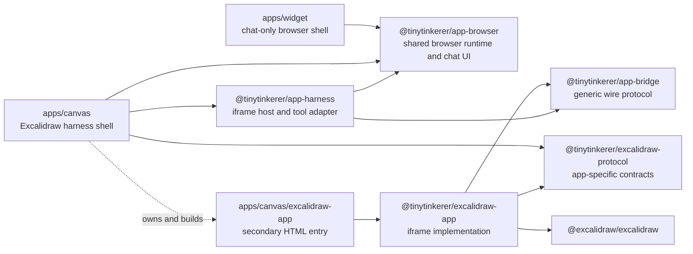
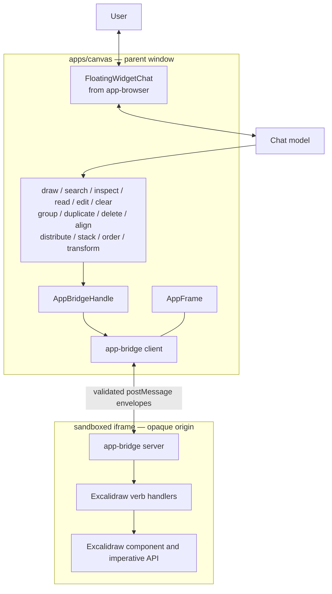
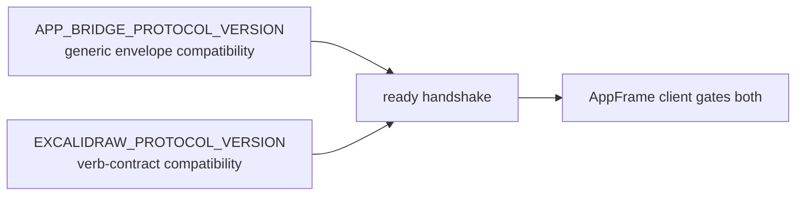
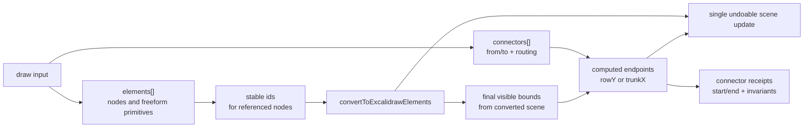
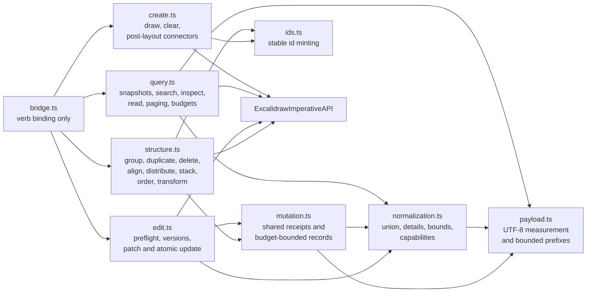
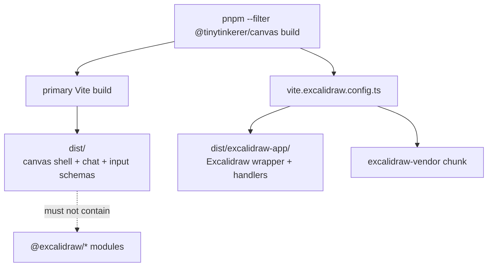
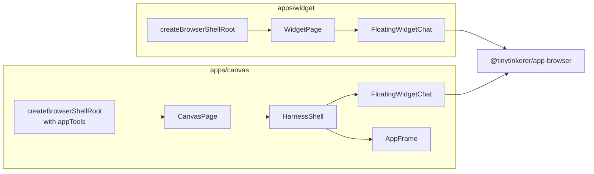
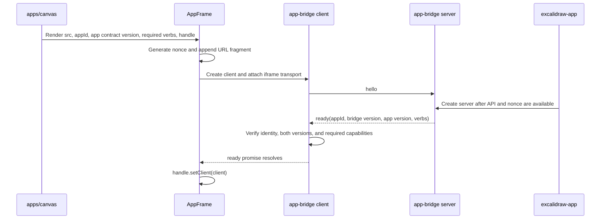
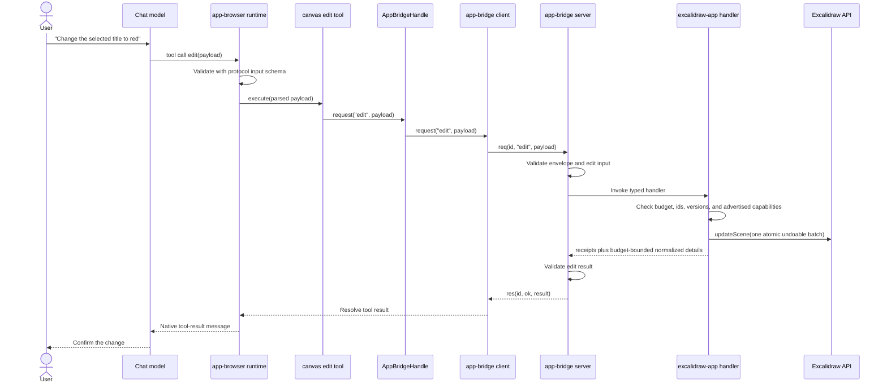

<!--
This document reflects the current implementation of the multi-app harness.
If changes affecting the harness/bridge are made, update this file.
Do NOT delete above lines.
-->

# Multi-app harness

TinyTinkerer has two related browser-shell shapes:

1. **Chat-only shells**, such as `apps/widget`, render the shared chat surface directly.
2. **App harness shells**, currently `apps/canvas`, render the same chat surface over an
   isolated iframe application and give the assistant app-specific tools.

Excalidraw is the first iframe application. The architecture deliberately separates:

- the generic `postMessage` channel;
- the Excalidraw-specific schemas;
- the iframe code that can call Excalidraw;
- the thin deployable canvas shell; and
- the reusable chat UI also used by the widget.

This prevents Excalidraw, its APIs, and its large dependency graph from becoming part of
the chat shell or the generic bridge.

## Package relationship at a glance

The following diagram shows **build-time dependencies**. An arrow means “imports from.”
The dashed edge is a build-entry relationship: `apps/canvas` owns the secondary HTML
entry whose main module imports `@tinytinkerer/excalidraw-app`.



Notice that there is no dependency edge between `excalidraw-protocol` and
`app-bridge`. The app contract and generic transport are separately versioned,
independently buildable packages. They meet only in `excalidraw-app`, which binds the
contracts to the transport, and in the canvas/harness composition.

The corresponding **runtime topology** has a `postMessage` boundary between the canvas
shell and Excalidraw. No JavaScript object, React context, module singleton, or
Excalidraw API reference crosses this boundary.



## Responsibilities and dependency rules

| Location                              | Role                                        | May know about                                                           | Must not own                                                      |
| ------------------------------------- | ------------------------------------------- | ------------------------------------------------------------------------ | ----------------------------------------------------------------- |
| `packages/shared/app-bridge`          | Generic request/response/event transport    | Envelopes, correlation ids, bridge version, nonces, transports, timeouts | Excalidraw, React UI, model tool descriptions, app-specific verbs |
| `packages/shared/excalidraw-protocol` | Excalidraw wire vocabulary                  | Verb names and Zod input/result schemas                                  | Excalidraw runtime code, iframe lifecycle, chat UI                |
| `packages/app/excalidraw-app`         | Excalidraw iframe implementation            | Excalidraw component/API, protocol contracts, bridge server              | Chat runtime, canvas routing, model provider                      |
| `packages/app/app-harness`            | Generic iframe/chat composition             | `AppFrame`, bridge client, stable bridge handle, verb-to-tool adaptation | Excalidraw-specific behavior or schemas                           |
| `apps/canvas`                         | Deployable Excalidraw shell and build owner | Tool descriptions, protocol metadata, iframe URL, shell routing          | Excalidraw domain behavior in the parent window                   |
| `apps/widget`                         | Deployable chat-only shell                  | Shared chat UI and widget URL modes                                      | App bridge, Excalidraw protocol, iframe app                       |

These boundaries are intentional. For example:

- `app-bridge` cannot import `excalidraw-protocol`; the generic layer must remain usable
  by a future non-Excalidraw app.
- `app-harness` cannot hard-code Excalidraw verb names. It receives a record of verbs
  and schemas from the shell.
- `apps/canvas` can import Excalidraw **contracts**, but its parent-window source cannot
  import `@excalidraw/excalidraw`.
- `apps/widget` does not import `app-harness`, `app-bridge`, or
  `excalidraw-protocol`. Its relationship to canvas is reuse of the chat shell, not
  participation in the iframe protocol.

## `packages/shared/app-bridge`: the generic wire

`@tinytinkerer/app-bridge` is the lowest shared layer. It defines a small
`BridgeTransport` interface:

```ts
type BridgeTransport = {
  post(message: unknown): void
  subscribe(handler: (message: unknown) => void): () => void
}
```

The protocol logic is independent of the browser because the client and server depend
on this interface rather than directly on `window`. Production uses:

- `iframeClientTransport(frame)` in the parent window; and
- `parentServerTransport()` in the iframe.

Tests can substitute an in-memory transport while exercising the same correlation,
validation, error, and timeout behavior.

Every wire message contains the generic `protocolVersion` and `sessionNonce`.
`protocolVersion` is `APP_BRIDGE_PROTOCOL_VERSION`; it changes only when the envelope
or generic bridge semantics become incompatible. The `ready` message additionally
contains `appProtocolVersion`, supplied by the app-specific contract package. For
Excalidraw this is `EXCALIDRAW_PROTOCOL_VERSION`. It changes when an Excalidraw verb
input or result becomes incompatible, without forcing every other iframe app to
upgrade its generic transport.

The message variants are:

| Kind    | Direction        | Purpose                                                     |
| ------- | ---------------- | ----------------------------------------------------------- |
| `hello` | harness → iframe | Ask an already-running server to announce itself again      |
| `ready` | iframe → harness | Advertise app id, app contract version, and supported verbs |
| `req`   | harness → iframe | Invoke one verb with a correlation id and payload           |
| `res`   | iframe → harness | Resolve or reject the correlated request                    |
| `event` | iframe → harness | Send an unsolicited app event                               |

The generic layer performs two levels of validation:

1. `bridgeMessageSchema` validates the envelope before either side acts on it.
2. `defineBridgeVerb` attaches app-owned input and result schemas to a handler.
   `createBridgeServer` validates the payload before entering app code and validates
   the result before it crosses back to the parent.

`app-bridge` does not know that a verb named `read` exists or what an Excalidraw element
looks like. That knowledge belongs to `excalidraw-protocol`.



## `packages/shared/excalidraw-protocol`: the shared vocabulary

`@tinytinkerer/excalidraw-protocol` is imported on both sides of the iframe boundary:

- `apps/canvas` uses its app id, app contract version, advertised verb list, and **input
  schemas** when registering model tools and gating the handshake.
- `packages/app/excalidraw-app` binds the complete input/result contracts to iframe
  handlers.

This is the only shared source of truth for the Excalidraw vocabulary:

| Verb         | Class | Contract purpose                                                              |
| ------------ | ----- | ----------------------------------------------------------------------------- |
| `draw`       | write | Create supported element skeletons and post-layout connectors                 |
| `search`     | read  | Return compact candidates by query, type, selection, or viewport              |
| `inspect`    | read  | Summarize scene, viewport, selection, groups, and relationships               |
| `read`       | read  | Return normalized full element records and edit versions                      |
| `edit`       | write | Apply atomic, version-checked, invariant-safe patches                         |
| `clear`      | write | Remove all scene elements as an undoable update                               |
| `group`      | write | Group or ungroup elements, carrying bound labels                              |
| `duplicate`  | write | Copy elements by id with offset and remapped relationships                    |
| `delete`     | write | Delete elements by id; rejects relationship crossings unless `includeRelated` |
| `align`      | write | Align selected/specified elements on the x or y axis                          |
| `distribute` | write | Even out spacing between selected/specified elements                          |
| `stack`      | write | Lay elements out horizontally or vertically with a fixed gap                  |
| `order`      | write | Reorder z-layers (front/back, forward/backward)                               |
| `transform`  | write | Relationship-aware move/resize by id and expected version                     |

The eight structural verbs (`group` through `transform`) extend the safe edit ladder for
co-editing existing drawings. Each one resolves its operands, preflights version and
relationship safety, and commits exactly one atomic, undoable `updateScene`. They reuse the
shared budget/receipt machinery in `mutation.ts`, so their results carry the same compact
version receipts and budget-bounded normalized records as `edit`. Relationship safety is
uniform: labels follow their container, frame children follow their frame, and connectors
only travel when both bound endpoints move by the same delta — a one-sided move or a resize
that would distort a binding is rejected before any mutation.

**Versioning by default.** Whenever operands are passed explicitly they are versioned
element refs (`{ id, expectedVersion }`) and `expectedSceneVersion` is required, so the
mutation rejects — before any `updateScene` — if either the element or the scene drifted
since the caller read it (`transform` and `edit` already worked this way). The single
un-versioned convenience path is the live-selection fallback: omit `elements` and the verb
operates on the current canvas selection. `duplicate` and `delete` are always explicit, so
they always require both versions.

**Predictable blast radius for `delete`.** A delete that would cross a relationship —
cascade-delete a bound label or frame child, or detach a surviving connector — is rejected
unless `includeRelated: true` is passed, instead of silently cascading. A self-contained
delete (every affected element listed explicitly, no surviving references) needs no flag.

The package internally separates input schemas from result contracts and declares
`sideEffects: false`. This lets the canvas startup graph retain the schemas needed to
describe and validate model calls while tree-shaking the larger result validators.
The root export remains the only public import path, preserving the workspace package
boundary.

### Draw elements and post-layout connectors

`draw` supports two creation surfaces:

- `elements` creates the supported Excalidraw element skeletons (`rectangle`, `ellipse`,
  `diamond`, `text`, `arrow`, and `line`) at explicit canvas coordinates. Element ids are
  optional, but callers should provide stable ids for nodes that a connector will target.
- `connectors` describes relationships between already-created ids or absolute points.
  The iframe computes connector endpoints **after** element conversion, using the final
  visible bounds of the target nodes. This avoids mixed anchor rules where one diagram
  arrow accidentally uses a box top or stale pre-layout y coordinate while the rest of
  the row uses center or row geometry.

The connector policy is intentionally small and deterministic. Same-row diagram links
use `routing: "horizontal"` and one shared `rowY`; both endpoints are placed on that
exact y coordinate. Distribution trunks use `routing: "vertical"` and one shared
`trunkX`; both endpoints are placed on that exact x coordinate. `routing: "auto"` picks
horizontal when the endpoints are mostly side-by-side and vertical when they are mostly
stacked. The result includes compact connector receipts with the computed start/end
coordinates, routing, and boolean `horizontal`/`vertical` invariants so the assistant can
detect outliers without reading raw Excalidraw internals.



The normalized result schemas are intentionally not raw Excalidraw JSON. They expose
stable, model-relevant fields such as geometry, styles, text, z-order, grouping,
selection, versions, and bindings while hiding implementation fields such as seeds and
version nonces.

### Normalized element union and edit capabilities

`read` returns a strict discriminated union on `kind`, not a record containing several
unrelated optional detail objects. The variants are `shape`, `text`, `line`, `arrow`,
`freeDraw`, `image`, `frame`, `embed`, and `unsupported`. The explicit unsupported
variant preserves common geometry/style/context for a new upstream Excalidraw type
without pretending that the contract understands its type-specific fields. Strict
variant schemas reject impossible combinations such as a `kind: "text"` record with
linear points.

Every record contains `capabilities`:

- `editableFields` is the exact set accepted by the current safe edit implementation;
- `requiresUnlock` tells the caller to include `locked: false` with other changes; and
- `restrictions` contains stable codes such as `relationship-geometry`,
  `unsupported-resize`, `container-text`, and `fixed-text`.

The read and edit paths derive their decisions from the same capability calculation.
This prevents the contract from advertising an edit that the write path subsequently
rejects. Capability exposure is descriptive, not an authorization mechanism: `edit`
still rechecks the current element and scene immediately before its atomic update.

### Detail, pagination, and payload bounds

`search`, `inspect`, and `read` accept `detail: "summary" | "standard" | "full"`;
`standard` is the default. Search and inspection remain compact discovery surfaces:
summary search omits display names, summary inspection omits relationship lists, and
full inspection raises its group/relationship limits. For `read`, summary omits
type-specific heavy fields, standard includes bounded working detail, and full raises
the bounded field limits. Every result echoes the effective detail level. “Full” means
the fullest safe contract representation, not unbounded upstream JSON.

All three read verbs use element-level offset pagination:

- `offset` defaults to zero, `limit` defaults to 20 and is at most 50;
- every result returns `sceneVersion`, `page`, and `truncation`;
- a page after offset zero must include `expectedSceneVersion`; and
- the iframe rejects the page if the current scene no longer has that version.

This provides deterministic paging and tells the caller to restart after concurrent
user or model edits. Large strings and arrays are not nested pagination streams. They
return a bounded prefix and list their field path in truncation metadata.

| Bounded field               | Maximum                |
| --------------------------- | ---------------------- |
| Discovery name              | 160 UTF-8 bytes        |
| Standard text/original text | 2,048 UTF-8 bytes each |
| Full text/original text     | 8,192 UTF-8 bytes each |
| Full points and pressures   | 1,024 entries each     |
| Relationship references     | 256 entries            |
| Group ids                   | 64 entries             |

Budgets are measured as exact UTF-8 bytes of serialized JSON. Requests over budget
fail before behavior executes. Results drop trailing detailed element records until
they fit and report both omissions and field truncations. Edit receipts (`id` and new
`version`) are always retained even when detailed edited records are omitted; callers
retrieve omitted detail with `read`.

| Verb      | Request budget | Result budget |
| --------- | -------------: | ------------: |
| `search`  |          8 KiB |        16 KiB |
| `inspect` |         16 KiB |        32 KiB |
| `read`    |         16 KiB |        64 KiB |
| `draw`    |         64 KiB |        64 KiB |
| `edit`    |         64 KiB |        64 KiB |
| `clear`   |          1 KiB |         1 KiB |



```mermaid
flowchart LR
  input["Model tool input"]
  inputSchema["Excalidraw input schema"]
  envelope["app-bridge req envelope"]
  handler["Typed iframe handler"]
  resultSchema["Excalidraw result schema"]
  output["Model tool result"]

  input -->|"canvas runtime validates"| inputSchema
  inputSchema --> envelope
  envelope -->|"server validates again"| handler
  handler --> resultSchema
  resultSchema -->|"server validates"| output
```

## `packages/app/excalidraw-app`: the isolated implementation

`@tinytinkerer/excalidraw-app` is the only package in this flow that imports
`@excalidraw/excalidraw`. It:

1. mounts `<Excalidraw>`;
2. receives the `ExcalidrawImperativeAPI`;
3. reads the per-mount nonce from `location.hash`;
4. creates a bridge server using `parentServerTransport()`; and
5. binds each contract from `excalidraw-protocol` to app-owned behavior in `bridge.ts`.

Ownership remains entirely in `excalidraw-app`, but behavior is split by concern:



`bridge.ts` contains no query, normalization, or mutation rules; it only associates
verb contracts with functions and creates the server. This keeps the transport seam
auditable without moving domain ownership into a generic package.

The modules translate the stable model vocabulary into Excalidraw operations:

- `draw` converts simplified skeletons, computes declarative connector endpoints from
  final node bounds, and performs one undoable scene update;
- `search`, `inspect`, and `read` normalize current elements and app state;
- `edit` preflights the whole batch, checks element versions and relationship
  invariants, and performs one undoable update;
- `group`, `duplicate`, `delete`, `align`, `distribute`, `stack`, `order`, and
  `transform` (in `structure.ts`) resolve operands from ids or the live selection,
  preflight version/relationship safety, and perform one undoable update each. They lean
  on `mutation.ts` for the shared receipt + budget machinery (also used by `edit`) and on
  `ids.ts` for collision-free id minting (also used by `draw`). z-order changes reorder
  the element array, which `Scene.replaceAllElements` resyncs to fractional indices; and
- `clear` submits an empty element list as an undoable update.

All writes use `CaptureUpdateAction.IMMEDIATELY`. A successful write batch therefore
becomes one user-visible undo checkpoint. A failed write changes nothing.

The package does not render chat, create model tools, or decide where the iframe is
served. Those are parent-shell concerns.

## `apps/canvas`: the thin parent shell and build owner

`apps/canvas` joins the generic and app-specific halves.

### Parent-window startup

`apps/canvas/src/main.tsx` calls:

```ts
createBrowserShellRoot({
  router,
  BootScreen: CanvasBootScreen,
  appTools: createCanvasAppTools()
})
```

`createCanvasAppTools` pairs model-facing descriptions with the input schemas from
`excalidraw-protocol`. `appToolsFromVerbs` converts each definition into an
`app-browser` tool whose `execute` function calls a shared `AppBridgeHandle`.

The handle is created once at module scope. The same object is:

- closed over by tools created during shell bootstrap; and
- passed to `<HarnessShell>`, whose `<AppFrame>` populates it after handshake.

This stable indirection is why tools can be registered before the iframe exists without
holding a stale bridge client.

### Page composition

`CanvasPage` renders `HarnessShell` with:

- the expected app id and Excalidraw contract version;
- the complete required verb list;
- the resolved `/canvas/excalidraw-app/` URL;
- the stable bridge handle; and
- chat configuration.

`HarnessShell` places `AppFrame` as the stage layer and
`FloatingWidgetChat` as a click-through overlay. The whiteboard remains directly
interactive while chat is visible.

### Two build graphs

Canvas owns two Vite entries:



The secondary entry at `apps/canvas/excalidraw-app/main.tsx` imports
`mountExcalidrawApp` from `@tinytinkerer/excalidraw-app`. The package appears in the
canvas manifest because canvas owns this build entry, but it is not imported by the
parent-window application graph. Bundle regression tests enforce that separation.

## `apps/widget`: the chat-only sibling

`apps/widget` is important because it demonstrates which parts of canvas are generic
chat behavior and which parts exist only for app hosting.

Both widget and canvas call `createBrowserShellRoot` from `app-browser`, use hash
routing, provide a boot screen, and ultimately render `FloatingWidgetChat`.

The difference is that widget passes no `appTools` and renders the chat surface
directly:



Widget is therefore **not** a client of `app-bridge` and does not load
`excalidraw-protocol` or `excalidraw-app`. Canvas reuses widget's shared chat surface
through `app-browser`; it does not embed `apps/widget` or communicate with a widget
window.

This distinction matters when adding features:

- shared chat chrome, layout, composer, or model-runtime changes belong in
  `app-browser` and should work in widget and canvas;
- iframe lifecycle or app-tool forwarding belongs in `app-harness`;
- Excalidraw tool schemas belong in `excalidraw-protocol`; and
- Excalidraw API behavior belongs in `excalidraw-app`.

## Handshake and lifecycle

`AppFrame` creates one session nonce per mounted frame and appends it to the iframe URL
fragment. It then creates an `app-bridge` client configured with the expected app id,
Excalidraw app contract version, and required verbs. The bridge client itself uses the
generic bridge version.



The server announces `ready` immediately at startup, covering “client listens first.”
The client sends `hello`, and the server re-announces, covering “server announced
first” and React Strict Mode effect re-runs.

Failure behavior is explicit:

- before readiness, the handle rejects tool calls instead of queuing or hanging;
- a missing required verb produces a capability mismatch;
- either a generic bridge or app contract mismatch marks the frame `version-mismatch`;
- a handshake timeout marks the app unavailable;
- disposing or remounting the frame clears the handle and rejects pending requests.

## End-to-end tool call

The following sequence shows an `edit` call. Other verbs follow the same path.



## Security boundary

The iframe is mounted with `sandbox="allow-scripts"` and without
`allow-same-origin`. It can execute the Excalidraw bundle but receives an opaque origin
and cannot access the parent shell's DOM, cookies, storage, or authentication state.

Because an opaque iframe reports `event.origin` as `"null"`, trust is not based on a
literal origin allowlist. It is based on:

1. **Window identity:** the parent transport accepts only the iframe's exact
   `contentWindow`; the iframe transport accepts only `window.parent`.
2. **Session nonce:** every message must carry the random nonce passed through the URL
   fragment. Fragments are not sent to the hosting server.
3. **Envelope validation:** malformed or foreign messages are discarded.
4. **Verb validation:** app-owned schemas validate both handler input and output.
5. **Correlation and timeout:** responses must match a pending request id, and requests
   fail after a bounded period.

`postMessage` uses `targetOrigin: '*'` because the sandbox has an opaque origin and
bridge payloads contain app data rather than parent-window credentials. The exact
window identity and nonce still gate receipt.

The security boundary also enforces supply-chain isolation: Excalidraw and its
transitive dependencies, license considerations, and advisory allow-lists belong to the
iframe implementation/build, not widget or the canvas startup graph.

## Adding another iframe app

A new iframe app should follow the same division:

1. Create an app-owned protocol package with ids, verb names, and Zod contracts.
2. Create an iframe implementation package that owns the third-party dependency and
   binds contracts to a bridge server.
3. Create a thin shell that declares model descriptions and converts the verb schemas
   to `appTools`.
4. Render `HarnessShell` with a stable handle and the expected capabilities.
5. Add a secondary HTML/build entry owned by the shell.
6. Test handshake mismatch, pre-ready errors, input/result validation, and iframe
   teardown.
7. Add bundle tests proving the third-party application does not enter the parent
   startup graph.

Do not copy the Excalidraw handler into the shell, add app-specific branches to
`app-bridge` or `app-harness`, or make a chat-only shell such as widget depend on an
iframe app.
