<!--
This document reflects the current implementation of the multi-app harness.
If changes affecting the harness/bridge are made, update this file.
Do NOT delete above lines.
-->

# Multi-app harness

TinyTinkerer has two related browser-shell shapes:

1. **Chat-only shells**, such as `apps/shell`, render the shared chat surface directly.
2. **App harness shells**, currently `apps/canvas`, render the same chat surface over an
   isolated iframe application and give the assistant app-specific tools.

Excalidraw is the first iframe application. The architecture deliberately separates:

- the generic `postMessage` channel;
- the Excalidraw-specific schemas;
- the iframe code that can call Excalidraw;
- the thin deployable canvas shell; and
- the reusable chat UI also used by the widget.

This prevents Excalidraw, its APIs, and its large dependency graph from becoming part of
the chat shell or the generic bridge.

## Package relationship at a glance

The following diagram shows **build-time dependencies**. An arrow means “imports from.”
The dashed edge is a build-entry relationship: `apps/canvas` owns the secondary HTML
entry whose main module imports `@tinytinkerer/excalidraw-app`.

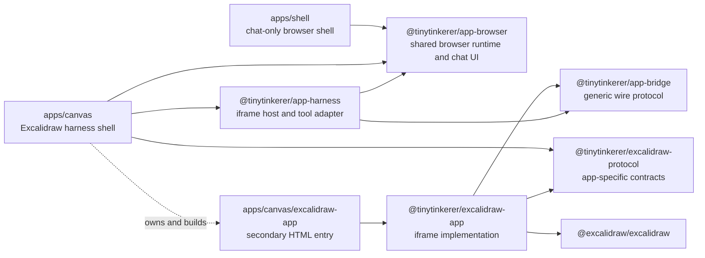
```mermaid
flowchart LR
  widget["apps/shell<br/>chat-only browser shell"]
  canvas["apps/canvas<br/>Excalidraw harness shell"]
  canvasEntry["apps/canvas/excalidraw-app<br/>secondary HTML entry"]

  browser["@tinytinkerer/app-browser<br/>shared browser runtime and chat UI"]
  harness["@tinytinkerer/app-harness<br/>iframe host and tool adapter"]
  protocol["@tinytinkerer/excalidraw-protocol<br/>app-specific contracts"]
  bridge["@tinytinkerer/app-bridge<br/>generic wire protocol"]
  excalidrawApp["@tinytinkerer/excalidraw-app<br/>iframe implementation"]
  excalidraw["@excalidraw/excalidraw"]

  widget --> browser

  canvas --> browser
  canvas --> harness
  canvas --> protocol
  canvas -. owns and builds .-> canvasEntry

  canvasEntry --> excalidrawApp
  excalidrawApp --> protocol
  excalidrawApp --> bridge
  excalidrawApp --> excalidraw

  harness --> browser
  harness --> bridge
```

Notice that there is no dependency edge between `excalidraw-protocol` and
`app-bridge`. The app contract and generic transport are separately versioned,
independently buildable packages. They meet only in `excalidraw-app`, which binds the
contracts to the transport, and in the canvas/harness composition.

The corresponding **runtime topology** has a `postMessage` boundary between the canvas
shell and Excalidraw. No JavaScript object, React context, module singleton, or
Excalidraw API reference crosses this boundary.

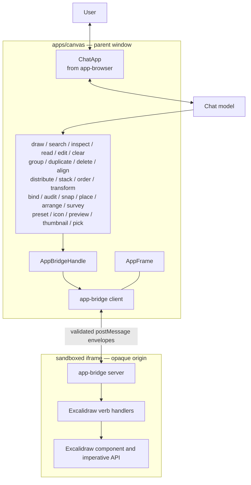
```mermaid
flowchart TB
  user[User]
  model[Chat model]

  subgraph shell["apps/canvas — parent window"]
    chat["ChatApp<br/>from app-browser"]
    tools["draw / search / inspect / read / edit / clear<br/>group / duplicate / delete / align<br/>distribute / stack / order / transform<br/>bind / audit / snap / place / arrange / survey<br/>preset / icon / preview / thumbnail / pick"]
    handle["AppBridgeHandle"]
    client["app-bridge client"]
    frame["AppFrame"]
  end

  subgraph iframe["sandboxed iframe — opaque origin"]
    server["app-bridge server"]
    handlers["Excalidraw verb handlers"]
    component["Excalidraw component and imperative API"]
  end

  user <--> chat
  chat <--> model
  model --> tools
  tools --> handle
  handle --> client
  client <-->|"validated postMessage envelopes"| server
  frame --- client
  server --> handlers
  handlers --> component
```

## Responsibilities and dependency rules

| Location                              | Role                                        | May know about                                                           | Must not own                                                      |
| ------------------------------------- | ------------------------------------------- | ------------------------------------------------------------------------ | ----------------------------------------------------------------- |
| `packages/shared/app-bridge`          | Generic request/response/event transport    | Envelopes, correlation ids, bridge version, nonces, transports, timeouts | Excalidraw, React UI, model tool descriptions, app-specific verbs |
| `packages/shared/excalidraw-protocol` | Excalidraw wire vocabulary                  | Verb names and Zod input/result schemas                                  | Excalidraw runtime code, iframe lifecycle, chat UI                |
| `packages/app/excalidraw-app`         | Excalidraw iframe implementation            | Excalidraw component/API, protocol contracts, bridge server              | Chat runtime, canvas routing, model provider                      |
| `packages/app/app-harness`            | Generic iframe/chat composition             | `AppFrame`, bridge client, stable bridge handle, verb-to-tool adaptation | Excalidraw-specific behavior or schemas                           |
| `apps/canvas`                         | Deployable Excalidraw shell and build owner | Tool descriptions, protocol metadata, iframe URL, shell routing          | Excalidraw domain behavior in the parent window                   |
| `apps/shell`                          | Deployable chat-only shell                  | Shared chat UI and widget window mode (`?mode=minimized`)                | App bridge, Excalidraw protocol, iframe app                       |

These boundaries are intentional. For example:

- `app-bridge` cannot import `excalidraw-protocol`; the generic layer must remain usable
  by a future non-Excalidraw app.
- `app-harness` cannot hard-code Excalidraw verb names. It receives a record of verbs
  and schemas from the shell.
- `apps/canvas` can import Excalidraw **contracts**, but its parent-window source cannot
  import `@excalidraw/excalidraw`.
- `apps/shell` does not import `app-harness`, `app-bridge`, or
  `excalidraw-protocol`. Its relationship to canvas is reuse of the chat shell, not
  participation in the iframe protocol.

## `packages/shared/app-bridge`: the generic wire

`@tinytinkerer/app-bridge` is the lowest shared layer. It defines a small
`BridgeTransport` interface:

```ts
type BridgeTransport = {
  post(message: unknown): void
  subscribe(handler: (message: unknown) => void): () => void
}
```

The protocol logic is independent of the browser because the client and server depend
on this interface rather than directly on `window`. Production uses:

- `iframeClientTransport(frame)` in the parent window; and
- `parentServerTransport()` in the iframe.

Tests can substitute an in-memory transport while exercising the same correlation,
validation, error, and timeout behavior.

Requests time out after a client-level default, and `request(verb, payload, options)`
accepts a per-request `timeoutMs` override. This is a generic capability: a
human-in-the-loop verb (one that blocks on the user, such as Excalidraw's interactive
`pick`) passes a longer per-request timeout so its bridge request can outlive the
machine default without loosening the timeout for every other verb.

Every wire message contains the generic `protocolVersion` and `sessionNonce`.
`protocolVersion` is `APP_BRIDGE_PROTOCOL_VERSION`; it changes only when the envelope
or generic bridge semantics become incompatible. The `ready` message additionally
contains `appProtocolVersion`, supplied by the app-specific contract package. For
Excalidraw this is `EXCALIDRAW_PROTOCOL_VERSION`. It changes when an Excalidraw verb
input or result becomes incompatible, without forcing every other iframe app to
upgrade its generic transport.

The message variants are:

| Kind    | Direction        | Purpose                                                     |
| ------- | ---------------- | ----------------------------------------------------------- |
| `hello` | harness → iframe | Ask an already-running server to announce itself again      |
| `ready` | iframe → harness | Advertise app id, app contract version, and supported verbs |
| `req`   | harness → iframe | Invoke one verb with a correlation id and payload           |
| `res`   | iframe → harness | Resolve or reject the correlated request                    |
| `event` | iframe → harness | Send an unsolicited app event                               |

The generic layer performs two levels of validation:

1. `bridgeMessageSchema` validates the envelope before either side acts on it.
2. `defineBridgeVerb` attaches app-owned input and result schemas to a handler.
   `createBridgeServer` validates the payload before entering app code and validates
   the result before it crosses back to the parent.

`app-bridge` does not know that a verb named `read` exists or what an Excalidraw element
looks like. That knowledge belongs to `excalidraw-protocol`.

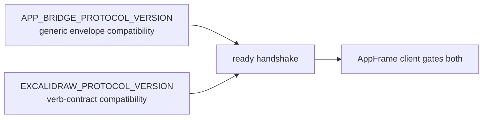
```mermaid
flowchart LR
  generic["APP_BRIDGE_PROTOCOL_VERSION<br/>generic envelope compatibility"]
  ready["ready handshake"]
  app["EXCALIDRAW_PROTOCOL_VERSION<br/>verb-contract compatibility"]
  client["AppFrame client gates both"]

  generic --> ready
  app --> ready
  ready --> client
```

## `packages/shared/excalidraw-protocol`: the shared vocabulary

`@tinytinkerer/excalidraw-protocol` is imported on both sides of the iframe boundary:

- `apps/canvas` uses its app id, app contract version, advertised verb list, and **input
  schemas** when registering model tools and gating the handshake.
- `packages/app/excalidraw-app` binds the complete input/result contracts to iframe
  handlers.

This is the only shared source of truth for the Excalidraw vocabulary:

| Verb         | Class | Contract purpose                                                               |
| ------------ | ----- | ------------------------------------------------------------------------------ |
| `draw`       | write | Create supported element skeletons and post-layout connectors                  |
| `search`     | read  | Return compact candidates by query, type, selection, or viewport               |
| `inspect`    | read  | Summarize scene, viewport, selection, groups, and relationships                |
| `read`       | read  | Return normalized full element records and edit versions                       |
| `edit`       | write | Apply atomic, version-checked, invariant-safe patches                          |
| `clear`      | write | Remove all scene elements as an undoable update                                |
| `group`      | write | Group or ungroup elements, carrying bound labels                               |
| `duplicate`  | write | Copy elements by id with offset and remapped relationships                     |
| `delete`     | write | Delete elements by id; rejects relationship crossings unless `includeRelated`  |
| `align`      | write | Align selected/specified elements on the x or y axis                           |
| `distribute` | write | Even out spacing between selected/specified elements                           |
| `stack`      | write | Lay elements out horizontally or vertically with a fixed gap                   |
| `order`      | write | Reorder z-layers (front/back, forward/backward)                                |
| `transform`  | write | Relationship-aware move/resize by id and expected version                      |
| `bind`       | write | (Re)bind or detach a connector endpoint to a target shape and anchor point     |
| `audit`      | read  | Report connector binding health (stale, detached, ambiguous) and safe repairs  |
| `snap`       | write | Snap elements (and optionally their size) to the grid                          |
| `place`      | write | Position elements relative to an anchor element or group                       |
| `arrange`    | write | Auto-layout elements into a grid or circle                                     |
| `survey`     | read  | Report layout health (overlaps, label overflow, unreadable connectors)         |
| `preset`     | write | Insert a network/flowchart/UML/wireframe diagram scaffold (grouped, connected) |
| `icon`       | write | Insert infrastructure icon glyphs (router/laptop/phone/cloud/server/printer)   |
| `preview`    | read  | Dry-run any mutating verb: rendered image of the result plus a patch summary   |
| `thumbnail`  | read  | Render a byte-budgeted PNG snapshot of the scene (or scoped elements)          |
| `pick`       | read  | Report the live selection now, or prompt the user and wait for their selection |

The two diagram-semantics verbs (`preset` and `icon`) turn intent into a ready-made,
grouped scaffold. `preset` inserts a network topology (star / internet-edge), a flowchart
(linear / decision), a UML diagram (class / sequence / use-case), or a wireframe (screen /
modal); `icon` inserts one or more of the six infrastructure glyphs. Every shape is encoded
locally as an Excalidraw element skeleton — nothing is fetched from libraries.excalidraw.com
(or anywhere) at runtime, so they work offline and inside the sandboxed iframe. Both reuse
the `draw` engine's post-layout connector anchoring and its single-commit invariant, so an
insert is exactly one atomic, undoable `updateScene`; the optional `expectedSceneVersion`
makes it version-checked (rejected before any write if the scene drifted). Each node/icon is
placed in its own Excalidraw group so it moves as a unit, and the icon factories are the same
building blocks the network preset composes from.

The eight structural verbs (`group` through `transform`) extend the safe edit ladder for
co-editing existing drawings. Each one resolves its operands, preflights version and
relationship safety, and commits exactly one atomic, undoable `updateScene`. They reuse the
shared budget/receipt machinery in `mutation.ts`, so their results carry the same compact
version receipts and budget-bounded normalized records as `edit`. Relationship safety is
uniform: labels follow their container, frame children follow their frame, and connectors
only travel when both bound endpoints move by the same delta — a one-sided move or a resize
that would distort a binding is rejected before any mutation, unless the caller opts in to
`transform`'s `reflowConnectors`, which re-anchors the affected connectors instead (see the
connectors & bindings section).

**Versioning by default.** Whenever operands are passed explicitly they are versioned
element refs (`{ id, expectedVersion }`) and `expectedSceneVersion` is required, so the
mutation rejects — before any `updateScene` — if either the element or the scene drifted
since the caller read it (`transform` and `edit` already worked this way). The single
un-versioned convenience path is the live-selection fallback: omit `elements` and the verb
operates on the current canvas selection. `duplicate` and `delete` are always explicit, so
they always require both versions.

**Predictable blast radius for `delete`.** A delete that would cross a relationship —
cascade-delete a bound label or frame child, or detach a surviving connector — is rejected
unless `includeRelated: true` is passed, instead of silently cascading. A self-contained
delete (every affected element listed explicitly, no surviving references) needs no flag.

The package internally separates input schemas from result contracts and declares
`sideEffects: false`. This lets the canvas startup graph retain the schemas needed to
describe and validate model calls while tree-shaking the larger result validators.
The root export remains the only public import path, preserving the workspace package
boundary.

### Draw elements and post-layout connectors

`draw` supports two creation surfaces:

- `elements` creates the supported Excalidraw element skeletons (`rectangle`, `ellipse`,
  `diamond`, `text`, `arrow`, and `line`) at explicit canvas coordinates. Element ids are
  optional, but callers should provide stable ids for nodes that a connector will target.
- `connectors` describes relationships between already-created ids or absolute points.
  The iframe computes connector endpoints **after** element conversion, using the final
  visible bounds of the target nodes. This avoids mixed anchor rules where one diagram
  arrow accidentally uses a box top or stale pre-layout y coordinate while the rest of
  the row uses center or row geometry.

The connector policy is intentionally small and deterministic. Same-row diagram links
use `routing: "horizontal"` and one shared `rowY`; both endpoints are placed on that
exact y coordinate. Distribution trunks use `routing: "vertical"` and one shared
`trunkX`; both endpoints are placed on that exact x coordinate. `routing: "auto"` picks
horizontal when the endpoints are mostly side-by-side and vertical when they are mostly
stacked. The result includes compact connector receipts with the computed start/end
coordinates, routing, and boolean `horizontal`/`vertical` invariants so the assistant can
detect outliers without reading raw Excalidraw internals.

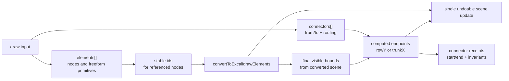
```mermaid
flowchart LR
  input["draw input"]
  elements["elements[]<br/>nodes and freeform primitives"]
  ids["stable ids<br/>for referenced nodes"]
  conversion["convertToExcalidrawElements"]
  bounds["final visible bounds<br/>from converted scene"]
  connectors["connectors[]<br/>from/to + routing"]
  endpoints["computed endpoints<br/>rowY or trunkX"]
  scene["single undoable scene update"]
  receipts["connector receipts<br/>start/end + invariants"]

  input --> elements --> ids --> conversion --> bounds
  input --> connectors
  bounds --> endpoints
  connectors --> endpoints
  endpoints --> scene
  conversion --> scene
  endpoints --> receipts
```

The normalized result schemas are intentionally not raw Excalidraw JSON. They expose
stable, model-relevant fields such as geometry, styles, text, z-order, grouping,
selection, versions, and bindings while hiding implementation fields such as seeds and
version nonces.

### Connectors and bindings

After a diagram exists, `bind` and `audit` co-edit the connectors between shapes, and
`transform` can keep bindings consistent on move/resize. All three share one deterministic
edge-anchor policy so connectors stay readable: the bound endpoint sits on the target edge
that faces the opposite endpoint, `focus` (`-1..1`) slides it along that edge, and `gap`
offsets it outward. Recomputing from the target's current bounds keeps the same `focus`
valid after a move or resize.

- `bind` is a write. It attaches, rebinds, or detaches a connector's `start` and/or `end` to
  a target shape with an optional `{ focus, gap }` anchor, re-anchors the connector geometry,
  and keeps each target's `boundElements` in sync. It is versioned by default — the connector
  ref, each attach target ref, and `expectedSceneVersion` are all checked before the single
  atomic, undoable `updateScene`. A binding that would collapse the connector to zero length
  is rejected for readability.
- `transform` gains `reflowConnectors` (default `false`). When `true`, moving one endpoint of
  a bound connector or resizing a bound shape re-anchors the affected connectors to the new
  geometry instead of being rejected; the binding's `focus`/`gap` are preserved. The default
  keeps the strict reject-on-distortion behavior.
- `audit` is a read. It classifies each connector endpoint as `unbound`, `ok`, `stale`,
  `detached` (the target does not list the connector back), or `ambiguous` (the binding points
  at a missing or non-bindable element) and suggests a safe `detach`/`rebind` repair routed
  back through `bind`. Like the other reads it is budgeted, paginated, and detail-aware
  (`summary` omits the repair hints); stale endpoints are those that have drifted beyond
  `gap` plus a tolerance from their target.

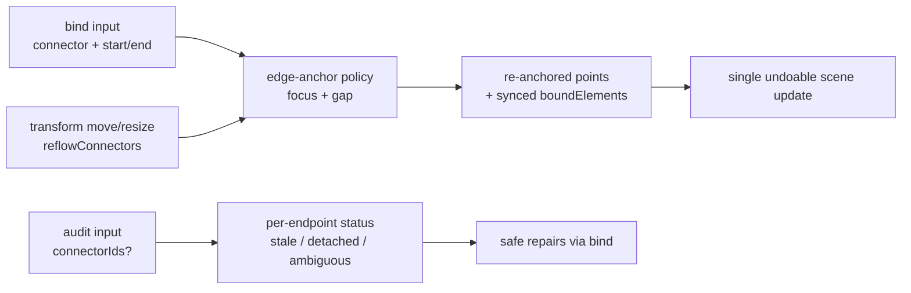
```mermaid
flowchart LR
  bindInput["bind input<br/>connector + start/end"]
  anchor["edge-anchor policy<br/>focus + gap"]
  geometry["re-anchored points<br/>+ synced boundElements"]
  scene["single undoable scene update"]
  moveResize["transform move/resize<br/>reflowConnectors"]
  auditInput["audit input<br/>connectorIds?"]
  health["per-endpoint status<br/>stale / detached / ambiguous"]
  repairs["safe repairs via bind"]

  bindInput --> anchor --> geometry --> scene
  moveResize --> anchor
  auditInput --> health --> repairs
```

### Layout helpers

`snap`, `place`, and `arrange` are writes that reposition existing elements, and `survey`
is a read that reports layout health. The three writes share the same relationship-safe
translation machinery as the structural verbs: they seed a per-element delta map and apply
it through `applyDeltas` (so bound labels and frame children follow), then re-anchor bound
connectors through `reflowBoundConnectors` (the connectors & bindings reflow), and commit
exactly one atomic, undoable `updateScene`. They are versioned by default like the other
structural verbs.

- `snap` rounds each element's top-left — and, with `snapSize`, its width/height — to the
  grid. It uses an explicit `gridSize` or the live scene grid size; with neither available
  it is a no-op. It accepts explicit versioned elements or falls back to the selection.
- `place` moves a versioned cluster of elements relative to an anchor **element or group**:
  `below`, `above`, `left-of`, `right-of`, or `center-over`, with a `gap` and cross-axis
  `align`. The cluster keeps its internal arrangement (one shared delta).
- `arrange` lays elements out in the given order into a row-major `grid` (columns/rows +
  gaps) or an evenly spaced `circle` — the 2-D arrangements that linear `align`/`distribute`/
  `stack` do not cover.
- `survey` reports findings the writes can fix: element **overlaps** (ignoring intended
  label-in-container and frame-child overlaps), bound **labels** that overflow their
  container, and **connectors** too short to read. Each finding carries a suggested fix.
  Like the other reads it is budgeted, paginated, and detail-aware (`summary` drops the fix
  hints); `checks` and `elementIds` scope it.

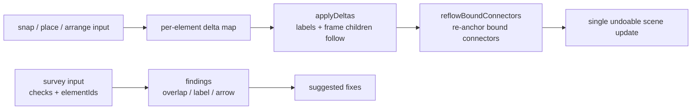
```mermaid
flowchart LR
  writeInput["snap / place / arrange input"]
  deltas["per-element delta map"]
  apply["applyDeltas<br/>labels + frame children follow"]
  reflow["reflowBoundConnectors<br/>re-anchor bound connectors"]
  scene["single undoable scene update"]
  surveyInput["survey input<br/>checks + elementIds"]
  findings["findings<br/>overlap / label / arrow"]
  fixes["suggested fixes"]

  writeInput --> deltas --> apply --> reflow --> scene
  surveyInput --> findings --> fixes
```

### Safer iterative workflows

`preview`, `thumbnail`, and `pick` close the loop between proposing a change, verifying
it, and grounding it in what the user actually means.

- `preview` is a **stateless dry-run** of any mutating verb that returns a **rendered image
  of the hypothetical result** alongside a patch summary — "what would this look like" gets
  pixels, not just a diff. There is no staged-mutation token or state held in the iframe —
  staged state would go stale on any concurrent user edit and duplicate `mutation.ts`'s
  lifecycle. Instead, the versioned input **is** the staged plan: `preview` validates `input`
  against the target verb's own schema, then runs that verb's **real executor** — same
  validation, same geometry, same stale-version, lock, and relationship guards — against a
  hardened capture proxy over the imperative API that records what `updateScene` would have
  committed instead of committing it (and no-ops `scrollToContent`, so a dry-run never moves
  the viewport either). The proxy delegates every other property to the real target — evaluated
  and, for functions, **bound** against the real object rather than the proxy — so a real
  `ExcalidrawImperativeAPI`'s methods (which may read private instance state via `this`) behave
  identically to a live call. The captured elements are diffed against the current scene by id
  and object identity (executors return the same object for elements they didn't touch; a pure
  z-reorder — same id set, changed array position — is reported as an update too) into a
  compact **patch summary**: `wouldChange`, add/update/delete counts, and a bounded `changes`
  list of `{ op, id, type, label?, version? }` entries. The captured (never-committed)
  `after` scene is also rendered to a PNG via the same shared `renderScenePng` helper
  `thumbnail` uses — called against the **real** api, never the proxy, since exporting is a
  pure read. Rendering **degrades instead of erroring**: `render:false` (an explicit opt-out)
  yields `thumbnailReason: 'not-requested'`; nothing would change yields `'no-change'`; an
  empty result scene (e.g. `clear`) yields `'empty-result'`; a render that doesn't fit
  alongside the summary under the result budget is dropped with `'over-budget'` (the image is
  the preferred payload when trimming, so `changes` — not the image — gets cut first); a
  successful render yields `'rendered'` with the result's `media` array populated by one
  display-only image item, its `description` built by `describePreview` (see "Tool-result
  media" below). The summary counts come from the full diff and never shrink; only trailing
  `changes` entries are trimmed to make room. Applying is simply calling the target verb
  itself with the same input — its `expectedVersion`/`expectedSceneVersion` checks make
  apply-after-preview safe by construction.
- `thumbnail` renders an on-demand PNG snapshot of the whole scene or scoped `elementIds`,
  scaled to `maxDimension`, and returns it as a display-only `media` item (see "Tool-result
  media" below) for visual verification. It shares its export path (`exportToCanvas`,
  `api.getFiles()`, background color handling) with `preview`'s visual via the
  `renderScenePng` helper in `thumbnail.ts`. Unlike the record-list reads it has a **hard byte
  budget** rather than truncation metadata: an image cannot be "trimmed", so an over-budget
  export is an actionable error (lower `maxDimension` or narrow `elementIds`), never a
  silently degraded result — `preview`'s visual, by contrast, degrades to an empty `media`
  array with a `thumbnailReason` rather than ever failing the dry-run over an image.
- `pick` is the interactive/selection read, one verb with two modes. `current` reports the
  live canvas selection now; `interactive` is the human-in-the-loop flow — it shows an
  in-canvas toast prompt and resolves with the user's next **settled** selection change (a
  marquee drag emits a stream of selection events, so the selection must be stable for a
  short debounce before it counts), or `timedOut: true` after `timeoutSeconds`. Stale ids
  pointing at deleted elements are silently dropped, and the selected elements come back as
  normalized, versioned records so they can be edited immediately. Instead of inventing a
  second HITL path, `pick` reuses the issue-#85 machinery: the canvas tool declares
  `awaitsHumanInput` so the runtime governs it with the human-input budget, and sets a
  per-request bridge timeout (derived from `EXCALIDRAW_PICK_MAX_TIMEOUT_SECONDS`, the
  generic app-bridge override described earlier) so the underlying request outlives the
  wait too.

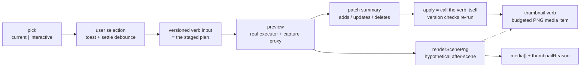
```mermaid
flowchart LR
  plan["versioned verb input<br/>= the staged plan"]
  dryRun["preview<br/>real executor + capture proxy"]
  patch["patch summary<br/>adds / updates / deletes"]
  render["renderScenePng<br/>hypothetical after-scene"]
  visual["media[] + thumbnailReason"]
  apply["apply = call the verb itself<br/>version checks re-run"]
  snapshot["thumbnail verb<br/>budgeted PNG media item"]
  pickVerb["pick<br/>current | interactive"]
  user["user selection<br/>toast + settle debounce"]

  plan --> dryRun --> patch --> apply
  dryRun --> render --> visual
  apply --> snapshot
  render -.-> snapshot
  pickVerb --> user --> plan
```

### Tool-result media: the generic convention

`preview` and `thumbnail` are the first consumers of a convention that is otherwise entirely
app-agnostic: any tool result — Excalidraw or not — may carry a top-level
`media: ToolResultImageMedia[]`, each item `{ kind: 'image', dataUrl, mimeType, width, height,
description }`. This lives in `@tinytinkerer/contracts` (`toolResultImageMediaSchema`), not in
`excalidraw-protocol`, because the problem it solves is generic: a tool result that inlines a
base64 PNG bloats every model request (the whole result, base64 included, gets
JSON-stringified into the tool message) and never rendered as a picture anyway. The convention
splits the heavy pixels from the light text so each can travel its own path.

Two helpers, shared by every producer and consumer so they cannot drift on the wire format:

- `partitionToolResultMedia(output) => { rest, media }` is the one structural split. It never
  throws — non-object output, a missing/non-array `media` field, or a malformed item all
  degrade to "no media found" rather than breaking the caller — so it is safe to call
  uniformly over arbitrary, untrusted tool output.
- `mediaRefFor(callId, index) => "media:<callId>#<index>"` mints the one canonical handle
  format. Both sides that need to agree on a ref — the inference path minting it for the
  model, and the UI registry resolving it back to pixels — import this single function.

**Inference path (token savings).** `serializeToolResult`
(`packages/app/app-browser/src/runtime/tool-calling.ts`) partitions media out of every tool
result before it becomes `tool` message content: the model receives `{ ...rest, media: [{
mediaRef, description, width, height, mimeType }] }` per image — the base64 `dataUrl` never
reaches a chat request. `serializeToolNote` (`packages/app/agent-core/src/runtime/agent-runtime-base.ts`)
applies the same reduction to the ReAct note trail, collapsing each media item to its
`description` string. The system prompt tells the model it may show an image to the user by
embedding `` in its reply, rather than pasting raw image data.

**Activity panel render (guaranteed).** `neutralView`/`ActivitySectionEntry`
(`packages/app/app-browser/src/turn-activity-panel.tsx`) partition the output the same way and
render each media item as a real `image` `ActivityViewSection` — a bounded `` sourced
from the persisted `dataUrl` — with anything left of the payload still shown as its usual
`json` section right after. This is generic across every tool (no tool-id branching), and
because tool output is persisted to IndexedDB via the `agent.tool.completed` event (`dataUrl`
included), the render survives a reload.

**Transcript render (model-elected).** If the model instead embeds
``, that handle has to survive markdown parsing and then
resolve to a real image at render time. `sanitizeImageUrl` (`content-markdown`) whitelists the
`media:` scheme alongside `https:` and `data:image/` so the ref isn't stripped;
`ContentRenderOptions.resolveMediaUrl` (`content-react`) is the seam a host injects a resolver
into; content-image's `ImageNodeRenderer` calls it before falling back to raw-SVG handling, and
renders gracefully if the ref doesn't resolve. The resolver
(`buildMediaRegistry`/`useResolveMediaUrl` in `packages/app/app-browser/src/media-registry.ts`)
is derived from the conversation's persisted `agent.tool.completed` events rather than a
separate cache: it re-runs `partitionToolResultMedia` over each event's output and keys the
result `mediaRefFor(stepId, i)` — the SAME ref the inference path minted, because a
tool-completed event's `stepId` equals the `callId` `serializeToolResult` used. One registry,
derived straight from persisted events, so a ref resolves identically live and after reload.

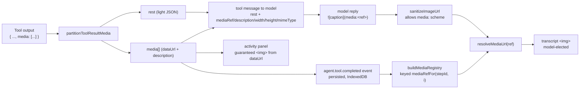
```mermaid
flowchart LR
  output["Tool output<br/>{ ..., media: [...] }"]
  partition["partitionToolResultMedia"]
  rest["rest (light JSON)"]
  mediaArr["media[] (dataUrl + description)"]
  modelMsg["tool message to model<br/>rest + mediaRef/description/width/height/mimeType"]
  activityImg["activity panel<br/>guaranteed &lt;img&gt; from dataUrl"]
  persisted["agent.tool.completed event<br/>persisted, IndexedDB"]
  registry["buildMediaRegistry<br/>keyed mediaRefFor(stepId, i)"]
  modelReply["model reply<br/>![caption](media:&lt;ref&gt;)"]
  sanitize["sanitizeImageUrl<br/>allows media: scheme"]
  resolve["resolveMediaUrl(ref)"]
  transcriptImg["transcript &lt;img&gt;<br/>model-elected"]

  output --> partition --> rest --> modelMsg
  partition --> mediaArr --> modelMsg
  mediaArr --> activityImg
  mediaArr --> persisted --> registry
  modelMsg --> modelReply --> sanitize --> resolve
  registry --> resolve --> transcriptImg
```

`preview` and `thumbnail` build their `description` deterministically rather than calling a
model to caption the image: `describeScene`/`describePreview`
(`packages/app/excalidraw-app/src/describe.ts`) count element types and quote a few display
labels, bounded to ~240 bytes. `excalidraw-protocol` cannot import `@tinytinkerer/contracts`
(app-protocol packages may depend only on `@tinytinkerer/app-bridge`), so it mirrors
`toolResultImageMediaSchema` locally as `previewMediaSchema` instead. The reshape does not
change the byte budgets below: `thumbnail`'s 128 KiB result budget is still a hard error over
budget (an image can't be trimmed), and `preview`'s 160 KiB result budget still prefers the
image when trimming — it drops to `media: []` with `thumbnailReason: 'over-budget'` before the
rendered picture is ever cut.

### Normalized element union and edit capabilities

`read` returns a strict discriminated union on `kind`, not a record containing several
unrelated optional detail objects. The variants are `shape`, `text`, `line`, `arrow`,
`freeDraw`, `image`, `frame`, `embed`, and `unsupported`. The explicit unsupported
variant preserves common geometry/style/context for a new upstream Excalidraw type
without pretending that the contract understands its type-specific fields. Strict
variant schemas reject impossible combinations such as a `kind: "text"` record with
linear points.

Every record contains `capabilities`:

- `editableFields` is the exact set accepted by the current safe edit implementation;
- `requiresUnlock` tells the caller to include `locked: false` with other changes; and
- `restrictions` contains stable codes such as `relationship-geometry`,
  `unsupported-resize`, `container-text`, and `fixed-text`.

The read and edit paths derive their decisions from the same capability calculation.
This prevents the contract from advertising an edit that the write path subsequently
rejects. Capability exposure is descriptive, not an authorization mechanism: `edit`
still rechecks the current element and scene immediately before its atomic update.

### Detail, pagination, and payload bounds

`search`, `inspect`, and `read` accept `detail: "summary" | "standard" | "full"`;
`standard` is the default. Search and inspection remain compact discovery surfaces:
summary search omits display names, summary inspection omits relationship lists, and
full inspection raises its group/relationship limits. For `read`, summary omits
type-specific heavy fields, standard includes bounded working detail, and full raises
the bounded field limits. Every result echoes the effective detail level. “Full” means
the fullest safe contract representation, not unbounded upstream JSON.

All three read verbs use element-level offset pagination:

- `offset` defaults to zero, `limit` defaults to 20 and is at most 50;
- every result returns `sceneVersion`, `page`, and `truncation`;
- a page after offset zero must include `expectedSceneVersion`; and
- the iframe rejects the page if the current scene no longer has that version.

This provides deterministic paging and tells the caller to restart after concurrent
user or model edits. Large strings and arrays are not nested pagination streams. They
return a bounded prefix and list their field path in truncation metadata.

| Bounded field               | Maximum                |
| --------------------------- | ---------------------- |
| Discovery name              | 160 UTF-8 bytes        |
| Standard text/original text | 2,048 UTF-8 bytes each |
| Full text/original text     | 8,192 UTF-8 bytes each |
| Full points and pressures   | 1,024 entries each     |
| Relationship references     | 256 entries            |
| Group ids                   | 64 entries             |

Budgets are measured as exact UTF-8 bytes of serialized JSON. Requests over budget
fail before behavior executes. Results drop trailing detailed element records until
they fit and report both omissions and field truncations. Edit receipts (`id` and new
`version`) are always retained even when detailed edited records are omitted; callers
retrieve omitted detail with `read`.

### Field projection (`fields`)

`pick` and `read` additionally accept an optional `fields` array (from
`ELEMENT_PROJECTION_FIELDS`/`elementFieldSchema`) that narrows each element record to
identity — `id`, `type`, `kind`, always included and not listed in the enum — plus
only the requested keys. Omitting `fields` returns today's full record, byte-for-byte
unchanged; this is the default because most existing callers rely on it. A selection
of ~10 elements easily exceeds `pick`'s 64 KiB result budget once every record carries
`style` (7 fields) and `capabilities` (an `editableFields` array plus
`restrictions`) — `fields: ['x', 'y', 'width', 'height']` gets back just the geometry
that a layout decision needs, so the whole selection fits.

`fields` is orthogonal to `detail`: `detail` still governs which type-specific blocks
get built and how far their strings/arrays are truncated (as above); `fields` then
narrows which of the built keys make it into the record. A field the record doesn't
have (e.g. `text` on a shape) is silently skipped rather than sent as `undefined`.
Every result echoes the applied projection back as `fields`; it is absent when the
caller didn't project. Truncation reporting is projection-aware too: a truncated
`text.text` on a record whose projection excludes `text` is not reported, since that
data was never sent.

`search` and `inspect` don't need `fields` — they're already bespoke, compact records
(a handful of scalar fields, not the full normalized union), not a case of a caller
wanting a subset of a verbose default. Extending the same projection to mutation
receipts (`edit` and the structural verbs echo budget-bounded `elements` alongside
their receipts) is a natural follow-up, not yet implemented.

| Verb        | Request budget | Result budget |
| ----------- | -------------: | ------------: |
| `search`    |          8 KiB |        16 KiB |
| `inspect`   |         16 KiB |        32 KiB |
| `read`      |         16 KiB |        64 KiB |
| `draw`      |         64 KiB |        64 KiB |
| `edit`      |         64 KiB |        64 KiB |
| `clear`     |          1 KiB |         1 KiB |
| `preview`   |         64 KiB |       160 KiB |
| `thumbnail` |          4 KiB |       128 KiB |
| `pick`      |          4 KiB |        64 KiB |

`preview` and `thumbnail`'s result budgets are unchanged by the tool-result media convention
above — the reshape moves the image into `media` instead of a flat `dataUrl`/nested
`thumbnail` field, but the byte accounting and the "image preferred, cut last" trimming order
are the same as before.


```mermaid
flowchart LR
  input["Model tool input"]
  inputSchema["Excalidraw input schema"]
  envelope["app-bridge req envelope"]
  handler["Typed iframe handler"]
  resultSchema["Excalidraw result schema"]
  output["Model tool result"]

  input -->|"canvas runtime validates"| inputSchema
  inputSchema --> envelope
  envelope -->|"server validates again"| handler
  handler --> resultSchema
  resultSchema -->|"server validates"| output
```

## `packages/app/excalidraw-app`: the isolated implementation

`@tinytinkerer/excalidraw-app` is the only package in this flow that imports
`@excalidraw/excalidraw`. It:

1. mounts `<Excalidraw>`;
2. receives the `ExcalidrawImperativeAPI`;
3. reads the per-mount nonce from `location.hash`;
4. creates a bridge server using `parentServerTransport()`; and
5. binds each contract from `excalidraw-protocol` to app-owned behavior in `bridge.ts`.

Ownership remains entirely in `excalidraw-app`, but behavior is split by concern:

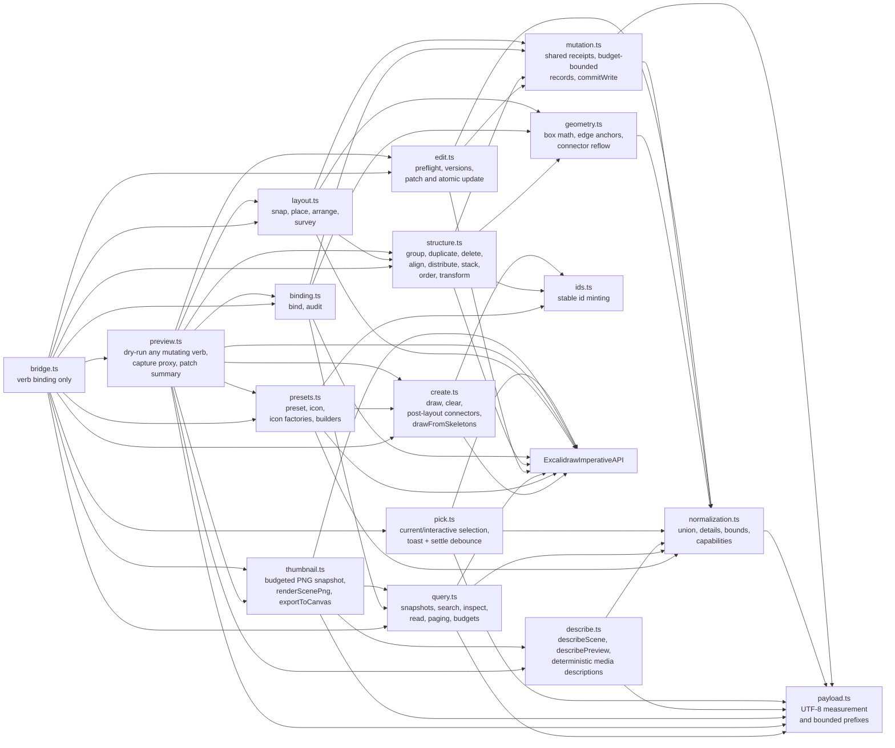
```mermaid
flowchart LR
  bridge["bridge.ts<br/>verb binding only"]
  create["create.ts<br/>draw, clear,<br/>post-layout connectors,<br/>drawFromSkeletons"]
  presets["presets.ts<br/>preset, icon,<br/>icon factories, builders"]
  query["query.ts<br/>snapshots, search, inspect,<br/>read, paging, budgets"]
  normalization["normalization.ts<br/>union, details, bounds,<br/>capabilities"]
  edit["edit.ts<br/>preflight, versions,<br/>patch and atomic update"]
  structure["structure.ts<br/>group, duplicate, delete,<br/>align, distribute, stack,<br/>order, transform"]
  binding["binding.ts<br/>bind, audit"]
  layout["layout.ts<br/>snap, place, arrange,<br/>survey"]
  preview["preview.ts<br/>dry-run any mutating verb,<br/>capture proxy, patch summary"]
  thumbnail["thumbnail.ts<br/>budgeted PNG snapshot,<br/>renderScenePng, exportToCanvas"]
  describe["describe.ts<br/>describeScene, describePreview,<br/>deterministic media descriptions"]
  pick["pick.ts<br/>current/interactive selection,<br/>toast + settle debounce"]
  geometry["geometry.ts<br/>box math, edge anchors,<br/>connector reflow"]
  mutation["mutation.ts<br/>shared receipts, budget-bounded<br/>records, commitWrite"]
  ids["ids.ts<br/>stable id minting"]
  payload["payload.ts<br/>UTF-8 measurement<br/>and bounded prefixes"]
  api["ExcalidrawImperativeAPI"]

  bridge --> create --> api
  bridge --> presets --> api
  presets --> create
  presets --> ids
  presets --> normalization
  bridge --> query --> api
  query --> normalization
  query --> payload
  bridge --> edit --> api
  edit --> mutation
  bridge --> structure --> api
  structure --> mutation
  structure --> ids
  structure --> geometry
  bridge --> binding --> api
  binding --> mutation
  binding --> query
  binding --> geometry
  bridge --> layout --> api
  layout --> structure
  layout --> mutation
  layout --> geometry
  bridge --> preview --> api
  preview --> create
  preview --> edit
  preview --> structure
  preview --> binding
  preview --> layout
  preview --> presets
  preview --> payload
  preview --> thumbnail
  preview --> describe
  bridge --> thumbnail --> api
  thumbnail --> query
  thumbnail --> payload
  thumbnail --> describe
  describe --> normalization
  describe --> payload
  bridge --> pick --> api
  pick --> normalization
  pick --> payload
  geometry --> normalization
  create --> ids
  mutation --> normalization
  edit --> normalization
  normalization --> payload
  mutation --> payload
```

`bridge.ts` contains no query, normalization, or mutation rules; it only associates
verb contracts with functions and creates the server. This keeps the transport seam
auditable without moving domain ownership into a generic package.

The modules translate the stable model vocabulary into Excalidraw operations:

- `draw` converts simplified skeletons, computes declarative connector endpoints from
  final node bounds, and performs one undoable scene update;
- `search`, `inspect`, and `read` normalize current elements and app state;
- `edit` preflights the whole batch, checks element versions and relationship
  invariants, and performs one undoable update;
- `group`, `duplicate`, `delete`, `align`, `distribute`, `stack`, `order`, and
  `transform` (in `structure.ts`) resolve operands from ids or the live selection,
  preflight version/relationship safety, and perform one undoable update each. They lean
  on `mutation.ts` for the shared receipt + budget machinery and the `commitWrite`
  choke-point (also used by `edit`, binding, and layout) and on `ids.ts` for collision-free
  id minting (also used by `draw`). z-order changes reorder the element array, which
  `Scene.replaceAllElements` resyncs to fractional indices;
- `bind` and `audit` (in `binding.ts`) own connector binding behavior: `bind` re-anchors
  and (re)binds/detaches connector endpoints with synced `boundElements`, and `audit`
  reports binding health;
- `snap`, `place`, `arrange`, and `survey` (in `layout.ts`) own the layout helpers: the
  three writes reuse `structure.ts`'s `applyDeltas` so repositioning carries relationships,
  and `survey` reports overlaps/label/connector health as a bounded read;
- `preset` and `icon` (in `presets.ts`) own the diagram-semantics inserts: pure builders turn
  intent into an intermediate set of primitives + declarative links (keyed by local names),
  the six infrastructure icon factories encode each glyph locally (no runtime library fetch),
  and the executor mints collision-free ids/group ids, version-checks the scene, and reuses
  `create.ts`'s `drawFromSkeletons` to convert + commit in one atomic, undoable update;
- `preview` (in `preview.ts`) dry-runs any mutating verb: it parses the nested input with
  that verb's own schema, runs the verb's real executor against a hardened capture proxy
  (delegated properties bound to the real target, not the proxy) that suppresses the single
  `updateScene` commit, and diffs before/after into a compact patch summary — no staged
  state, nothing committed. It also renders the captured (unapplied) `after` scene to a PNG
  via `thumbnail.ts`'s shared `renderScenePng`, attaching it as a display-only `media` item
  described by `describe.ts`'s `describePreview`, and degrading to an empty `media` array
  with a `thumbnailReason` instead of failing the dry-run over an image;
- `thumbnail` (in `thumbnail.ts`) exports the scene (or scoped elements) to a PNG data URL
  via the shared `renderScenePng` (which owns the `exportToCanvas` call, `api.getFiles()`, and
  background color handling — also used by `preview`'s visual), returns it as a display-only
  `media` item described by `describe.ts`'s `describeScene`, and is version-checked and
  hard-capped by its own result byte budget;
- `describe.ts` builds the deterministic, LLM-free `description` text `thumbnail` and
  `preview` attach to their rendered image: `describeScene` counts element types (and quotes
  a few display labels) for `thumbnail`, `describePreview` reports the patch-summary counts
  for `preview`'s hypothetical image, and both are bounded to a short byte budget (see "Tool-
  result media: the generic convention" above);
- `pick` (in `pick.ts`) reads the live selection, or — in interactive mode — shows a toast
  (`api.setToast`), subscribes to `api.onChange`, and resolves with the user's next settled
  selection as normalized records (or `timedOut: true`);
- `geometry.ts` is the shared, verb-agnostic geometry: the axis-aligned box math, the
  deterministic connector edge-anchor policy, and `reflowBoundConnectors` (re-anchoring
  connectors bound to a moved/resized shape). `structure`, `binding`, and `layout` all
  consume it instead of re-deriving box/anchor math, and it depends only on
  `normalization`, so it never forms an import cycle with the verb modules; and
- `clear` submits an empty element list as an undoable update.

All writes commit through `mutation.ts`'s `commitWrite` with
`CaptureUpdateAction.IMMEDIATELY` (a no-op when nothing changed). A successful write batch
therefore becomes one user-visible undo checkpoint, from a single choke-point; a failed
write changes nothing.

The package does not render chat, create model tools, or decide where the iframe is
served. Those are parent-shell concerns.

## `apps/canvas`: the thin parent shell and build owner

`apps/canvas` joins the generic and app-specific halves.

### Parent-window startup

`apps/canvas/src/main.tsx` calls:

```ts
createBrowserShellRoot({
  router,
  BootScreen: CanvasBootScreen,
  appTools: createCanvasAppTools()
})
```

`createCanvasAppTools` pairs model-facing descriptions with the input schemas from
`excalidraw-protocol`. `appToolsFromVerbs` converts each definition into an
`app-browser` tool whose `execute` function calls a shared `AppBridgeHandle`.

The handle is created once at module scope. The same object is:

- closed over by tools created during shell bootstrap; and
- passed to `<HarnessShell>`, whose `<AppFrame>` populates it after handshake.

This stable indirection is why tools can be registered before the iframe exists without
holding a stale bridge client.

### Page composition

`CanvasPage` renders `HarnessShell` with:

- the expected app id and Excalidraw contract version;
- the complete required verb list;
- the resolved `/canvas/excalidraw-app/` URL;
- the stable bridge handle; and
- chat configuration.

`HarnessShell` places `AppFrame` as the stage layer and the shared `ChatApp` —
starting in the floating layout — as a click-through overlay, so the whiteboard
remains directly interactive while chat is visible. The chat is morphable (#324):
dragging it to a viewport edge docks it into the resizable sidebar split, and the
harness shrinks the iframe into the space the docked panel leaves so the app and
chat sit side by side.

### Two build graphs

Canvas owns two Vite entries:

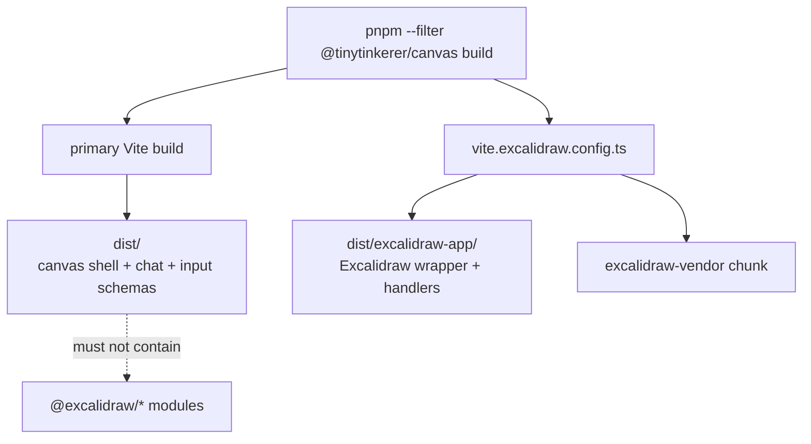
```mermaid
flowchart TB
  canvasBuild["pnpm --filter @tinytinkerer/canvas build"]

  canvasBuild --> shellBuild["primary Vite build"]
  canvasBuild --> iframeBuild["vite.excalidraw.config.ts"]

  shellBuild --> shellOutput["dist/<br/>canvas shell + chat + input schemas"]
  iframeBuild --> iframeOutput["dist/excalidraw-app/<br/>Excalidraw wrapper + handlers"]
  iframeBuild --> vendor["excalidraw-vendor chunk"]

  shellOutput -. must not contain .-> excalidrawVendor["@excalidraw/* modules"]
```

The secondary entry at `apps/canvas/excalidraw-app/main.tsx` imports
`mountExcalidrawApp` from `@tinytinkerer/excalidraw-app`. The package appears in the
canvas manifest because canvas owns this build entry, but it is not imported by the
parent-window application graph. Bundle regression tests enforce that separation.

## `apps/shell`: the chat-only sibling

`apps/shell` is important because it demonstrates which parts of canvas are generic
chat behavior and which parts exist only for app hosting.

Both widget and canvas call `createBrowserShellRoot` from `app-browser`, use hash
routing, provide a boot screen, and ultimately render the shared `ChatApp`. Both
are morphable — the floating window can dock into the resizable sidebar layout
and back in place. In canvas the harness additionally shrinks the iframe into the
region the docked panel leaves free.

The difference is that widget passes no `appTools` and renders the chat surface
directly:

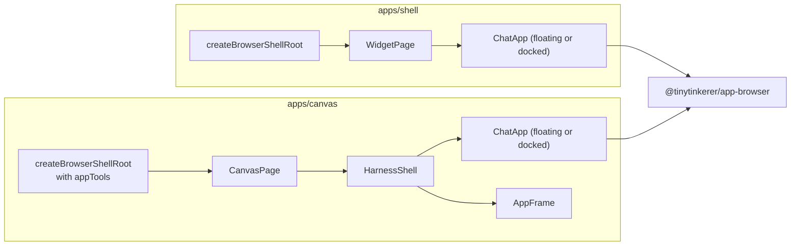
```mermaid
flowchart LR
  subgraph widget["apps/shell"]
    widgetMain["createBrowserShellRoot"]
    widgetPage["WidgetPage"]
    widgetChat["ChatApp (floating or docked)"]
    widgetMain --> widgetPage --> widgetChat
  end

  subgraph canvas["apps/canvas"]
    canvasMain["createBrowserShellRoot<br/>with appTools"]
    canvasPage["CanvasPage"]
    harnessShell["HarnessShell"]
    canvasChat["ChatApp (floating or docked)"]
    appFrame["AppFrame"]
    canvasMain --> canvasPage --> harnessShell
    harnessShell --> canvasChat
    harnessShell --> appFrame
  end

  shared["@tinytinkerer/app-browser"]
  widgetChat --> shared
  canvasChat --> shared
```

Widget is therefore **not** a client of `app-bridge` and does not load
`excalidraw-protocol` or `excalidraw-app`. Canvas reuses widget's shared chat surface
through `app-browser`; it does not embed `apps/shell` or communicate with a widget
window.

This distinction matters when adding features:

- shared chat chrome, layout, composer, or model-runtime changes belong in
  `app-browser` and should work in widget and canvas;
- iframe lifecycle or app-tool forwarding belongs in `app-harness`;
- Excalidraw tool schemas belong in `excalidraw-protocol`; and
- Excalidraw API behavior belongs in `excalidraw-app`.

## Handshake and lifecycle

`AppFrame` creates one session nonce per mounted frame and appends it to the iframe URL
fragment. It then creates an `app-bridge` client configured with the expected app id,
Excalidraw app contract version, and required verbs. The bridge client itself uses the
generic bridge version.

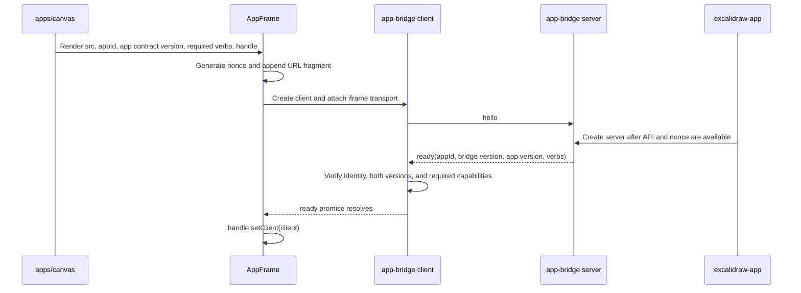
```mermaid
sequenceDiagram
  participant Canvas as apps/canvas
  participant Frame as AppFrame
  participant Client as app-bridge client
  participant Server as app-bridge server
  participant App as excalidraw-app

  Canvas->>Frame: Render src, appId, app contract version, required verbs, handle
  Frame->>Frame: Generate nonce and append URL fragment
  Frame->>Client: Create client and attach iframe transport
  Client->>Server: hello
  App->>Server: Create server after API and nonce are available
  Server-->>Client: ready(appId, bridge version, app version, verbs)
  Client->>Client: Verify identity, both versions, and required capabilities
  Client-->>Frame: ready promise resolves
  Frame->>Frame: handle.setClient(client)
```

The server announces `ready` immediately at startup, covering “client listens first.”
The client sends `hello`, and the server re-announces, covering “server announced
first” and React Strict Mode effect re-runs.

Failure behavior is explicit:

- before readiness, the handle rejects tool calls instead of queuing or hanging;
- a missing required verb produces a capability mismatch;
- either a generic bridge or app contract mismatch marks the frame `version-mismatch`;
- a handshake timeout marks the app unavailable;
- disposing or remounting the frame clears the handle and rejects pending requests.

## End-to-end tool call

The following sequence shows an `edit` call. Other verbs follow the same path.

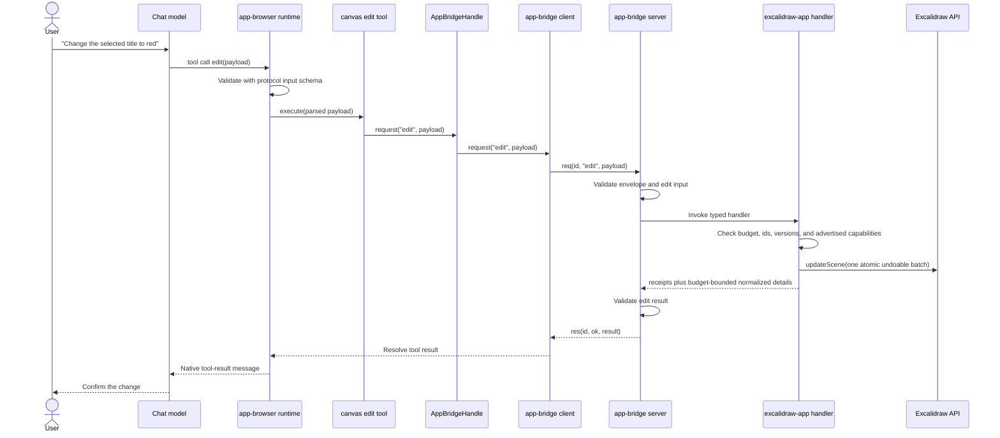
```mermaid
sequenceDiagram
  actor User
  participant Model as Chat model
  participant Runtime as app-browser runtime
  participant Tool as canvas edit tool
  participant Handle as AppBridgeHandle
  participant Client as app-bridge client
  participant Server as app-bridge server
  participant Handler as excalidraw-app handler
  participant API as Excalidraw API

  User->>Model: "Change the selected title to red"
  Model->>Runtime: tool call edit(payload)
  Runtime->>Runtime: Validate with protocol input schema
  Runtime->>Tool: execute(parsed payload)
  Tool->>Handle: request("edit", payload)
  Handle->>Client: request("edit", payload)
  Client->>Server: req(id, "edit", payload)
  Server->>Server: Validate envelope and edit input
  Server->>Handler: Invoke typed handler
  Handler->>Handler: Check budget, ids, versions, and advertised capabilities
  Handler->>API: updateScene(one atomic undoable batch)
  Handler-->>Server: receipts plus budget-bounded normalized details
  Server->>Server: Validate edit result
  Server-->>Client: res(id, ok, result)
  Client-->>Runtime: Resolve tool result
  Runtime-->>Model: Native tool-result message
  Model-->>User: Confirm the change
```

## Security boundary

The iframe is mounted with
`sandbox="allow-scripts allow-downloads allow-popups allow-popups-to-escape-sandbox"`
and `allow="clipboard-write; clipboard-read"`, but **without** `allow-same-origin`. It
can execute the Excalidraw bundle but receives an opaque origin and cannot access the
parent shell's DOM, cookies, storage, or authentication state.

The grant is the minimum the embedded app's features need, and each flag is deliberate:

- `allow-scripts` — run the app bundle.
- `allow-downloads` — Excalidraw export / save-to-image triggers a file download.
- `allow-popups` — external links (the GitHub link, the Excalidraw Libraries browser)
  open in a new window.
- `allow-popups-to-escape-sandbox` — those popups land in a normal top-level context
  rather than inheriting this restrictive sandbox, so the external sites work.
- `allow="clipboard-write; clipboard-read"` — the Clipboard API is gated by Permissions
  Policy independently of the sandbox, so copy-to-clipboard (write) and paste (read)
  stay blocked unless the host frame delegates them.

`allow-same-origin` is intentionally omitted: granting it would collapse the opaque
origin (the app is served from the harness's own origin), letting the iframe reach the
parent DOM/storage and defeating the isolation the nonce handshake is built on. Because
the opaque origin also means the app has **no Web Storage of its own**, scene
persistence is delegated to the harness (see "Scene persistence" below) rather than
weakening the sandbox.

Because an opaque iframe reports `event.origin` as `"null"`, trust is not based on a
literal origin allowlist. It is based on:

1. **Window identity:** the parent transport accepts only the iframe's exact
   `contentWindow`; the iframe transport accepts only `window.parent`.
2. **Session nonce:** every message must carry the random nonce passed through the URL
   fragment. Fragments are not sent to the hosting server.
3. **Envelope validation:** malformed or foreign messages are discarded.
4. **Verb validation:** app-owned schemas validate both handler input and output.
5. **Correlation and timeout:** responses must match a pending request id, and requests
   fail after a bounded period.

`postMessage` uses `targetOrigin: '*'` because the sandbox has an opaque origin and
bridge payloads contain app data rather than parent-window credentials. The exact
window identity and nonce still gate receipt.

The security boundary also enforces supply-chain isolation: Excalidraw and its
transitive dependencies, license considerations, and advisory allow-lists belong to the
iframe implementation/build, not widget or the canvas startup graph.

## Scene persistence

A reload must restore the last canvas. The opaque-origin iframe cannot use `localStorage`
(or any Web Storage) itself, so persistence is split across the boundary instead of
weakening the sandbox:

1. **App serializes (owns the data).** `excalidraw-app` subscribes to the Excalidraw
   `onChange` and, debounced, emits a versioned snapshot — the live elements plus a
   curated slice of view state (`scrollX`, `scrollY`, `zoom`, `viewBackgroundColor`,
   `theme`) — over the bridge `event` channel under the reserved `app:snapshot` verb.
2. **Harness persists (owns the storage).** `<AppFrame>`, which runs at the real origin,
   writes the **opaque** snapshot blob to `localStorage` under the shell-provided
   `persistenceKey`. It never interprets the payload, so the generic harness stays
   product-agnostic. Reads and writes fail safe (missing key, unavailable storage, or
   corrupt JSON all degrade to an empty scene).
3. **Harness replays on reload.** Once the handshake completes, `<AppFrame>` reads the
   stored blob and hands it back through the reserved `app:restore` request. The app's
   contract version-guards the snapshot; a stale/incompatible blob is rejected at the
   wire and the canvas opens empty rather than corrupt. The restore applies with
   `CaptureUpdateAction.NEVER` so hydration never pollutes the undo history.

`app:snapshot` and `app:restore` are generic, reserved bridge verb names
(`APP_SNAPSHOT_EVENT` / `APP_SNAPSHOT_RESTORE_VERB` in `app-bridge`); the snapshot
schema and its version live in `excalidraw-protocol`. The harness only moves an opaque
blob between the app and `localStorage`. Imported libraries (see below) ride along in the
same snapshot so they are restored on reload too.

## Libraries

The Excalidraw "Browse libraries" flow opens `libraries.excalidraw.com`, and "Add to
Excalidraw" navigates `target=<window.name||_blank>` to `<libraryReturnUrl>#addLibrary=…`.
That round-trip cannot reach our canvas directly: the iframe has an opaque origin and is
gated by the session nonce (so a navigation that drops the nonce would only hit the
"opened by the canvas harness" guard), and browser navigation rules forbid the
cross-origin library popup from targeting our sandboxed iframe. So the import is relayed
on the **real origin** instead:

1. `excalidraw-app` sets `libraryReturnUrl` to the shell's same-origin
   `/canvas/library-callback/` page (derived from the iframe's real `location.href`).
2. "Add to Excalidraw" opens that callback page in a new tab with
   `#addLibrary=<url>&token=<token>`. The page posts the URL on a same-origin
   `BroadcastChannel` (`EXCALIDRAW_LIBRARY_CHANNEL`) and closes itself. It imports no
   React or Excalidraw — it stays a tiny standalone build entry.
3. The live canvas shell listens on that channel, allow-lists the URL to excalidraw.com
   (`isAllowedLibraryUrl`), fetches the `.excalidrawlib`, and forwards the text into the
   iframe over the reserved `excalidraw:import-library` system verb.
4. `excalidraw-app` hands the text to `updateLibrary` (Excalidraw's own loader) and tracks
   `onLibraryChange` so the library is persisted in the scene snapshot.

The iframe is never navigated, so the nonce, bridge, and scene are untouched. Like
`app:restore`, `excalidraw:import-library` is a system verb kept out of the model-facing
verb set.

## Adding another iframe app

A new iframe app should follow the same division:

1. Create an app-owned protocol package with ids, verb names, and Zod contracts.
2. Create an iframe implementation package that owns the third-party dependency and
   binds contracts to a bridge server.
3. Create a thin shell that declares model descriptions and converts the verb schemas
   to `appTools`.
4. Render `HarnessShell` with a stable handle and the expected capabilities.
5. Add a secondary HTML/build entry owned by the shell.
6. Test handshake mismatch, pre-ready errors, input/result validation, and iframe
   teardown.
7. Add bundle tests proving the third-party application does not enter the parent
   startup graph.

Do not copy the Excalidraw handler into the shell, add app-specific branches to
`app-bridge` or `app-harness`, or make a chat-only shell such as widget depend on an
iframe app.
