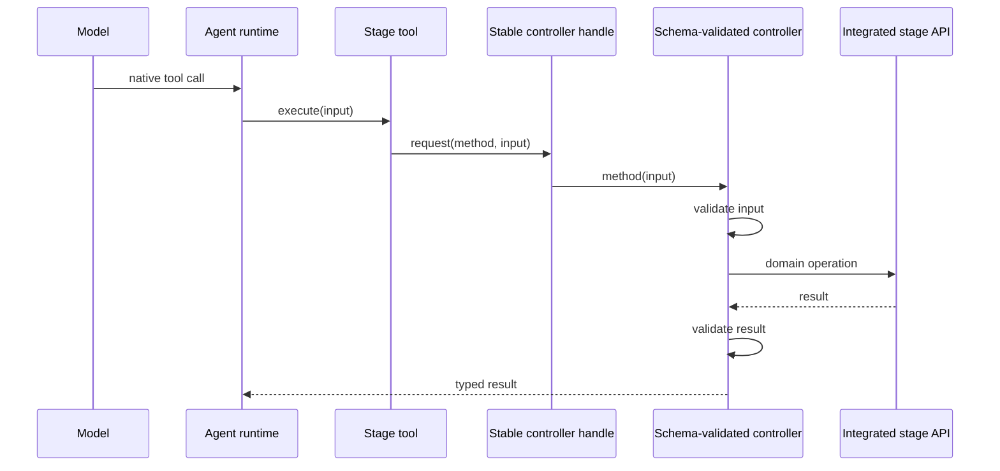

<!--
This document reflects the current integrated application-shell implementation.
Update it when the stage/controller/dock contract changes.
-->

# Integrated Application Shells

Canvas, IDE, and Mermaid are application workspaces embedded in the TinyTinkerer product. They
render as trusted React stages in the same document as their assistant. There is no application
iframe transport or second runtime.

## Ownership

| Boundary                    | Responsibility                                                                                         |
| --------------------------- | ------------------------------------------------------------------------------------------------------ |
| `apps/<app>`                | Hash routes, app-local loading copy, browser boot, and composing stage + assistant                     |
| `packages/app/<app>`        | Stage UI, app domain, Zod contracts, controller methods, model-facing tools, and app-owned persistence |
| `@tinytinkerer/app-shell`   | Generic controller handle, tool adapter, workspace store, assistant action hook, and dock layout       |
| `@tinytinkerer/app-browser` | Shared browser runtime, chat surfaces, OAuth callback route, and common loading/router factories       |

This direction is intentional: generic infrastructure never imports a concrete stage. An
`integrated-shell` app declares its one stage package in `package.json`, and the boundary checker
enforces the allowed dependency set.

## Runtime flow



The handle exists before the lazy stage mounts, so tools can be registered during browser boot.
Requests fail with a clear loading message until the stage installs its controller. Unmounting
clears the controller. No global test hook, serialization, nonce, handshake, or duplicated verb
registry is required.

## Dock workspace

`DockablePanelLayout` accepts exactly two or three panels:

- Canvas: Canvas + Assistant.
- IDE: Editor + Preview + Assistant.
- Mermaid: Editor + Preview + Assistant.

It owns named presets, persisted sizes/assignments, accessible pointer and keyboard separators,
panel swapping, a custom-state marker, reset, and a narrow stacked layout. Consumers supply panel
IDs, titles, content, a storage key, and the workspace title. The layout owns no app vocabulary.

## Persistence

`createWorkspaceStore` provides the shared Dexie mechanics while each stage owns its record and
database name. Canvas stores the `default` record in `tinytinkerer-canvas`:

```ts
{
  id: 'default',
  snapshot: { version, elements, appState?, libraryItems? },
  updatedAt: string
}
```

On first integrated startup Canvas checks that IndexedDB record, then migrates the former
`tinytinkerer:canvas-scene:v1` localStorage snapshot. A valid legacy value is removed only after
the IndexedDB write succeeds; if IndexedDB is unavailable it remains available for a later retry.
Invalid legacy data is discarded. Subsequent changes are debounced and written directly to the
workspace store.

IDE and Mermaid use the same store abstraction with app-owned schemas and namespaces.

## Loading and bundle boundaries

`@tinytinkerer/app-browser` owns `createAppShellRouter` and `createAppLoadingScreens`, eliminating
route/callback/loading markup duplication while leaving copy in each app. Stage packages may keep
heavy dependencies behind a package-local `lazy()` boundary. Canvas therefore registers tools at
startup without statically pulling Excalidraw into the startup chunk; the one lazy chunk still
renders in the same document.

## Library callback

Excalidraw's external library picker returns to `/canvas/library-callback/`. The lightweight page
publishes the allow-listed library URL over `BroadcastChannel`; the mounted stage fetches the file
and calls the in-process Excalidraw API. The callback does not load React or Excalidraw.

## Adding an integrated app

1. Create `packages/app/<app>` with stage props, a stable controller handle, schema-validated
   controller methods, tools, and app-owned persistence.
2. Compose the stage and `ChatApp` in `apps/<app>`.
3. Declare `tinytinkerer.architectureRole: integrated-shell` and `stagePackage`.
4. Use the shared router/loading factories and `DockablePanelLayout` or `AppStageShell`.
5. Add the mount to the host build inventory and verify startup/lazy bundle budgets.
6. Test real tool calls through chat/controller integration; do not expose a test-only global.
