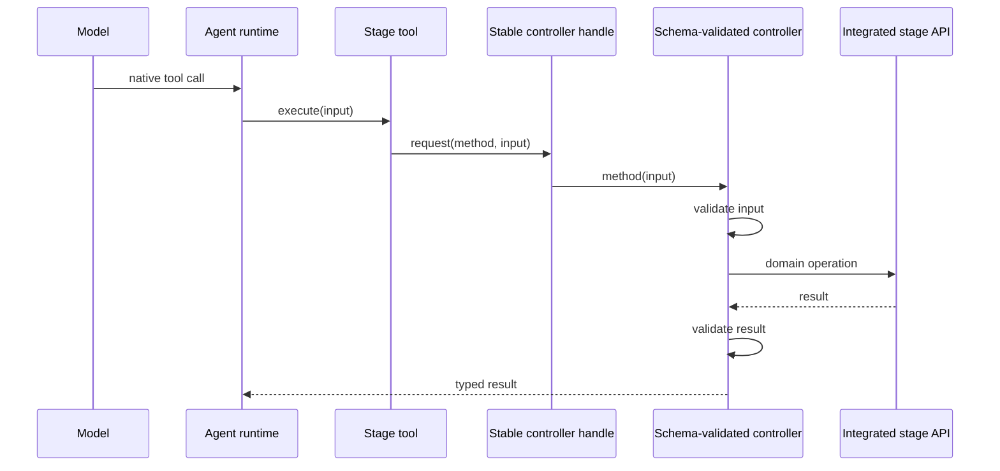

<!--
This document reflects the current integrated application-shell implementation.
Update it when the stage/controller/dock contract changes.
-->

# Integrated Application Shells

Canvas, IDE, Mermaid, and Pixel Agents are application workspaces embedded in the TinyTinkerer
product. Their stage shell and assistant render in the same React document. Pixel Agents is the
one visualization-specific exception inside a stage: its pinned, CI-built browser distribution
runs in a sandboxed iframe (an opaque-origin isolation boundary) and receives activity through a
narrow bridge that authenticates by window identity; chat still has one TinyTinkerer runtime and no
backend transport.

## Ownership

| Boundary                    | Responsibility                                                                                   |
| --------------------------- | ------------------------------------------------------------------------------------------------ |
| `apps/<app>`                | Hash routes, app-local loading copy, browser boot, and composing stage + assistant               |
| `packages/app/<app>`        | Stage UI, app domain integration, optional model-facing tools, and app-owned persistence         |
| `@tinytinkerer/app-shell`   | Generic controller handle, tool adapter, workspace store, assistant action hook, and dock layout |
| `@tinytinkerer/app-browser` | Shared browser runtime, chat surfaces, OAuth callback route, and common loading/router factories |

This direction is intentional: generic infrastructure never imports a concrete stage. An
`integrated-shell` app declares its one stage package in `package.json`, and the boundary checker
enforces the allowed dependency set.

## Runtime flow



The handle exists before the lazy stage mounts, so tools can be registered during browser boot.
Requests fail with a clear loading message until the stage installs its controller. Unmounting
clears the controller. No global test hook, serialization, nonce, handshake, or duplicated verb
registry is required.

## Dock workspace

`DockablePanelLayout` accepts exactly two or three panels:

- Canvas: Canvas + Assistant.
- IDE: Editor + Preview + Assistant.
- Mermaid: Editor + Preview + Assistant.
- Pixel Agents: animated office + Assistant.

It owns named presets, persisted sizes/assignments, accessible pointer and keyboard separators,
panel swapping, a custom-state marker, reset, and a narrow stacked layout. Consumers supply panel
IDs, titles, content, a storage key, and the workspace title. The layout owns no app vocabulary.

## Persistence

`createWorkspaceStore` provides the shared Dexie mechanics while each stage owns its record and
database name. Canvas stores the `default` record in `tinytinkerer-canvas`:

```ts
{
  id: 'default',
  snapshot: { version, elements, appState?, libraryItems? },
  updatedAt: string
}
```

On first integrated startup Canvas checks that IndexedDB record, then migrates the former
`tinytinkerer:canvas-scene:v1` localStorage snapshot. A valid legacy value is removed only after
the IndexedDB write succeeds; if IndexedDB is unavailable it remains available for a later retry.
Invalid legacy data is discarded. Subsequent changes are debounced and written directly to the
workspace store.

IDE, Mermaid, and Pixel Agents use the same store abstraction with app-owned schemas and
namespaces. Pixel Agents stores its office layout and the persistent assistant agent's seat and
appearance in `tinytinkerer-pixel-agents`.

## Pixel Agents distribution bridge

TinyTinkerer does not vendor or submodule Pixel Agents source. `config/pixel-agents-upstream.json`
pins an NNTin-controlled mirror of the canonical repository (not the canonical repository itself)
to a reviewed full commit SHA, so the pinned SHA can never become unreachable out from under the
build. The Pixel Agents shell build checks out exactly that commit in a temporary directory,
installs only its browser workspace with lifecycle scripts disabled, builds the browser
distribution, and generates pre-decoded asset JSON.

`prepare-pixel-agents.mjs` is idempotent: it stamps the prepared output with the pinned repository,
commit, and a hash of its own scripts, and skips the clone-and-build entirely when the destination
already matches that stamp — `pnpm dev` does not pay the ~16 s network/build cost on every start.
Set `TINYTINKERER_PIXEL_AGENTS_FORCE=1` to force a full re-prepare. The stamp is written last, only
after the build and the conformance gate below succeed, so a failed run never leaves a valid stamp.

Before the stamp is written, `scripts/check-pixel-agents-conformance.mjs` re-verifies the hand-mirrored
assumptions this integration hard-codes about upstream internals: the message protocol strings
`packages/app/pixel-agents/src/protocol.ts` mirrors, the on-handler-only WebSocket shape
`scripts/pixel-agents-bridge.mjs` shims, the button titles its injected CSS hides by, and the test
hooks `packages/e2e/tests/pixel-agents.e2e.ts` drives. If upstream drifts at the pinned commit, this
gate fails the _build_ loudly instead of letting the visualization break silently at runtime. The
upstream project and its bundled production dependencies (currently react, react-dom, and
scheduler) are listed in the generated `THIRD_PARTY_NOTICES` and the Settings dialog's Credits
entry, sourced from the committed `config/pixel-agents-third-party.json` supplement (see
`scripts/lib/dependency-licenses.mjs`) because pnpm's own lockfile cannot see a separately compiled
bundle.

`prepare-pixel-agents.mjs` injects a second classic script, `tinytinkerer-animation-probe.js`
(`scripts/pixel-agents-animation-probe.mjs`), immediately after the bridge and before the same
module entry. It is e2e-only: it checks `window.__PIXEL_AGENTS_E2E` at install time and is a
complete no-op — no prototype patch, no globals — everywhere else, including production. When
active, it wraps `CanvasRenderingContext2D.prototype.drawImage` and `.fillRect` to record every
office canvas draw into a bounded ring buffer (timestamp, a stable per-object sprite/canvas
identity, source dimensions, and destination rectangle) and an aggregate spawn/despawn-effect
count, exposed as `window.__ttAnimationProbe`. `packages/e2e/tests/pixel-agents.e2e.ts` uses it to
assert the office character actually animates in response to live chat activity, not just that
protocol messages were delivered.

### Bumping the pin

1. Sync the NNTin mirror from the canonical repository.
2. Update `config/pixel-agents-upstream.json` with the new commit SHA.
3. Run `pnpm prepare:pixel-agents` — the conformance gate fails loudly on any drift.
4. If the webview's production dependency closure changed, update
   `config/pixel-agents-third-party.json` after reviewing each new/changed package's license.
5. Review the upstream diff between the old and new pinned commits.

The injected browser bridge replaces the upstream standalone WebSocket transport before its
module entry executes. The iframe is sandboxed (`allow-scripts`, no `allow-same-origin`), so it
runs at an opaque origin: it cannot reach TinyTinkerer's own origin (conversation IndexedDB, auth,
parent DOM), and neither side can check the other's origin string, since the sandboxed side's
`location.origin` is the literal `"null"` and the parent's real origin isn't statically knowable
inside the frame. The bridge instead validates the parent by window identity
(`event.source === window.parent`) on a versioned channel. Outbound client messages are pinned to
the embedding TinyTinkerer origin via a `tinytinkerer-parent-origin` query parameter the parent
appends when it navigates the frame; if that parameter is absent the bridge drops the message
rather than guess a target. The upstream distribution's own assets (module entry, fonts) are then
cross-origin (`Origin: null`) requests from the frame's perspective — GitHub Pages answers with
`access-control-allow-origin: *` in production, and dev/preview set the same header explicitly,
since these are public static assets and ACAO `*` is never credentialed. The host creates one
stable agent and maps live TinyTinkerer run/step/tool events to Pixel Agents status messages via
`@tinytinkerer/app-shell`'s shared `useLiveChatActivity` hook, which deliberately seeds the
seen-event set so persisted chat history is never replayed as fresh activity. Office layout and
agent-seat messages flow back to IndexedDB. Terminal, session, and
filesystem controls are hidden; zoom and layout editing remain available.

## Loading and bundle boundaries

`@tinytinkerer/app-browser` owns `createAppShellRouter` and `createAppLoadingScreens`, eliminating
route/callback/loading markup duplication while leaving copy in each app. Stage packages may keep
heavy dependencies behind a package-local `lazy()` boundary. Canvas therefore registers tools at
startup without statically pulling Excalidraw into the startup chunk; the one lazy chunk still
renders in the same document.

## Library callback

Excalidraw's external library picker returns to `/canvas/library-callback/`. The lightweight page
publishes the allow-listed library URL over `BroadcastChannel`; the mounted stage fetches the file
and calls the in-process Excalidraw API. The callback does not load React or Excalidraw.

## Adding an integrated app

1. Create `packages/app/<app>` with stage props and app-owned persistence. Add a stable controller
   handle, schema-validated methods, and tools when the assistant can mutate the stage.
2. Compose the stage and `ChatApp` in `apps/<app>`.
3. Declare `tinytinkerer.architectureRole: integrated-shell` and `stagePackage`.
4. Use the shared router/loading factories and `DockablePanelLayout` or `AppStageShell`.
5. Add the mount to the host build inventory and verify startup/lazy bundle budgets.
6. Test live chat integration (and real tool calls when present); do not expose a test-only global.
