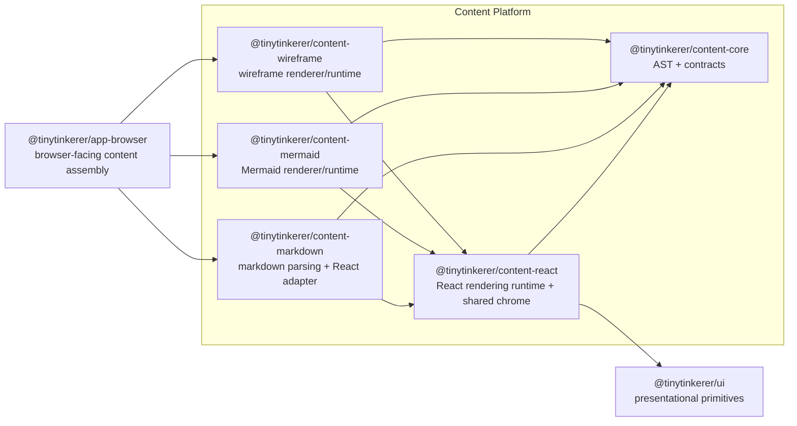

# Content Platform

This document defines the current shared assistant-content architecture for TinyTinkerer.

It complements [ARCHITECTURE.md](./ARCHITECTURE.md) and [packages-concept.md](./packages-concept.md) by describing the subsystem that owns assistant-content parsing, rendering, specialized runtimes, and fallback behavior.

## Purpose

The content platform exists to keep rich assistant output out of app shells while also preventing `@tinytinkerer/app-browser` and `@tinytinkerer/ui` from turning into content-specific dumping grounds.

The design goals are:

- keep frontend shells thin
- keep assistant-content parsing and rendering reusable across `web`, `widget`, and `mobile`
- keep `@tinytinkerer/ui` primitive-only
- keep heavy specialized renderers lazy and isolated from the main browser entry bundle

## Scope

This document describes the active content architecture in the repo today.

In scope:

- internal content AST types
- markdown parsing into that AST
- generic React rendering of content documents
- specialized content runtimes such as Mermaid and wireframe
- shared fallback behavior for invalid or unsupported rich content

Out of scope:

- chat, auth, settings, or shell bootstrap logic
- browser OAuth or persistence helpers
- shell-specific page composition
- moving rich-content AST types into `@tinytinkerer/contracts`
- changing edge payloads away from assistant markdown strings

## Package Model

The content platform is split into five packages.

### `@tinytinkerer/content-core`

Owns the content AST and package-level contracts.

Owns:

- `ContentNode`
- `ContentDocument`
- node-specific TypeScript types
- parser and renderer contract types

Must not own:

- React code
- markdown parsing libraries
- browser runtime composition
- app-shell concerns

### `@tinytinkerer/content-react`

Owns the shared React rendering runtime for `ContentDocument`.

Owns:

- the React content renderer
- renderer registry types
- shared copy and preview/code interaction chrome
- default renderers for content nodes that do not need specialized markup from another package
- shared React-side fallback behavior

Must not own:

- markdown parsing
- app-shell state or routing
- browser runtime wiring that belongs in `app-browser`

### `@tinytinkerer/content-markdown`

Owns markdown parsing and AST transformation into `ContentDocument`.

Owns:

- markdown parsing
- GFM support
- mapping markdown structures into `ContentNode`
- thin markdown-to-document rendering adapter built on `content-react`
- fallback rules for unsupported content

Must not own:

- shell-facing exports for apps
- browser runtime assembly

### `@tinytinkerer/content-mermaid`

Owns Mermaid-specific rendering behavior.

Owns:

- Mermaid node rendering
- Mermaid runtime loading
- Mermaid-specific fallback handling

Must not own:

- markdown parsing
- app-shell composition
- general browser runtime wiring

### `@tinytinkerer/content-wireframe`

Owns wireframe-specific rendering behavior.

Owns:

- wireframe node rendering
- wireframe runtime loading
- wireframe-specific fallback handling

Must not own:

- markdown parsing
- app-shell composition
- general browser runtime wiring

## AST Surface

The content platform owns the internal rich-content AST. It is not a wire contract in this phase.

```ts
type ContentNode =
  | MarkdownNode
  | CodeBlockNode
  | MermaidNode
  | WireframeNode
  | ChoicePromptNode
  | TableNode
  | ImageNode
```

Rules:

- `ContentNode` stays inside the content platform.
- `@tinytinkerer/contracts` does not mirror this AST yet.
- `ChoicePromptNode` remains an extension point and does not require interactive behavior yet.
- Shared runtime layers may continue to treat assistant output as strings until a later transport change is intentionally planned.

## Shell-Facing API

The public browser-facing content surface is `AssistantContent` from `@tinytinkerer/app-browser`.

That means:

- browser shells render assistant output through `app-browser`, not through direct `content-*` imports
- the shell-facing component accepts raw assistant text plus shell-local styling hooks
- parsing, renderer composition, specialized runtime wiring, and fallback policy remain hidden behind `app-browser`
- shared content styling hooks may be exposed from the browser layer, but content packages do not own app-shell layout

## Composition Boundary

`@tinytinkerer/app-browser` is the browser-facing composition layer for the content platform.

Browser apps should not import `content-*` packages directly. Instead:

1. `app-browser` accepts assistant text from shared runtime state.
2. `app-browser` delegates markdown parsing and document rendering to `content-markdown`.
3. `app-browser` mounts specialized renderers from `content-mermaid` and `content-wireframe`.
4. Browser shells consume the final shell-safe export from `app-browser`.

This keeps the dependency surface small and preserves the rule that apps extend capability through `app-browser` instead of reaching into lower layers directly.

## Browser Composition Diagram



## Dependency Rules

- `content-core` must not depend on any workspace package.
- `content-react` may depend only on `content-core` and `ui`.
- `content-markdown` may depend only on `content-core` and `content-react`.
- `content-mermaid` and `content-wireframe` may depend only on `content-core` and `content-react`.
- `app-browser` may compose the content platform, but the content platform must not depend on `app-browser`.
- Browser apps consume shell-facing content exports from `app-browser`, not directly from `content-*`.
- `ui` must not absorb content parsing, specialized renderers, or browser-shell runtime logic.
- `content-*` packages must not become a second browser runtime or a second app shell.

## Rendering Model

The current rendering split is:

- `content-markdown` parses raw markdown into `ContentDocument`
- `content-markdown` exposes a thin `MarkdownContent` adapter that delegates document rendering to `content-react`
- `content-react` renders general-purpose nodes such as markdown, code blocks, tables, and images, and layers shared copy/preview chrome plus shared content styles on top
- `content-mermaid` renders Mermaid nodes
- `content-wireframe` renders wireframe nodes
- `app-browser` decides which specialized capabilities are available and exposes the shell-facing entrypoint

Specialized renderers such as Mermaid and wireframe should stay lazy-loadable so they do not bloat the main browser entry chunk.

## Parsing Rules

The content platform treats markdown as the source format for this phase and promotes only well-defined structures into specialized nodes.

Initial mapping rules:

- fenced code blocks with info string `mermaid` become `MermaidNode`
- fenced code blocks with info string `wireframe` become `WireframeNode`
- other fenced code blocks become `CodeBlockNode`
- tables become `TableNode`
- images become `ImageNode`
- remaining prose stays in `MarkdownNode`

Fallback rules:

- invalid or unsupported specialized blocks must not break rendering
- specialized rendering failures should degrade to readable content, typically a code-block-style fallback
- parsing should preserve display order so mixed markdown and specialized nodes render in the same sequence as the source text

## App Responsibilities

Apps still own:

- where assistant content appears
- shell-specific spacing and container styling
- app-local affordances around the rendered content

Apps do not own:

- markdown parsing
- content AST construction
- Mermaid source detection
- wireframe runtime setup
- shared content fallback policy
