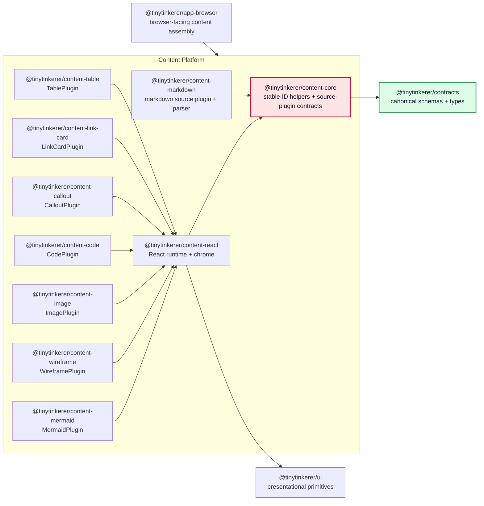

# Content Platform

This document defines the current shared assistant-content architecture for TinyTinkerer.

It complements [ARCHITECTURE.md](./ARCHITECTURE.md) and [packages-concept.md](./packages-concept.md) by describing the subsystem that owns assistant-content parsing, rendering, specialized runtimes, and fallback behavior.

## Purpose

The content platform exists to keep rich assistant output out of app shells while also preventing `@tinytinkerer/app-browser` and `@tinytinkerer/ui` from turning into content-specific dumping grounds.

The design goals are:

- keep frontend shells thin
- keep assistant-content parsing and rendering reusable across `web`, `widget`, and `mobile`
- keep `@tinytinkerer/ui` primitive-only
- keep heavy specialized renderers lazy and isolated from the main browser entry bundle
- keep the dispatch/orchestration layer platform-agnostic so React is one renderer among potential others

## Scope

This document describes the active content architecture in the repo today.

In scope:

- the canonical content document model (block + inline) with stable node IDs applied by content behavior
- a platform-agnostic content runtime that owns plugin dispatch, lazy loading, and fallback policy
- markdown parsing into that content model
- a React runtime implementation that ships the default React plugins and chrome
- specialized content runtimes such as Mermaid and wireframe, registered as plugins
- shared fallback behavior for invalid or unsupported rich content

Out of scope:

- chat, auth, settings, or shell bootstrap logic
- browser OAuth or persistence helpers
- shell-specific page composition
- moving parsing, rendering, or stable-ID behavior into `@tinytinkerer/contracts`
- non-React renderer packages beyond the current runtime contract

## Package Model

The content platform is split into ten packages: five foundational (`content-core`, `content-react`, `content-markdown`, `content-mermaid`, `content-wireframe`) and five additional specialized renderers (`content-image`, `content-code`, `content-callout`, `content-link-card`, `content-table`). All specialized renderers follow the same shape — each owns one `ReactNodeRendererPlugin` and depends only on `content-react`.

### `@tinytinkerer/content-core`

Owns content behavior, stable-ID utilities, and package-level contracts over the canonical shared content model from `@tinytinkerer/contracts`.

Owns:

- `computeNodeId` / `hashContent` (deterministic stable-ID helpers)
- `assignNodeIds()` for deterministic block, list-item, and inline-node identity normalization
- source-plugin/session contracts
- re-exports of the canonical content-model types for content-platform ergonomics

Must not own:

- React code
- markdown parsing libraries
- browser runtime composition
- app-shell concerns
- canonical Zod schemas or canonical content-model type ownership

### `@tinytinkerer/content-react`

Owns the React content runtime, the default React plugins + chrome, and the outward-facing facade for the React side of the content platform.

Owns:

- `NodeRendererPlugin` / `ReactNodeRendererPlugin` and the runtime execution policy types
- `createReactContentRuntime` — builds a `ContentRuntime<ReactNode>` with default plugins pre-registered
- default React plugins (paragraph, heading, list, blockquote, thematic-break, code-block, table, image)
- React inline-node renderer (text, emphasis, strong, strikethrough, code, link, image, break)
- shared copy and preview/code interaction chrome (`PreviewCodeFrame`, `CodeBlockFallback`)
- React-side fallback policy (Suspense + RendererBoundary wrap)
- `ContentDocumentRenderer`
- `ContentDocumentContent` — React adapter that normalizes a semantic `ContentDocument`, builds a runtime, and renders it
- re-exports of the content-core AST types and stable-ID helpers (`computeNodeId`, `hashContent`, `assignNodeIds`, `NodeId`, the full AST node-type set) and the React plugin/runtime types (`ReactContentRuntime`, `ReactContentPlugin`, `ReactNodeRendererPlugin`, `ContentNodeRendererProps`) so downstream content packages depend only on `content-react`
- re-exports of the runtime policy/failure types needed by downstream content packages

Must not own:

- markdown parsing
- app-shell state or routing
- browser runtime wiring that belongs in `app-browser`

### `@tinytinkerer/content-markdown`

Owns the default markdown source plugin and AST transformation into the semantic `ContentDocument`. It depends only on `content-core`.

Owns:

- markdown parsing
- GFM support
- mapping markdown structures into the canonical block + inline content nodes
- `markdownSourcePlugin` implementing the source/session contract from `content-core`
- stable ID assignment via `computeNodeId` plus final normalization through `assignNodeIds()`
- `createMarkdownContentSession()` — accumulates markdown source and returns full `ContentDocument` snapshots

Must not own:

- shell-facing exports for apps
- React runtime construction

### `@tinytinkerer/content-mermaid`

Owns Mermaid-specific rendering behavior, exposed as a plugin. Imports node types, plugin contract, and shared chrome via `@tinytinkerer/content-react` only.

Owns:

- `mermaidPlugin` (`NodeRendererPlugin<'codeBlock'>` with `matches(node.language === 'mermaid')`, runtime `load()`, render, fallback)
- Mermaid runtime loading (script-injection lazy-import)
- Mermaid-specific fallback handling

Must not own:

- markdown parsing
- app-shell composition
- general browser runtime wiring
- direct imports from `content-core`

### `@tinytinkerer/content-wireframe`

Owns wireframe-specific rendering behavior, exposed as a plugin. Imports node types, plugin contract, and shared chrome via `@tinytinkerer/content-react` only.

Owns:

- `wireframePlugin` (`NodeRendererPlugin<'codeBlock'>` with `matches(node.language === 'wireframe')`, render, fallback)
- wireframe iframe sandboxing
- wireframe-specific fallback handling

Must not own:

- markdown parsing
- app-shell composition
- general browser runtime wiring
- direct imports from `content-core`

### `@tinytinkerer/content-image`

Owns the canonical `ImageNode` renderer. Replaces the previous `core:image` default in `content-react`.

Owns:

- `imagePlugin` (`NodeRendererPlugin<'image'>` with always-matches, priority 10)
- figure + figcaption layout, lazy loading, click-to-lightbox, zoom, open/download controls

Must not own:

- inline image rendering (`imageInline` stays in the inline renderer in `content-react`)
- markdown parsing
- direct imports from `content-core`

### `@tinytinkerer/content-code`

Owns specialized `CodeBlockNode` rendering for languaged code blocks. Single plugin with internal language dispatch.

Owns:

- `codePlugin` (`NodeRendererPlugin<'codeBlock'>` with `matches: typeof node.language === 'string' && length > 0`, priority 30, `lazy + clientOnly` requirements)
- per-language sub-renderers for `diff`, `json` (with Format toggle), `yaml`, `http`, `sql`, `bash`, and a generic syntax-highlighted fallback
- the lazy `highlight.js` runtime loader

Must not own:

- mermaid / wireframe dispatch (those plugins still win their own languages via higher priority and narrower `matches`)
- direct imports from `content-core`

### `@tinytinkerer/content-callout`

Owns GitHub-style `[!NOTE]` / `[!TIP]` / `[!WARNING]` / `[!IMPORTANT]` / `[!CAUTION]` callout rendering. Pure renderer plugin — no parser changes required.

Owns:

- `calloutPlugin` (`NodeRendererPlugin<'blockquote'>` with `matches`: first paragraph's first text node begins with `[!KIND]`)
- per-kind icon + colour variants and marker-stripping while preserving the rest of the blockquote children

Must not own:

- markdown parsing
- direct imports from `content-core`

### `@tinytinkerer/content-link-card`

Owns rich preview-card rendering for paragraphs that are just a single link.

Owns:

- `linkCardPlugin` (`NodeRendererPlugin<'paragraph'>` with `matches`: single `LinkNode` child, or single `TextNode` whose trimmed value parses as a URL)
- bordered card layout with title, hostname, and external-link icon

Must not own:

- OG / metadata fetching
- markdown parsing
- direct imports from `content-core`

### `@tinytinkerer/content-table`

Owns the canonical `TableNode` renderer. Replaces the previous `core:table` default in `content-react`.

Owns:

- `tablePlugin` (`NodeRendererPlugin<'table'>` with always-matches, priority 10)
- sticky header, responsive card-layout mode (mobile breakpoint), CSV export, markdown copy (via `tableToMarkdown` from `content-react`), row-hover highlight
- internal `tableToCsv` helper

Must not own:

- markdown parsing
- direct imports from `content-core`

## AST Surface

The canonical content document shape lives in `@tinytinkerer/contracts`. The content platform owns the parsing, normalization, plugin runtime, and rendering behavior built on top of that shared model.

```ts
type BlockNode =
  | HeadingNode        // { type: 'heading', id?, level, children: readonly InlineNode[] }
  | ParagraphNode      // { type: 'paragraph', id?, children: readonly InlineNode[] }
  | ListNode           // { type: 'list', id?, ordered, start?, children: readonly ListItemNode[] }
  | BlockquoteNode     // { type: 'blockquote', id?, children: readonly BlockNode[] }
  | ThematicBreakNode  // { type: 'thematicBreak', id? }
  | CodeBlockNode      // { type: 'codeBlock', id?, code, language? }
  | ChoicePromptNode
  | TableNode
  | ImageNode

type InlineNode =
  | TextNode
  | EmphasisNode
  | StrongNode
  | StrikethroughNode
  | CodeInlineNode
  | LinkNode
  | ImageInlineNode
  | BreakNode

type ContentNode = BlockNode
type ContentDocument = { nodes: readonly BlockNode[] }
```

Rules:

- `ContentNode` is the canonical shared content model. All consumers — including non-content callers — use the canonical `ContentDocument` boundary directly.
- `@tinytinkerer/contracts` owns the canonical `ContentDocument` schema and types directly. The schema declares strict interfaces for each node variant (`?: T` optionals, `readonly` child arrays), builds a recursive `z.discriminatedUnion` with `z.lazy`, and bridges schema → interface with a single `as z.ZodType<…>` cast per recursive schema. See `docs/ARCHITECTURE.md#coding-conventions` for the rationale.
- Every block, list-item, and inline node may carry an optional `id`. Markdown parsing assigns deterministic, prefix-stable block IDs via `computeNodeId`; hand-constructed documents may omit `id`, and the shared `assignNodeIds()` helper normalizes the full document before React rendering.
- `ChoicePromptNode` remains an extension point and does not require interactive behavior yet.
- Shared runtime layers now treat assistant output as structured `{ source, content }` snapshots at the chat-event boundary; parser/runtime internals still operate on the semantic AST.

## Shell-Facing API

The public browser-facing content surface is `AssistantContent` from `@tinytinkerer/app-browser`.

That means:

- browser shells render assistant output through `app-browser`, not through direct `content-*` imports
- the shell-facing component accepts structured `ContentDocument` DTOs plus shell-local styling hooks
- runtime construction, plugin registration, and fallback policy remain hidden behind `app-browser`
- shared content styling hooks may be exposed from the browser layer, but content packages do not own app-shell layout

## Composition Boundary

`@tinytinkerer/app-browser` is the browser-facing composition layer for the content platform.

Browser apps should not import `content-*` packages directly. Instead:

1. `app-browser` imports the `ContentDocument` type from `contracts`, `ContentDocumentContent` from `content-react`, `createMarkdownContentSession()` from `content-markdown`, and the singleton plugin exports from each specialized content package: `mermaidPlugin`, `wireframePlugin`, `codePlugin`, `calloutPlugin`, `linkCardPlugin`, `imagePlugin`, `tablePlugin`.
2. During synthesis, `app-browser` creates a markdown content session and emits each `ContentDocument` snapshot directly as the wire-safe `{ source, content }` assistant event payload.
3. During rendering, `AssistantContent` passes the document directly to `ContentDocumentContent`, supplies a stable plugin array, and lets the content platform own runtime assembly and rendering.
4. Browser shells consume the final shell-safe export (`AssistantContent`) from `app-browser`.

This keeps apps thin while making the chat-event boundary structured without forcing `app-browser` to hand-map every content node. Runtime construction and plugin registration remain inside the content platform.

## Browser Composition Diagram



Diagram convention: external consumers should point to the `ContentPlatform` subgraph when they depend on the subsystem as a whole. Keep the internal package edges inside the subgraph so the subsystem's internal structure remains visible.

## Dependency Rules

- `content-core` may depend only on `contracts` and local modules.
- `content-react` may depend only on `content-core`, `ui`, and local modules. It is the public facade for the React side of the content platform and re-exports the content-core symbols downstream packages need.
- `content-markdown` may depend only on `content-core` and local modules.
- `content-mermaid`, `content-wireframe`, `content-image`, `content-code`, `content-callout`, `content-link-card`, and `content-table` may depend only on `content-react` and local modules.
- `app-browser` may depend on `content-react`, `content-markdown`, `content-mermaid`, `content-wireframe`, `content-image`, `content-code`, `content-callout`, `content-link-card`, and `content-table`.
- `contracts` may depend only on local modules.
- The content platform must not depend on `app-browser`.
- Browser apps consume shell-facing content exports from `app-browser`, not directly from `content-*`.
- `ui` must not absorb content parsing, specialized renderers, or browser-shell runtime logic.
- `content-*` packages must not become a second browser runtime or a second app shell.

## Rendering Model

The current rendering split is:

- `content-markdown` parses raw markdown into the semantic `ContentDocument`, assigning stable block IDs and then normalizing any remaining block/list-item/inline ids through `assignNodeIds()`.
- `content-markdown` exposes `markdownSourcePlugin`, `parseMarkdownContent()`, and `createMarkdownContentSession()` for parser-side snapshot streaming.
- `content-react` provides `createReactContentRuntime`, which returns a `ContentRuntime<ReactNode>` with default React plugins pre-registered (paragraph, heading, list, blockquote, thematic break, code block). Image and table no longer ship a default — they are owned by `content-image` and `content-table` and must be registered explicitly. `ContentDocumentContent` normalizes hand-built documents through `assignNodeIds()` and then delegates to `ContentDocumentRenderer`, which assumes a canonical document and wraps each rendered block in a runtime-backed preparation boundary plus `<Suspense>` + a class-based `RendererBoundary` so lazy plugins and thrown render errors degrade gracefully. `content-react` also re-exports the content-core AST types, the stable-ID helpers, `renderInline`, `tableToMarkdown`, `useCopyButtonState`, and the runtime `RenderContext` so downstream content packages can drop direct `content-core` imports.
- `content-react` also exports `REACT_SSR_EXECUTION_POLICY`, which blocks lazy, client-only, and DOM-required plugins so SSR falls back deterministically to code rendering.
- `content-mermaid` and `content-wireframe` each export typed `NodeRendererPlugin<'codeBlock'>` singletons plus `createMermaidPlugin()` / `createWireframePlugin()` factory helpers for runtime-scoped plugin instances.
- `app-browser` owns browser-side composition, but runtime construction and default plugin registration stay inside the content platform.

Specialized renderers such as Mermaid stay lazy-loadable: Mermaid's runtime is fetched via dynamic script injection on first use, so it does not bloat the main browser entry chunk.

## Parsing Rules

The content platform treats markdown as the source format for this phase and decomposes it into the semantic AST.

Initial mapping rules:

- fenced code blocks become `CodeBlockNode`
- `mermaid` and `wireframe` stay specialized through `CodeBlockNode.language`
- tables become `TableNode`
- standalone block images (a paragraph whose only child is an image) become `ImageNode`; inline images stay inside `ImageInlineNode` within a `ParagraphNode`
- headings become `HeadingNode`, prose paragraphs become `ParagraphNode`, lists become `ListNode` + `ListItemNode`, blockquotes become `BlockquoteNode`, `---` becomes `ThematicBreakNode`
- inline marks (emphasis, strong, strikethrough, code, link, hard break) map one-for-one to their `InlineNode` equivalents

Fallback rules:

- invalid or unsupported specialized blocks must not break rendering
- specialized rendering failures should degrade to readable content, typically a code-block-style fallback
- parsing should preserve display order so mixed markdown and specialized nodes render in the same sequence as the source text
- stable IDs guarantee that re-parsing identical content yields identical node identities, and appending content to a document does not change the IDs of prior nodes

## Adding a Renderer Package

The platform is plugin-driven on two axes:

1. source plugins turn raw source text into semantic `ContentDocument` snapshots
2. renderer plugins map AST node types to React rendering behavior

New rich-content kinds (executable widgets, embeds, citation cards, specialized images, custom choice prompts, etc.) ship as their own `@tinytinkerer/content-*` renderer package, mirroring `content-mermaid` and `content-wireframe`.

### Two scenarios

Decide which case applies before adding a package:

1. **Specialized rendering for an existing AST node** — e.g., a richer `ImageNode` viewer or a custom `CodeBlockNode` specialization like Mermaid/wireframe. The block type already exists in `content-core` and usually has a default plugin in `content-react`. The new package only needs to ship a plugin that overrides the default through `priority` + `matches(node)`.
2. **A new AST node type** — e.g., a media embed, executable widget, or interactive `ChoicePromptNode`. The node variant has to be added to `content-core`, taught to the parser in `content-markdown`, and rendered by a new plugin package.

### Steps

1. **(Scenario 2 only) Add the node type.** Append the new variant to the relevant union in `content-core` (`BlockNode` or `InlineNode`) and re-export it from `content-react/src/index.tsx`. No package downstream of `content-react` should import the type from `content-core` directly.
2. **(Scenario 2 only, markdown-sourced nodes) Extend the parser.** Add a mapping rule in `content-markdown` that emits the new node. Use `computeNodeId(type, digest, occurrence)` (re-exported by `content-react`) to assign stable IDs, then let `assignNodeIds()` fill any remaining gaps.
3. **Create `packages/content-<name>/`** with:
   - `package.json` whose only workspace dep is `@tinytinkerer/content-react` (plus a `react` peer dep and any third-party runtime libs).
   - `tsconfig.json` extending the workspace base.
   - `src/index.tsx` exporting the plugin and (optionally) the renderer component.
4. **Define the plugin** as a `ReactNodeRendererPlugin<'<nodeType>'>`:
   - `id`: stable plugin identifier (e.g. `'choice-prompt'`).
   - `nodeType`: the AST `type` literal it handles.
   - `priority` + `matches(node)` when several plugins specialize the same node type.
   - `requirements`: declare whether the plugin is `lazy`, `clientOnly`, or `needsDom`.
   - `load()` (optional): lazy-load the heavy runtime. `content-react` calls this during `prepareNode()`; Mermaid does this with dynamic `<script>` injection so the runtime never lands in the main entry chunk.
   - `render(node, ctx)`: return a `ReactNode`. Use `ctx.renderBlock` to recurse into child blocks. Reuse `PreviewCodeFrame`, `CodeBlockFallback`, and other chrome from `content-react`.
   - `fallback(node, failure)`: return a safe fallback (typically `<CodeBlockFallback>`). The runtime's `wrap` already adds the preparation boundary, `<Suspense>`, and an error boundary on top.
5. **Tests.** Add `packages/content-<name>/tests/` covering the success, lazy-loading, and failure paths. Plugin-shape tests can render the renderer component directly; integration tests can pass the plugin via the `plugins` prop of `ContentDocumentContent`.
6. **Boundary rules.** Extend `scripts/check-boundaries.mjs`: the new package's allowed deps are itself and `@tinytinkerer/content-react`, and `app-browser` must be allowed to depend on the new package if it should be wired into the assistant surface.
7. **Compose.** Add the plugin to the stable `assistantPlugins` array in `packages/app-browser/src/assistant-content.tsx`, and add the workspace dep to `packages/app-browser/package.json`. Apps and shells do not need to change.
8. **Docs.** Update the package list and the dependency diagram in this document (and `docs/ARCHITECTURE.md` if the new package changes the platform's external surface).

### What stays the same

A new renderer package never:

- imports from `content-core` directly (use the `content-react` re-exports)
- builds its own `ContentRuntime` — `ContentDocumentContent` owns runtime construction
- depends on `app-browser` (that direction is forbidden)
- ships its own app-shell layout, routing, or transport

### Reusing the chrome

Most specialized renderers reuse the shared chrome from `content-react`:

- `PreviewCodeFrame` — the toggleable preview/code split with copy controls
- `CodeBlockFallback` — the canonical "show the source as code" fallback

Because the chrome and runtime mechanics live in `content-react`, a new plugin package usually stays small: it contributes the rendering logic and the `NodeRendererPlugin` shape, not new chrome.

## App Responsibilities

Apps still own:

- where assistant content appears
- shell-specific spacing and container styling
- app-local affordances around the rendered content

Apps do not own:

- markdown parsing
- content AST construction
- runtime instantiation or plugin registration
- Mermaid source detection
- wireframe runtime setup
- shared content fallback policy
