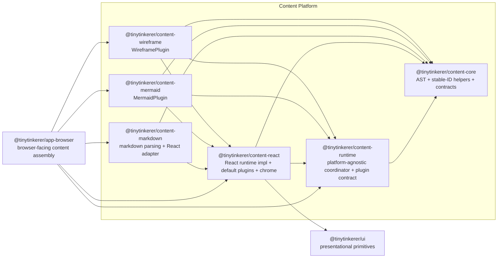

# Content Platform

This document defines the current shared assistant-content architecture for TinyTinkerer.

It complements [ARCHITECTURE.md](./ARCHITECTURE.md) and [packages-concept.md](./packages-concept.md) by describing the subsystem that owns assistant-content parsing, rendering, specialized runtimes, and fallback behavior.

## Purpose

The content platform exists to keep rich assistant output out of app shells while also preventing `@tinytinkerer/app-browser` and `@tinytinkerer/ui` from turning into content-specific dumping grounds.

The design goals are:

- keep frontend shells thin
- keep assistant-content parsing and rendering reusable across `web`, `widget`, and `mobile`
- keep `@tinytinkerer/ui` primitive-only
- keep heavy specialized renderers lazy and isolated from the main browser entry bundle
- keep the dispatch/orchestration layer platform-agnostic so React is one renderer among potential others

## Scope

This document describes the active content architecture in the repo today.

In scope:

- the semantic content AST (block + inline) with stable node IDs
- a platform-agnostic content runtime that owns plugin dispatch, lazy loading, and fallback policy
- markdown parsing into that AST
- a React runtime implementation that ships the default React plugins and chrome
- specialized content runtimes such as Mermaid and wireframe, registered as plugins
- shared fallback behavior for invalid or unsupported rich content

Out of scope:

- chat, auth, settings, or shell bootstrap logic
- browser OAuth or persistence helpers
- shell-specific page composition
- moving rich-content AST types into `@tinytinkerer/contracts`
- changing edge payloads away from assistant markdown strings

## Package Model

The content platform is split into six packages.

### `@tinytinkerer/content-core`

Owns the content AST, stable-ID utilities, and package-level contracts.

Owns:

- `BlockNode` / `InlineNode` / `ContentNode` / `ContentDocument`
- node-specific TypeScript types
- `computeNodeId` / `hashContent` (deterministic stable-ID helpers)
- parser and renderer contract types

Must not own:

- React code
- markdown parsing libraries
- browser runtime composition
- app-shell concerns

### `@tinytinkerer/content-runtime`

Owns the platform-agnostic content runtime coordinator and plugin contract.

Owns:

- `NodeRendererPlugin` interface (id, nodeType, capabilities, load, render, fallback)
- `ContentRuntime<TResult>` interface
- `createContentRuntime<TResult>` factory (register, has, getPlugin, renderNode, renderDocument, ensureLoaded)
- host-supplied fallback + wrap hooks so platform-specific concerns (e.g. React Suspense + ErrorBoundary) stay outside the coordinator

Must not own:

- React code
- markdown parsing
- DOM-specific concerns

### `@tinytinkerer/content-react`

Owns the React implementation of the content runtime and the default React plugins + chrome.

Owns:

- `createReactContentRuntime` — builds a `ContentRuntime<ReactNode>` with default plugins pre-registered
- default React plugins (paragraph, heading, list, blockquote, thematic-break, code-block, table, image, legacy markdown)
- React inline-node renderer (text, emphasis, strong, strikethrough, code, link, image, break)
- shared copy and preview/code interaction chrome (`PreviewCodeFrame`, `CodeBlockFallback`)
- React-side fallback policy (Suspense + RendererBoundary wrap)
- legacy `ContentDocumentRenderer` + renderer-registry overrides for backward compatibility

Must not own:

- markdown parsing
- app-shell state or routing
- browser runtime wiring that belongs in `app-browser`

### `@tinytinkerer/content-markdown`

Owns markdown parsing and AST transformation into the semantic `ContentDocument`.

Owns:

- markdown parsing
- GFM support
- mapping markdown structures into block + inline `ContentNode`s
- stable ID assignment via `computeNodeId`
- thin markdown-to-document rendering adapter built on `content-react`
- fallback rules for unsupported content

Must not own:

- shell-facing exports for apps
- browser runtime assembly

### `@tinytinkerer/content-mermaid`

Owns Mermaid-specific rendering behavior, exposed as a plugin.

Owns:

- `mermaidPlugin` (id, nodeType, capabilities, lazy `load`, render, fallback)
- Mermaid runtime loading (script-injection lazy-import)
- Mermaid-specific fallback handling

Must not own:

- markdown parsing
- app-shell composition
- general browser runtime wiring

### `@tinytinkerer/content-wireframe`

Owns wireframe-specific rendering behavior, exposed as a plugin.

Owns:

- `wireframePlugin` (id, nodeType, capabilities, render, fallback)
- wireframe iframe sandboxing
- wireframe-specific fallback handling

Must not own:

- markdown parsing
- app-shell composition
- general browser runtime wiring

## AST Surface

The content platform owns the internal semantic AST. It is not a wire contract in this phase.

```ts
type BlockNode =
  | HeadingNode        // { type: 'heading', id?, level, children: InlineNode[] }
  | ParagraphNode      // { type: 'paragraph', id?, children: InlineNode[] }
  | ListNode           // { type: 'list', id?, ordered, start?, children: ListItemNode[] }
  | BlockquoteNode     // { type: 'blockquote', id?, children: BlockNode[] }
  | ThematicBreakNode  // { type: 'thematicBreak', id? }
  | CodeBlockNode
  | MermaidNode
  | WireframeNode
  | ChoicePromptNode
  | TableNode
  | ImageNode
  | MarkdownNode       // legacy escape hatch carrying raw markdown source

type InlineNode =
  | TextNode
  | EmphasisNode
  | StrongNode
  | StrikethroughNode
  | CodeInlineNode
  | LinkNode
  | ImageInlineNode
  | BreakNode

type ContentNode = BlockNode
type ContentDocument = { nodes: BlockNode[] }
```

Rules:

- `ContentNode` stays inside the content platform.
- `@tinytinkerer/contracts` does not mirror this AST yet.
- Every node carries an optional `id`. The parser assigns deterministic, prefix-stable IDs via `computeNodeId`; hand-constructed nodes (tests, internal tools) may omit `id` and the React runtime falls back to a hash-of-content + index key.
- `ChoicePromptNode` remains an extension point and does not require interactive behavior yet.
- `MarkdownNode` is kept as a legacy escape hatch — the parser no longer emits it, but tests and ad-hoc constructions still resolve to a React renderer.
- Shared runtime layers may continue to treat assistant output as strings until a later transport change is intentionally planned.

## Shell-Facing API

The public browser-facing content surface is `AssistantContent` from `@tinytinkerer/app-browser`.

That means:

- browser shells render assistant output through `app-browser`, not through direct `content-*` imports
- the shell-facing component accepts raw assistant text plus shell-local styling hooks
- parsing, runtime construction, plugin registration, and fallback policy remain hidden behind `app-browser`
- shared content styling hooks may be exposed from the browser layer, but content packages do not own app-shell layout

## Composition Boundary

`@tinytinkerer/app-browser` is the browser-facing composition layer for the content platform.

Browser apps should not import `content-*` packages directly. Instead:

1. `app-browser` builds a singleton `ReactContentRuntime` via `createReactContentRuntime` and registers `mermaidPlugin` + `wireframePlugin`.
2. `app-browser` accepts assistant text from shared runtime state and hands it (with the runtime) to `MarkdownContent` from `content-markdown`.
3. `content-markdown` parses to a `ContentDocument` and delegates document rendering to `ContentDocumentRenderer`, which dispatches each node through the runtime.
4. Browser shells consume the final shell-safe export from `app-browser`.

This keeps the dependency surface small and preserves the rule that apps extend capability through `app-browser` instead of reaching into lower layers directly.

## Browser Composition Diagram



## Dependency Rules

- `content-core` must not depend on any workspace package.
- `content-runtime` may depend only on `content-core`.
- `content-react` may depend only on `content-core`, `content-runtime`, and `ui`.
- `content-markdown` may depend only on `content-core`, `content-runtime`, and `content-react`.
- `content-mermaid` and `content-wireframe` may depend only on `content-core`, `content-runtime`, and `content-react`.
- `app-browser` may compose the content platform, but the content platform must not depend on `app-browser`.
- Browser apps consume shell-facing content exports from `app-browser`, not directly from `content-*`.
- `ui` must not absorb content parsing, specialized renderers, or browser-shell runtime logic.
- `content-*` packages must not become a second browser runtime or a second app shell.

## Rendering Model

The current rendering split is:

- `content-markdown` parses raw markdown into the semantic `ContentDocument`, assigning stable IDs to every block.
- `content-markdown` exposes a thin `MarkdownContent` adapter that delegates document rendering to `content-react`'s `ContentDocumentRenderer`.
- `content-react` provides `createReactContentRuntime`, which returns a `ContentRuntime<ReactNode>` with default React plugins pre-registered (paragraph, heading, list, blockquote, thematic break, legacy markdown, code block, table, image). Each rendered block is wrapped in `<Suspense>` + a class-based `RendererBoundary` so per-plugin React-lazy renderers and thrown errors degrade gracefully.
- `content-mermaid` and `content-wireframe` each export a typed `NodeRendererPlugin` (`mermaidPlugin`, `wireframePlugin`) — registration on the runtime is a single `runtime.register(plugin)` call.
- `app-browser` builds the singleton runtime, registers specialized plugins, and exposes the shell-facing entrypoint.

Specialized renderers such as Mermaid stay lazy-loadable: Mermaid's runtime is fetched via dynamic script injection on first use, so it does not bloat the main browser entry chunk.

## Parsing Rules

The content platform treats markdown as the source format for this phase and decomposes it into the semantic AST.

Initial mapping rules:

- fenced code blocks with info string `mermaid` become `MermaidNode`
- fenced code blocks with info string `wireframe` become `WireframeNode`
- other fenced code blocks become `CodeBlockNode`
- tables become `TableNode`
- standalone block images (a paragraph whose only child is an image) become `ImageNode`; inline images stay inside `ImageInlineNode` within a `ParagraphNode`
- headings become `HeadingNode`, prose paragraphs become `ParagraphNode`, lists become `ListNode` + `ListItemNode`, blockquotes become `BlockquoteNode`, `---` becomes `ThematicBreakNode`
- inline marks (emphasis, strong, strikethrough, code, link, hard break) map one-for-one to their `InlineNode` equivalents

Fallback rules:

- invalid or unsupported specialized blocks must not break rendering
- specialized rendering failures should degrade to readable content, typically a code-block-style fallback
- parsing should preserve display order so mixed markdown and specialized nodes render in the same sequence as the source text
- stable IDs guarantee that re-parsing identical content yields identical node identities, and appending content to a document does not change the IDs of prior nodes

## App Responsibilities

Apps still own:

- where assistant content appears
- shell-specific spacing and container styling
- app-local affordances around the rendered content

Apps do not own:

- markdown parsing
- content AST construction
- runtime instantiation or plugin registration
- Mermaid source detection
- wireframe runtime setup
- shared content fallback policy
