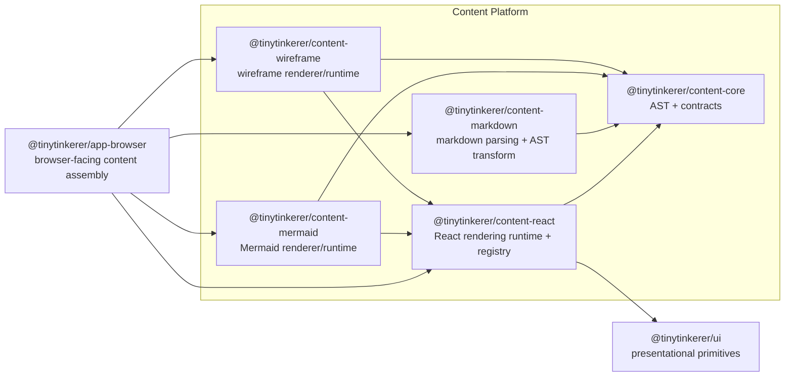

# Content Platform

This document defines the shared content-rendering architecture for TinyTinkerer.

It complements [ARCHITECTURE.md](./ARCHITECTURE.md) and [packages-concept.md](./packages-concept.md) by replacing the earlier `feature-markdown` and `feature-mermaid` direction with a dedicated content platform.

## Purpose

The content platform exists to keep rich assistant output out of app shells while still keeping browser-specific composition inside `@tinytinkerer/app-browser`.

The design goals are:

- keep frontend shells thin
- keep content parsing and rendering reusable across `web`, `widget`, and `mobile`
- prevent `@tinytinkerer/ui` from becoming a feature runtime
- keep heavy content renderers lazy and isolated from the main browser entry bundle

## Package Model

The content platform is split into five packages.

### `@tinytinkerer/content-core`

Owns the content AST and package-level contracts.

Owns:

- `ContentNode`
- `ContentDocument`
- node-specific TypeScript types
- parser and renderer contract types

Must not own:

- React code
- markdown parsing libraries
- browser runtime composition
- app-shell concerns

### `@tinytinkerer/content-react`

Owns the shared React rendering runtime for `ContentDocument`.

Owns:

- the React content renderer
- renderer registry types
- default renderers for content nodes that do not need a specialized feature package
- shared React-side fallback behavior

Must not own:

- markdown parsing
- app-shell state or routing
- browser runtime wiring that belongs in `app-browser`

### `@tinytinkerer/content-markdown`

Owns markdown parsing and AST transformation into `ContentDocument`.

Owns:

- markdown parsing
- GFM support
- mapping markdown structures into `ContentNode`
- fallback rules for unsupported content

Must not own:

- React rendering
- shell-facing exports for apps
- browser runtime assembly

### `@tinytinkerer/content-mermaid`

Owns Mermaid-specific rendering behavior.

Owns:

- Mermaid node rendering
- Mermaid runtime loading
- Mermaid-specific fallback handling

Must not own:

- markdown parsing
- app-shell composition
- general browser runtime wiring

### `@tinytinkerer/content-wireframe`

Owns wireframe-specific rendering behavior.

Owns:

- wireframe node rendering
- wireframe runtime loading
- wireframe-specific fallback handling

Must not own:

- markdown parsing
- app-shell composition
- general browser runtime wiring

## AST Surface

The content platform owns the internal rich-content AST. It is not a wire contract in this phase.

```ts
type ContentNode =
  | MarkdownNode
  | CodeBlockNode
  | MermaidNode
  | WireframeNode
  | ChoicePromptNode
  | TableNode
  | ImageNode
```

Rules:

- `ContentNode` stays inside the content platform in this migration.
- `@tinytinkerer/contracts` does not mirror this AST yet.
- `ChoicePromptNode` is reserved as an extension point in v1 and should not require parsing or interactive rendering yet.
- Existing browser/runtime layers may continue to treat assistant output as strings until a later transport change is intentionally planned.

## Composition Boundary

`@tinytinkerer/app-browser` is the browser-facing composition layer for the content platform.

Browser apps should not import `content-*` packages directly. Instead:

1. `app-browser` accepts assistant text from shared runtime state.
2. `app-browser` parses that text through `content-markdown`.
3. `app-browser` composes the renderer registry using `content-react`.
4. `app-browser` mounts specialized renderers from `content-mermaid` and `content-wireframe`.
5. Browser shells consume the final shell-safe export from `app-browser`.

This keeps the dependency surface small and preserves the rule that apps extend capability through `app-browser` instead of reaching into lower layers directly.

## Browser Composition Diagram



## Dependency Rules

- `content-core` must not depend on any workspace package.
- `content-react` may depend only on `content-core` and `ui`.
- `content-markdown` may depend only on `content-core`.
- `content-mermaid` and `content-wireframe` may depend only on `content-core` and `content-react`.
- `app-browser` may compose the content platform, but the content platform must not depend on `app-browser`.
- Browser apps consume shell-facing content exports from `app-browser`, not directly from `content-*`.
- `ui` stays primitive-only and must not absorb content parsing or specialized feature runtime logic.

## Rendering Model

The intended rendering split is:

- `content-markdown` parses raw markdown into `ContentDocument`
- `content-react` renders general-purpose nodes such as markdown, code blocks, tables, and images
- `content-mermaid` renders Mermaid nodes
- `content-wireframe` renders wireframe nodes
- `app-browser` decides how those pieces are composed and exposed to browser shells

Specialized renderers such as Mermaid and wireframe should be lazy-loadable so they do not bloat the main browser entry chunk.

## App Responsibilities

Apps still own:

- where assistant content appears
- shell-specific spacing and container styling
- app-local affordances around the rendered content

Apps do not own:

- markdown parsing
- content AST construction
- Mermaid source detection
- wireframe runtime setup
- shared content fallback policy

## Agent Checklist

Before changing rich-content rendering, check:

- Does this belong in `content-core`, `content-react`, `content-markdown`, `content-mermaid`, or `content-wireframe`?
- Can the browser shell consume the capability through `app-browser` instead of importing a lower layer?
- Is `ui` still only providing primitives and not feature runtime behavior?
- Will this change preserve lazy loading for heavy specialized renderers?
- Is the AST still internal unless a deliberate contracts change is being made?
