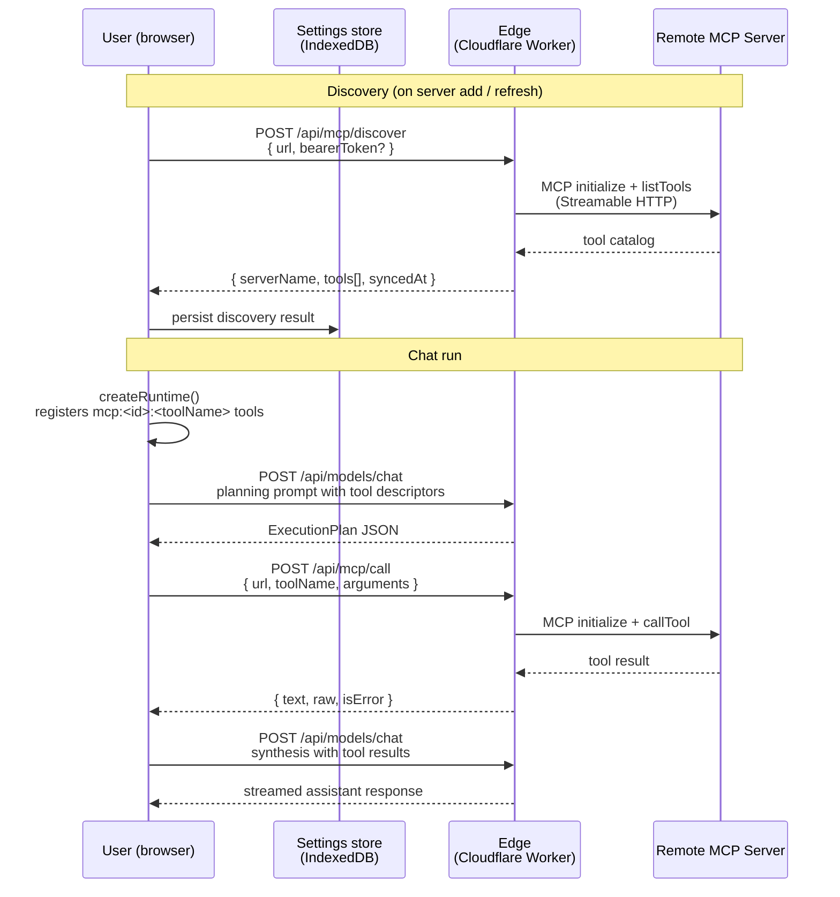

# MCP Integration

TinyTinkerer supports per-user [Model Context Protocol](https://modelcontextprotocol.io/) (MCP) servers. Users add remote MCP servers in Settings, the frontend discovers their tools, and those tools become available to the assistant during chat.

Only V1 scope is implemented: tool calling over Streamable HTTP. Resources, prompts, remote OAuth, SSE fallback, and stdio servers are out of scope.

See also:
- [ARCHITECTURE.md](./ARCHITECTURE.md)
- [packages-concept.md](./packages-concept.md)

---

## How It Works

### 1 — User registers a server

In the Settings modal (or widget inline settings), the user enters a name, URL, and an optional Bearer token. The frontend stores this in the user's local IndexedDB preferences.

### 2 — Discovery

When a server is added (or manually refreshed), the browser calls `POST /api/mcp/discover` on the edge. The edge opens a Streamable HTTP MCP connection to the remote server, runs `initialize` → `listTools`, and returns a normalized tool catalog. The catalog is stored alongside the server config in preferences.

### 3 — Tool registration

When a chat run starts, `createRuntime` reads the current MCP server configs and their cached discovery results. Every tool from every enabled server with a successful discovery is registered into the `ToolRegistry` with the id format `mcp:<serverId>:<toolName>`.

### 4 — Planning

If a GitHub Models token exists and at least one MCP tool is registered, the planner sends a one-shot request to `/api/models/chat` asking the model to produce a JSON `ExecutionPlan` that names which tools to call and what arguments to pass. On any failure it falls back to the keyword-based `inferPlan` heuristic.

### 5 — Tool call

The agent runtime executes each step in the plan. When a step carries a `toolCall` for an MCP tool, `createMcpTool`'s `execute` function calls `POST /api/mcp/call` on the edge, which opens a fresh MCP connection, calls the named tool, and returns a normalized result.

### 6 — Synthesis

Tool results are included in the synthesis prompt alongside any web search results. The assistant composes its answer from all gathered context.

---

## Architecture



### Package responsibilities

```mermaid
flowchart TD
    subgraph Browser["Browser (app-browser)"]
        settings["Settings store\nMcpServerConfig[]\nMcpDiscoveryResult{}"]
        surface["useSettingsSurfaceController\naddMcpServer / refreshMcpServer"]
        modal["BrowserSettingsModal\nMcpServerList component"]
        runtime["createRuntime\nregisters mcp:* tools"]
        planner["mcp-planner.ts\nllmPlan()"]
        tool["mcp-tool.ts\ncreateMcpTool()"]
        fetch["edge-fetch.ts\ncreateEdgeFetch()"]
    end

    subgraph Edge["Edge (apps/edge)"]
        discover["POST /api/mcp/discover"]
        call["POST /api/mcp/call"]
        sdk["@modelcontextprotocol/sdk\nClient + StreamableHTTPClientTransport"]
    end

    subgraph Remote["Remote MCP Server"]
        mcp["Any MCP-compliant server\nover Streamable HTTP"]
    end

    subgraph Contracts["@tinytinkerer/contracts"]
        schemas["mcpServerConfigSchema\nmcpDiscoveryResultSchema\nmcpCallRequestSchema\nmcpCallResponseSchema"]
    end

    modal --> surface
    surface --> settings
    surface --> fetch
    fetch --> discover
    fetch --> call
    runtime --> tool
    runtime --> planner
    tool --> fetch
    planner --> fetch
    discover --> sdk
    call --> sdk
    sdk --> mcp
    settings --> runtime
    discover -.->|normalized| schemas
    call -.->|normalized| schemas
```

---

## Data model

### McpServerConfig

Stored in IndexedDB under the preference key `settings_mcp_servers` as a JSON array.

```ts
type McpServerConfig = {
  id: string           // crypto.randomUUID() assigned on add
  name: string
  url: string          // must be https:// or http://localhost / 127.0.0.1
  bearerToken?: string // forwarded to the remote server, never logged
  enabled: boolean
}
```

### McpDiscoveryResult

Stored under `settings_mcp_discovery` as a JSON object keyed by `serverId`. Cleared automatically when `url` or `bearerToken` changes.

```ts
type McpDiscoveryResult = {
  serverId: string
  serverName: string
  tools: McpToolMeta[]
  syncedAt: string      // ISO timestamp
  error?: string        // set when last sync failed; server contributes no tools
}

type McpToolMeta = {
  toolName: string
  description: string
  inputSchema: Record<string, unknown>  // raw JSON Schema from the MCP server
}
```

---

## Edge proxy

Both MCP routes require the same `Authorization` header that `/api/search` and `/api/models/chat` require. They are stateless: each request opens a fresh MCP client connection and closes it in a `finally` block.

### URL validation

```
https://          → allowed everywhere
http://localhost  → allowed (local development)
http://127.0.0.1  → allowed (local development)
anything else     → rejected with HTTP 400
```

Private IP ranges, `file://`, and non-HTTP schemes are all blocked.

### Discover — `POST /api/mcp/discover`

Request body: `{ url: string, bearerToken?: string }`

The edge connects to the MCP server, calls `listTools`, and returns:

```json
{
  "serverId": "",
  "serverName": "My Weather Server",
  "tools": [
    {
      "toolName": "get_current_weather",
      "description": "Returns current weather for a location.",
      "inputSchema": { "type": "object", "properties": { "location": { "type": "string" } }, "required": ["location"] }
    }
  ],
  "syncedAt": "2025-05-28T10:00:00.000Z"
}
```

The `serverId` field in the response is empty — the browser fills it with the local UUID before persisting.

### Call — `POST /api/mcp/call`

Request body: `{ url, bearerToken?, toolName, arguments }`

```json
{
  "serverName": "My Weather Server",
  "toolName": "get_current_weather",
  "text": "Clear sky, 22°C in Berlin.",
  "raw": { "content": [{ "type": "text", "text": "Clear sky, 22°C in Berlin." }] },
  "isError": false
}
```

---

## Example: adding a weather MCP server

Suppose you have a Streamable HTTP MCP server at `https://mcp.example.com/weather` that exposes a `get_current_weather` tool.

### In the Settings modal

1. Open Settings → scroll to **MCP Servers**.
2. Click **+ Add server**.
3. Fill in:
   - **Name**: My Weather Server
   - **URL**: `https://mcp.example.com/weather`
   - **Bearer token**: *(your API key, if required)*
4. Click **Add** — discovery runs automatically. The card shows `1 tool` once it completes.

### What the assistant can now do

Ask: *"What's the weather in Berlin right now?"*

The LLM planner sees the `get_current_weather` tool descriptor and generates a plan like:

```json
{
  "complexity": "medium",
  "steps": [
    { "id": "understand", "summary": "Understand the user's location query" },
    {
      "id": "weather",
      "summary": "Fetch current weather for Berlin",
      "toolCall": {
        "toolId": "mcp:<serverId>:get_current_weather",
        "input": { "location": "Berlin" }
      }
    },
    { "id": "compose", "summary": "Compose the answer from weather data" }
  ]
}
```

The tool call flows through the edge proxy to the remote MCP server, and the result is included in the synthesis prompt.

### What Tool History shows

In the chat page's **Tool History** panel, the call appears as:

```
▶  get_current_weather
   Clear sky, 22°C in Berlin.
```

Web search results keep their existing richer format; MCP results show the tool name and the first 120 characters of the text content.

---

## Building a compatible MCP server

Any server that implements the [MCP Streamable HTTP transport](https://modelcontextprotocol.io/specification/2025-06-18/basic/transports) is compatible. The edge uses the official `@modelcontextprotocol/sdk` `Client` + `StreamableHTTPClientTransport`.

Minimal requirements:
- Respond to the `initialize` request (MCP handshake)
- Respond to `tools/list` with a list of tool definitions including `name`, `description`, and `inputSchema`
- Respond to `tools/call` with a `content` array of `{ type: "text", text: "..." }` items

The server does not need to support resources, prompts, or sampling for V1 compatibility.

---

## Limitations (V1)

| Out of scope | Reason |
|---|---|
| MCP Resources | V1 targets tool calling only |
| MCP Prompts | V1 targets tool calling only |
| Remote OAuth for MCP servers | Users manage tokens manually via Bearer token field |
| SSE fallback transport | Streamable HTTP is the standard remote transport |
| stdio servers | Browser-to-local-process communication is not feasible without a local proxy |
| Multiple tool calls per step | The agent runtime is capped at one tool call per step by default |
| Streaming tool results | MCP call results are collected in full before being returned |
