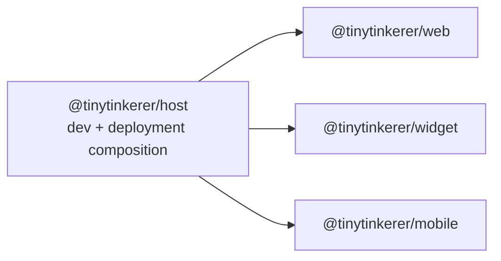

# UI/UX Concept

This document records the design intent for the tinytinkerer frontend surfaces.

It complements [ARCHITECTURE.md](./ARCHITECTURE.md) by focusing on UI ownership, shared frontend packages, and the rules agents should follow to avoid duplicating behavior or styling across frontend apps.

## Frontend Composition

`@tinytinkerer/host` is the composition layer for local development and deployment output. It serves the three frontend shells together, but it is not a fourth UI shell and must not become the home for shared feature logic.

## Purpose

The frontend apps are different shells around the same product runtime:

- `@tinytinkerer/web` is the full browser shell.
- `@tinytinkerer/mobile` is the installable narrow-screen shell.
- `@tinytinkerer/widget` is the stricter embedded shell.

They should feel like the same product family without forcing identical layouts.

The goal for future agents is:

- keep app shells thin
- keep styling consistent where the user perceives the same feature
- extract reusable UI and feature behavior into shared packages before it is copied into another app

## Shared UI System

The shared frontend model has three layers:

- `@tinytinkerer/ui` owns presentational primitives such as buttons and other reusable visual building blocks.
- `@tinytinkerer/app-browser` owns the shell-facing rich-content surface consumed by frontend apps.
- `@tinytinkerer/content-*` owns the shared content parsing and rendering pipeline behind that `app-browser` surface.

Rules:

1. App shells may decide layout, spacing, and app-specific affordances.
2. Shared controls, renderers, and non-trivial visual behavior should move into packages instead of being reimplemented per app.
3. `@tinytinkerer/ui` is for primitives, not feature runtimes.
4. The content platform is where cross-app parsing, rendering, sanitization policy, lazy loading, and shared feature glue belong.

## Shared Visual Direction

`web` and `mobile` currently share the main product mood:

- warm stone and amber surfaces
- soft rounded panels
- restrained borders and shadows
- amber focus and primary-action emphasis
- quiet status colors for info, warning, and error states

This should remain the baseline product identity unless there is a strong shell-specific reason to diverge.

The widget belongs to the same family, but it is allowed to be more compact and host-friendly:

- denser controls
- tighter spacing
- embedded-card presentation
- inline setup flows when a modal would hurt embedding

The widget may differ in shell structure, but it must not fork shared feature behavior or invent a separate styling system for the same shared controls.

## Shell Guidance

### Web

`@tinytinkerer/web` is the most spacious browser shell.

- Use the conversation as the dominant surface.
- Keep the page as a single primary workflow instead of adding competing panes.
- Keep settings in a modal or other clearly secondary surface.
- Treat transparency features such as thinking and tool history as subordinate to the conversation.

### Mobile

`@tinytinkerer/mobile` uses the same core product language on narrower screens.

- Preserve the single-column flow.
- Prefer thumb-friendly controls, larger hit targets, and safe-area-aware spacing.
- Keep install and mobile-specific affordances in the shell layer.
- Reuse shared runtime and rendering behavior rather than rebuilding mobile-specific versions of the same feature.

### Widget

`@tinytinkerer/widget` is the stricter embedded shell.

- Optimize for compact sessions and host integration.
- Inline configuration is acceptable when it reduces friction inside an embedded surface.
- Avoid assuming a full-page shell, modal-heavy flows, or large supporting panels.
- Keep the widget thin: it should reuse shared runtime, shared content rendering, and future shared features instead of copying web or mobile internals.

## Feature Reuse Rules

When a feature appears in more than one frontend app, duplication is not acceptable.

Use these rules:

1. If the feature is just a visual primitive, extend `@tinytinkerer/ui`.
2. If the feature has its own rendering or interaction pipeline, create or extend the content platform or another dedicated shared package.
3. If shared browser runtime integration is needed, expose it through `@tinytinkerer/app-browser` instead of letting apps wire lower layers directly.
4. Do not copy feature logic from `web` into `mobile` or `widget`, or from one app into another in any direction.

Mermaid is the explicit example:

- Mermaid support should not be separately implemented in `web`, `mobile`, and `widget`.
- Markdown hooks, Mermaid source detection, lazy loading, sanitization, fallback behavior, and shared styling glue belong in `@tinytinkerer/content-markdown`, `@tinytinkerer/content-mermaid`, and `@tinytinkerer/app-browser`.
- Apps should only decide where Mermaid appears and how it fits their shell.

## Current Gaps To Avoid Repeating

The repo still has some duplicated frontend UI that should be treated as migration pressure, not as the model to copy forward.

- Markdown prose styling is currently repeated across app stylesheets.
- Some settings-modal primitives are currently duplicated between `web` and `mobile`.

Future agents should not extend those copies again. If the same UI behavior or styling contract is needed in another app, extract it into a shared package instead.

## Agent Checklist

Before adding frontend UI, check:

- Is this a shell-specific layout choice or a reusable UI capability?
- Will another frontend app need the same control, renderer, or behavior?
- Should this live in `@tinytinkerer/ui`, the content platform, or another dedicated shared package?
- Does this preserve a consistent visual family across apps?
- Does this avoid app-to-app copying?

If the answer points to reuse, extract first and keep the app wrapper thin.
