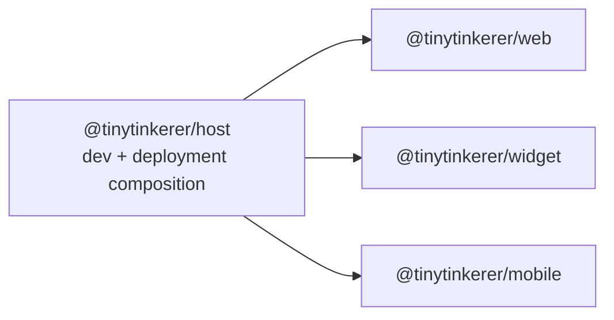

# UI/UX Concept

This document records the design intent for the tinytinkerer frontend surfaces.

It complements [ARCHITECTURE.md](./ARCHITECTURE.md) by focusing on UI ownership, shared frontend packages, and the rules agents should follow to avoid reintroducing duplicated behavior across frontend apps.

## Frontend Composition

`@tinytinkerer/host` is the composition layer for local development and deployment output.

- `/` is a multi-surface compositor workspace.
- `/web/`, `/mobile/`, and `/widget/` are the real shells.
- The root compositor is not a fourth product shell.
- Host may own workspace chrome, iframe composition, and floating-window behavior for the dev workspace.
- Host must not become the home for shared feature logic.

## Purpose

The frontend apps are different shells around the same product runtime:

- `@tinytinkerer/web` is the full browser shell.
- `@tinytinkerer/mobile` is the installable narrow-screen shell.
- `@tinytinkerer/widget` is the stricter embedded shell.

They should feel like the same product family without forcing identical layouts.

The goal for future agents is:

- keep app shells thin
- keep styling consistent where the user perceives the same feature
- extract reusable behavior into shared packages before it is copied into another app

## Shared UI System

The shared frontend model has three layers:

- `@tinytinkerer/ui` owns stateless primitives and tiny reusable visual atoms.
- `@tinytinkerer/app-browser` owns shared browser-surface behavior and the shell-facing React APIs consumed by frontend apps.
- `@tinytinkerer/content-*` owns the assistant-content parsing and rendering pipeline behind the `app-browser` surface.

In practice, that means:

1. App shells may decide layout, spacing, and shell-specific affordances.
2. Shared browser behavior such as chat/settings controllers, OAuth callback handling, shared browser components, and shared browser styles should live in `app-browser`.
3. `ui` is for primitives, not feature runtimes.
4. The content platform is where cross-app parsing, rendering, sanitization policy, lazy loading, and shared content fallback behavior belong.

## Shared Visual Direction

`web` and `mobile` share the main product mood:

- warm stone and amber surfaces
- soft rounded panels
- restrained borders and shadows
- amber focus and primary-action emphasis
- quiet status colors for info, warning, and error states

This remains the baseline product identity unless there is a strong shell-specific reason to diverge.

The widget belongs to the same family, but it is allowed to be more compact and host-friendly:

- denser controls
- tighter spacing
- embedded-card presentation
- inline setup flows when a modal would hurt embedding

The widget may differ in shell structure, but it must not fork shared feature behavior or invent a separate styling system for the same shared controls.

## Shell Guidance

### Web

`@tinytinkerer/web` is the most spacious browser shell.

- Use the conversation as the dominant surface.
- Keep the page as a single primary workflow instead of adding competing panes.
- Keep settings in a modal or other clearly secondary surface.
- Treat transparency features such as thinking and tool history as subordinate to the conversation.

### Mobile

`@tinytinkerer/mobile` uses the same core product language on narrower screens.

- Preserve the single-column flow.
- Prefer thumb-friendly controls, larger hit targets, and safe-area-aware spacing.
- Keep install and mobile-specific affordances in the shell layer.
- Reuse shared runtime and rendering behavior rather than rebuilding mobile-specific versions of the same feature.

### Widget

`@tinytinkerer/widget` is the stricter embedded shell.

- Optimize for compact sessions and host integration.
- Inline configuration is acceptable when it reduces friction inside an embedded surface.
- Avoid assuming a full-page shell, modal-heavy flows, or large supporting panels.
- Keep the widget thin: it should reuse shared runtime and shared content rendering instead of copying web or mobile internals.

## Feature Reuse Rules

When a feature appears in more than one frontend app, duplication is not acceptable.

Use these rules:

1. If the feature is just a stateless visual primitive, extend `@tinytinkerer/ui`.
2. If the feature is shared browser-shell behavior, extract it into `@tinytinkerer/app-browser`.
3. If the feature has its own assistant-content parsing or rendering pipeline, extend `@tinytinkerer/content-*`.
4. Do not copy feature logic from one app into another in any direction.

Mermaid remains the explicit content example:

- Mermaid support should not be separately implemented in `web`, `mobile`, and `widget`.
- Markdown hooks, Mermaid source detection, lazy loading, fallback behavior, and shared content wiring belong in `@tinytinkerer/content-markdown`, `@tinytinkerer/content-mermaid`, and `@tinytinkerer/app-browser`.
- Apps should only decide where Mermaid appears and how it fits their shell.

## Intentional Divergence

Not all similarity should be extracted.

The following are expected to stay shell-local unless a stronger shared contract emerges:

- page layout
- route structure
- mobile install UX
- widget window chrome and host embedding behavior
- shell-specific copy
- app-local panel arrangement

The current goal is behavior convergence, not identical markup.

## Agent Rules

Before adding frontend UI, check:

- Is this a shell-specific layout choice or a reusable capability?
- Is the behavior already present in another app?
- Should shared behavior go into `app-browser` before adding it to a second shell?
- Should only a tiny stateless atom move into `ui`?
- Is this really a content-platform concern rather than generic frontend logic?
- Does this preserve a consistent visual family across apps?
- Does this avoid app-to-app copying?

Use these heuristics:

- extract shared behavior first
- extract generic atoms second
- keep page-level markup local unless the interaction contract is actually the same
- do not extract whole pages just because two shells look similar
